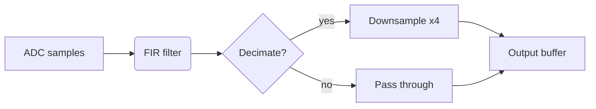

# Feature Request: Mermaid diagrams in notebooks (HTML + LaTeX/PDF)

## Problem

Tutorial and report notebooks frequently need block diagrams, flowcharts,
state machines, sequence diagrams, and signal-flow graphs that don't come
out of plot data. Today the only options are: (a) hand-author SVG and
embed it, or (b) screenshot a diagram from another tool. Both lose source
control: the diagram is opaque to diff/review and can't be re-themed when
the notebook theme changes.

Mermaid is the de facto Markdown diagram format — supported natively by
GitHub, GitLab, Obsidian, VS Code, and most Markdown viewers. Authoring a
diagram in Mermaid keeps the source human-readable and lets every viewer
that already understands `.md` files render it.

## Proposed syntax

A standard Mermaid fenced code block, exactly as GitHub renders it:

````markdown

````

The parser recognizes the `mermaid` info-string the same way it already
recognizes `rustlab` (`crates/rustlab-notebook/src/parse.rs`), but instead
of executing the block it captures the source as a `Block::Mermaid`.

## Output format mapping

| Format | Rendering |
|---|---|
| HTML | `<div class="mermaid">…source…</div>`. Load `mermaid.min.js` from a CDN (same pattern as KaTeX and Plotly) and call `mermaid.initialize({ startOnLoad: true, theme: "dark" })`. The browser renders SVG client-side. |
| LaTeX | `\begin{figure}\includesvg{plots/<notebook>/diagram-N.svg}\end{figure}` (float placement; see "LaTeX layout" below). Falls back to `\begin{verbatim}` printing the source if the in-process renderer fails on that diagram. |
| PDF  | Same as LaTeX — the SVG is embedded via the existing plot pipeline. |

## Static rendering for LaTeX/PDF

LaTeX has no native Mermaid renderer, so the LaTeX/PDF path needs a
build-time step that converts each Mermaid block to SVG. The renderer
must be in-process — shelling out to `mmdc` (mermaid-cli) drags in Node
+ headless Chromium and breaks the "single Rust binary" property of
`rustlab notebook`.

**Primary path: `mermaid-rs-renderer` crate.** Pure Rust, MIT, latest
release 0.2.2 (2026-04-24). Built on `resvg`/`usvg`/`fontdb` — pure
Rust SVG. The crate's README claims 23 diagram types and "100–1400×
faster than mmdc"; treat both as author claims to validate during
implementation, not facts.

Gate the renderer behind a Cargo feature (`mermaid-pdf` or similar):

- HTML rendering uses the CDN script and **does not depend on the
  feature** — Mermaid in HTML works in every build.
- LaTeX/PDF rendering uses `mermaid-rs-renderer`. With the feature
  off, Mermaid blocks in LaTeX/PDF output emit verbatim source plus
  a one-time warning that the feature was not enabled.
- Default-on so the typical user gets PDF rendering; users who want
  the smaller dep tree can opt out.

This satisfies the licensing rule "Core in pure Rust; libraries only
for infrastructure" — Mermaid rendering is output infrastructure, not
core numerics.

**Dependency weight (honest read).** `ttf-parser` is already in the
rustlab dep tree (via plotters). `resvg`, `usvg`, `fontdb` are *not*
— this is a meaningful new sub-tree (XML parsing, font matching,
SVG rasterization). Acceptable for an opt-in PDF feature, less
acceptable as an unconditional dep. The feature flag above keeps it
opt-out.

**Fallback for diagrams the crate cannot render.** If
`mermaid-rs-renderer` returns an error (or the feature is disabled),
emit a `\begin{verbatim}` block with the source so the document
still builds. The renderer must never panic the notebook render —
catch and log. Log one warning line per failed block, identifying
notebook + diagram index + reason; do not spam.

**Caching.** Hash the Mermaid source (BLAKE3 or SHA-256) and cache
the rendered SVG by hash under `plots/<notebook>/.cache/`.
Re-rendering a notebook with no Mermaid changes reuses the cached
SVGs. Implement from day one — cheap to add, matters for repeated
renders of stable notebooks.

## Theme integration

The HTML renderer already supports a `--theme` flag and emits
catppuccin-dark by default. Map rustlab's theme to Mermaid's:

- HTML: pass to `mermaid.initialize({ theme: "dark" | "default" })`.
- LaTeX/PDF: pass the equivalent theme option to `mermaid-rs-renderer`.
  Validate during implementation that the crate exposes a theme knob;
  if not, file an upstream issue and ship with a single hardcoded
  theme matching the rustlab default until upstream lands.

## LaTeX layout

`\includesvg` alone produces a non-floating inline image, which
typesets badly mid-paragraph. Wrap each diagram in a float:

```latex
\begin{figure}[htbp]
  \centering
  \includesvg[width=0.8\linewidth]{plots/<notebook>/diagram-N.svg}
  \caption{<from caption directive, if any>}
\end{figure}
```

Captions come from a preceding `<!-- caption: … -->` directive on
the line above the Mermaid block. If absent, omit `\caption{}` so no
empty caption renders.

## HTML / PDF rendering parity

HTML uses canonical Mermaid.js (the JS library that defines the
spec). LaTeX/PDF uses `mermaid-rs-renderer`, a third-party port at
0.2.x. Same source can render with different fonts, slightly
different layout, and possibly different supported syntax features.

Implications:

- The source `.md` is the editorial contract; pixel-perfect parity
  across formats is **not** a goal.
- Pick one rendering as the "design reference" for any diagram that
  appears on a cover or in marketing material — usually HTML, since
  that's the canonical engine.
- Document the divergence in the user-facing notebook docs so authors
  aren't surprised when a printed diagram looks subtly different.

## Interaction with other directives

- `<!-- hide -->` before a `mermaid` block hides the source (same as for
  rustlab blocks). Useful when only the rendered diagram should appear.
- `<!-- details: Title -->` wraps the rendered diagram in a `<details>`
  disclosure.
- Mermaid blocks do **not** participate in the evaluator — variables
  defined in earlier `rustlab` blocks are not interpolated into Mermaid
  source. (Open question: should `${var}` template interpolation extend
  to Mermaid blocks? Probably yes for label values; see "Open questions".)

## Files touched (estimate)

| File | Change |
|---|---|
| `crates/rustlab-notebook/src/parse.rs` | Recognize `mermaid` info-string; emit `Block::Mermaid { source: String }`. |
| `crates/rustlab-notebook/src/execute.rs` | Pass `Block::Mermaid` through to `Rendered::Mermaid` without execution. |
| `crates/rustlab-notebook/src/render.rs` | Emit `<div class="mermaid">`; add CDN script tag in `<head>`; init Mermaid after KaTeX. |
| `crates/rustlab-notebook/src/render_latex.rs` | Render each Mermaid block to SVG via `mermaid-rs-renderer`, write into `plots/<notebook>/diagram-N.svg`, emit `\includesvg`. Verbatim fallback on render error. |
| `crates/rustlab-notebook/Cargo.toml` | Add `mermaid-rs-renderer` as an optional dep behind a `mermaid-pdf` feature (default-on). HTML rendering does not depend on the feature. |

## Test cases

Parser / HTML:

- Single flowchart in HTML render produces a `<div class="mermaid">`
  with source intact (no CommonMark mangling of `-->`, `&`, etc.).
- Source containing `&`, `<`, `>` is HTML-escaped inside the div so
  Mermaid's parser still sees the original characters.
- Multiple Mermaid blocks in one notebook get unique IDs / filenames
  with no collision.
- A Mermaid block immediately following a rustlab block parses
  cleanly (no fence-state leak).
- A Mermaid block inside a `<!-- details: -->` wrapper renders inside
  the disclosure widget.
- A Mermaid block inside a callout (`<!-- note -->`) renders inside
  the callout box.
- `<!-- hide -->` + `mermaid`: HTML output contains the rendered div
  but no `<pre><code class="language-mermaid">` source listing.

LaTeX / PDF:

- LaTeX render produces an SVG file in `plots/<notebook>/` and a
  `\begin{figure}...\includesvg{...}...\end{figure}` reference.
- Multi-notebook directory render places SVGs under the *correct*
  `plots/<notebook>/` directory (no cross-notebook collisions).
- `<!-- caption: … -->` directly above a Mermaid block produces a
  `\caption{…}`; without it, no empty caption emitted.
- Syntax error in Mermaid source: render does not panic, falls back
  to verbatim, emits one warning identifying the source location.
- Cargo feature `mermaid-pdf` disabled: LaTeX/PDF emit verbatim with
  one warning per render (not per block).
- Re-rendering a notebook with no Mermaid source changes reuses the
  cached SVG (cache keyed on source hash).
- Editing a single Mermaid block re-renders only that one diagram
  (cache invalidation).

## Risks

1. **Crate maturity is the load-bearing risk.** `mermaid-rs-renderer`
   is 0.2.2, ~9k downloads, 3.1% documented per docs.rs, single
   maintainer. Promising but young. Budget time during implementation
   to validate against the diagram types we actually want (flowchart,
   sequence, state). If coverage is too thin, the feature ships as
   "HTML works, PDF falls back to verbatim source for some diagrams"
   — acceptable but worth being honest about up front.
2. **Validate the speed claim.** "100–1400× faster than mmdc" is
   author marketing. Benchmark against a representative diagram set
   during implementation; results inform whether caching is critical
   (it almost certainly is) but not whether to ship.
3. **Upstream theming may not exist yet.** If `mermaid-rs-renderer`
   has no theme API, ship with a single hardcoded style matching the
   default rustlab theme, file an upstream issue, revisit later.

## Open questions

1. **Template interpolation in Mermaid source.** Should `${var}` work
   inside Mermaid blocks the way it works in markdown prose? Useful
   for parameterized diagrams (filter order, sample rate in node
   labels) but adds an extra preprocessing pass. Default: skip in v1,
   revisit if users request it.
2. **CDN dependency / offline rendering.** HTML output depends on a
   CDN-hosted `mermaid.min.js` — same as KaTeX and Plotly. Notebooks
   distributed for offline reading silently break on first open. Not
   unique to Mermaid, but adding a third CDN dep makes the gap more
   acute. Address as a separate cross-cutting `--offline` feature
   (vendor all three JS deps into the output dir) rather than
   bundling here.
3. **Mermaid version pinning.** The CDN URL pins a specific version
   (e.g. `mermaid@10.9.0`). Pick the latest LTS at implementation
   time; document the version in the renderer source.
4. **`Block::Mermaid` shape.** Start with `{ source: String }`. If
   captions / per-block theme overrides land, extend the struct
   rather than adding parallel fields elsewhere.

## Motivation examples

- Filter design notebook: signal flow graph showing ADC → FIR → decimator → DAC.
- Controls notebook: state machine for a PID controller's bumpless transfer.
- DSP architecture overview: sequence diagram for a buffer-handoff between threads.
- Tutorial notebooks generally: flowcharts that walk readers through an algorithm before showing the code.
