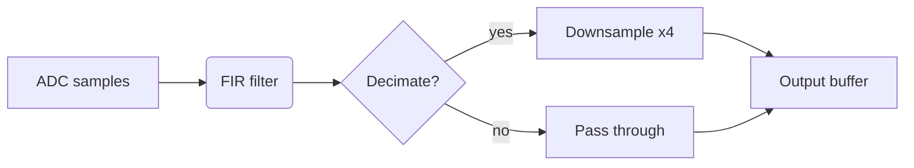

# rustlab-notebook

Render Markdown notebooks with executable rustlab code blocks into HTML
reports, LaTeX documents, PDFs, or GitHub-friendly Markdown with inline
SVG plots.

## Quick Start — Obsidian users

If you want a live notebook experience inside Obsidian — author in
Editing view, switch to Reading view, see plots and text update on
save — here's the shortest path:

### Single-file layout (one `.md` per notebook, simplest)

```
rustlab-notebook watch ~/your-obsidian-vault --obsidian
```

That's it. Then in Obsidian:

1. Open `~/your-obsidian-vault` as a vault (Open another vault → Open folder as vault).
2. Open or create any `.md` with rustlab code blocks.
3. **Edit** the code or prose in Editing view (`Cmd/Ctrl-E`).
4. **View** the rendered output by switching to Reading view (`Cmd/Ctrl-E` again).

The watcher re-renders every save. Plots are written to
`_attachments/<note>/plot-1-<hash>.svg` and embedded inline; Obsidian's
Reading view shows them automatically. Code-block output is wrapped in
`<!-- rustlab:output-start --> … <!-- rustlab:output-end -->` sentinels
so the renderer can refresh it cleanly on every pass.

### Two-directory layout (pristine source + rendered vault)

```
rustlab-notebook watch ~/notebooks/src -o ~/your-obsidian-vault --obsidian
```

Edit in `~/notebooks/src` (your authoring tree, keep it in git), view
in `~/your-obsidian-vault` (the rendered tree Obsidian opens). On
startup the watcher cleans any stale rustlab artifacts out of the
source tree automatically. Useful when you want the source bytes to
stay byte-identical to what you'd commit to a repo.

### What you get out of the box

| Feature | Notes |
|---|---|
| Live re-render on save | Debounced 250 ms; tune with `--debounce-ms <MS>`. |
| Prose-only edits skip code execution | Per-block cache: prose change → zero execution, mid-notebook code edit → only that block + downstream re-execute (state restored from snapshot). In-memory, per watcher session. |
| Stop the runaway-loop family of bugs | Self-write suppression, in-place auto-cleanup of generated header/iframe, hashed plot filenames so Obsidian doesn't show stale images. |
| Add `.md` notebooks while the watcher is running | They get picked up on first save, no restart needed. |
| Strip everything rustlab added and recover the source | `rustlab-notebook clean <path>` (in place). See [`notebook clean`](#notebook-clean--strip-rendered-artifacts) below. |
| Render to standalone HTML / PDF / LaTeX too | `rustlab-notebook render` with `-f html`/`-f pdf`/`-f latex`. |

### When to use which layout

- **Single-file in-place** when you want the simplest possible flow and
  don't care about keeping pristine source. The `.md` file in Obsidian
  is both source and rendered output.
- **Two-dir** when you want to commit the source to a repo without
  rendered output in it, or when the same source feeds multiple
  output formats. Watcher auto-strips artifacts from the source so it
  stays pristine. The trailing `<iframe>` to a sibling `.html` is
  emitted in two-dir only (suppress with `--no-iframe`).

If anything seems wrong — stale plot, weird duplication, runaway
re-rendering — try `rustlab-notebook clean <path>` on the affected
file to scrub it back to source, then restart the watcher.

---

## Other quick starts (non-Obsidian)

```
rustlab-notebook render analysis.md              # → analysis.html (default, dark theme)
rustlab-notebook render analysis.md -t light     # → analysis.html (light theme)
rustlab-notebook render analysis.md -f latex     # → analysis.tex + SVG plots
rustlab-notebook render analysis.md -f pdf       # → analysis.pdf (requires pdflatex)
rustlab-notebook render analysis.md -f markdown -o rendered.md  # explicit destination
rustlab-notebook render analysis.md -f markdown --obsidian  # vault-native in-place rewrite
rustlab-notebook render analysis.md -o out.html  # explicit output path
rustlab-notebook watch notebooks/ --obsidian     # live re-render on save (Obsidian Reading view)
```

The `markdown` output format is purpose-built for committing rendered
notebooks to a repo so they display with inline plots on GitHub — each
captured figure is written as SVG to `plots/<stem>/plot-N-<hash>.svg`
and referenced inline. Add `--obsidian` to switch the emitter into
vault-native mode (see [Obsidian integration](#obsidian-integration--obsidian)
below). See
[`examples/notebooks/README.md`](../examples/notebooks/README.md) for the
source/rendered split design pattern.

**`-f markdown` requires explicit consent to overwrite the source.**
Running `render note.md -f markdown` without `-o` or `--obsidian`
would land on `note.md` itself — so the renderer refuses and prints
the three legitimate forms. Same rule as `notebook watch`: only
`--obsidian` modifies a `.md` source implicitly; everything else
needs an explicit destination.

### Obsidian integration (`--obsidian`)

`--obsidian` (with `--format markdown`) switches the markdown emitter
into vault-native mode. The output reads like a hand-authored Obsidian
vault: cross-notebook links use `[[wikilinks]]`, plots route to
`_attachments/<stem>/`, frontmatter gets the standard vault metadata
keys, and a trailing iframe to the sibling `.html` is appended for
the interactive Plotly view.

```
rustlab-notebook render notebooks/ -f html                 # → <name>.html for each
rustlab-notebook render notebooks/ -f markdown --obsidian  # → vault-native .md
```

Five things change vs. the default `--format markdown`:

1. **Cross-notebook links emit as wikilinks.**
   - `[Foo](other.md)` in source → `[[other|Foo]]` in output.
   - `[Sec](other.md#section)` → `[[other#section|Sec]]`.
   - `[Foo](Foo.md)` → `[[Foo]]` (alias dropped when text matches the
     basename).
   - External URLs (`http://`, `https://`, `mailto:`, `#anchor` only)
     are left untouched.

2. **Plots emit to an attachments folder.** Default
   `_attachments/<stem>/plot-N.svg`. The leading `_` keeps the folder
   grouped at the top of Obsidian's file pane, away from authored
   notes. Override with `--attachments-dir <DIR>`.

3. **Frontmatter is merged.** If the source has none, a minimal block
   is emitted:
   ```yaml
   ---
   tags: [rustlab]
   cssclasses: [rustlab-notebook]
   ---
   ```
   If the source already has frontmatter, the two obsidian keys are
   appended *only* when absent — existing keys (including custom
   `tags:` / `cssclasses:`) are preserved verbatim. The
   `cssclasses: [rustlab-notebook]` value is a hook for vault-side CSS
   snippets that style rustlab-rendered notes.

4. **Trailing iframe.** A single
   `<iframe src="<stem>.html" width="100%" height="600">` is appended
   so Obsidian's Reading view can show the interactive Plotly version
   inline. Suppress with `--no-iframe` if you want the wikilink and
   attachment rewrites without embedding the HTML view.

5. **Vault home page.** When rendering a directory, an `index.md` is
   written at the output root with an H1 title and a `[[wikilink]]`
   list of every notebook in `order:` sequence. If the source
   directory provides its own `index.md`, that one is rendered
   through the normal pipeline instead (frontmatter merging, embed
   expansion) — the autogenerated index never overwrites authored
   content.

GitHub strips iframes during sanitization, but it does **not** render
wikilinks — committing a `--obsidian` output to a repo will show
`[[Foo]]` as literal text on github.com. Use `--obsidian` for vaults;
omit it for committed `gallery/`-style output.

#### Flags summary

| Flag | Effect |
|---|---|
| `--obsidian` | Enable all five behaviours above. Markdown format only. |
| `--attachments-dir <DIR>` | Override the default `_attachments` location for plot SVGs. |
| `--no-iframe` | Suppress the trailing iframe. |

The standalone `rustlab-notebook` binary accepts the same arguments:

```
rustlab-notebook render notebooks/ -f markdown --obsidian
rustlab-notebook render notebooks/ -f markdown --obsidian --attachments-dir media
rustlab-notebook render notebooks/ -f markdown --obsidian --no-iframe
```

### Live preview with `notebook watch`

`rustlab-notebook watch` has two modes:

1. **Interactive server (bare-input default, single file).** Spins
   up a local web server, renders the notebook to an HTML page,
   opens your browser, and **live-reloads on save** via a
   WebSocket push. Source `.md` is never modified.
2. **Re-render on save (with `--obsidian` or `--output`).** The
   long-running counterpart of `render`: re-renders any notebook
   whose source changes, debouncing filesystem events so a single
   editor save produces one render pass. Pair with `--obsidian` for
   the "edit in Editing view, see updates in Reading view" Obsidian
   loop.

#### Interactive server (bare input)

```
rustlab-notebook watch analysis.md                       # one notebook → opens http://127.0.0.1:8042
rustlab-notebook watch notebooks/                        # whole directory → index page at /
rustlab-notebook watch analysis.md --port 9000           # custom port (fails loud on collision)
rustlab-notebook watch analysis.md --no-browser          # don't auto-open the browser
rustlab-notebook watch analysis.md --editable            # edit the .md in the browser (writes back)
```

Behaviour:

- **A single `.md` serves one notebook; a directory serves every
  `.md` under it** (recursive, `README.md` skipped) behind a
  generated index page at `/`. Each notebook lives at `/n/<slug>`
  where `<slug>` is its URL-safe file stem (collisions get a `-N`
  suffix). Passing a directory *with* `--obsidian`/`--output` still
  selects the re-render-on-save mode instead.
- **Directory pages get the same navigation as `render`.** In
  directory mode each served page drops the sidebar for a sticky
  `← Index / <Page Title>` breadcrumb and a `Previous · Index · Next`
  footer wired to the adjacent notebooks (the index lives at `/`,
  siblings at `/n/<slug>`). A single-file `watch` keeps the classic
  sidebar + TOC layout — there's no sibling set to navigate. (See
  [Page navigation](#page-navigation).)
- **Relative `run`/`load` paths resolve against the notebook's own
  directory**, not wherever you launched the server — so
  `run setup.rlab` finds the sibling next to the notebook, matching
  `render`.
- **Loopback bind on `127.0.0.1:8042` by default.** If 8042 is busy
  the server tries 8043, 8044, … up to 10 attempts and logs the
  actual bound URL. An explicit `--port <N>` skips auto-increment
  and fails loud on collision.
- **Embedded KaTeX + Plotly.** The page references local `/assets/`
  paths, not jsdelivr/cdn.plot.ly. Works fully offline (e.g. tablet
  over an SSH tunnel on a plane).
- **Source `.md` is never modified** (unless you opt into
  `--editable`, the in-browser editor — see below). No
  `_attachments/` directory, no `<!-- Generated -->` header, no
  in-place rewrite.
- **Browser auto-opens** when stderr is a TTY and `CI` is unset;
  `--no-browser` forces off. On Linux/WSL the server tries
  `wslview` (under WSL, opens the Windows browser), then `xdg-open`,
  then `gio open` / `sensible-browser`, falling back to printing the
  URL if none are present.
- **Source pane (split view).** A "Source" button in the top-right
  toolbar slides in a pane showing the raw `.md` (served from
  `/raw/<slug>`). The toolbar and pane live outside the rendered
  `<main>`, so live re-renders update only the rendered side and
  leave the pane in place; an open read-only pane refreshes itself
  when a save lands. With `--editable` this pane becomes an
  in-browser editor (see below).
- **Ctrl-C** stops the server. Plot artefacts live in a tempdir
  that's cleaned up on exit.
- **Live reload on save** with block-level diffing. The rendered
  page includes a tiny WebSocket client that connects back to
  `/n/<slug>/ws` (one channel per notebook, so a save to one
  notebook in directory mode only reloads that page). On every
  save of the watched `.md`, the server
  re-renders (debounced 250 ms) and chooses the smallest payload
  that does the job:
  - `{"kind":"partial","blocks":[{"position":N,"html":"…"}]}` —
    same block count, only some blocks' rendered HTML changed
    (typical for small prose edits or a single code-block change).
    The page swaps the specific `<section class="rl-block">`
    elements in-place, re-executes inline `<script>`s in the new
    content (re-runs Plotly), re-invokes KaTeX on the affected
    nodes, and **preserves scroll position**.
  - `{"kind":"reconcile","blocks":[{"id":"b-…","html":"…"?}]}` —
    a **structural** edit (blocks inserted, removed, or reordered)
    on a flat notebook. Each entry is keyed by its content-hash
    `id`; entries with no `html` are reused in place (the existing
    DOM node — and its live Plotly/KaTeX state — is kept and moved
    if needed), and only new/changed blocks carry `html`. Leftover
    blocks are removed. Because untouched nodes keep their DOM
    identity, **scroll position survives** inserts and removes too.
  - `{"kind":"full","html":"…"}` — a structural edit on a notebook
    that nests blocks inside exercise/solution wrappers (not safe
    to reconcile), or any edit where >50% of blocks are new. The
    page swaps the rendered `<main>` (not the whole body, so the
    toolbar / source pane survive), re-executes its inline
    `<script>`s, and re-renders KaTeX. Scroll position snaps to
    top.

  If the server stops, the page shows a red "disconnected" banner
  and retries with exponential backoff 500 ms → 5 s capped at 10
  attempts; on a successful reconnect it hard-reloads to pick up
  any state it might have missed (unless the `--editable` editor
  has unsaved changes, in which case it keeps the page and shows a
  "reload to refresh" banner).
- **Render preemption.** A save during a slow render *cancels* the
  in-flight execution and starts fresh on the new source. The
  evaluator polls a cancel flag between statements and loop
  iterations, so even a runaway code block (`while true; end;`)
  stops promptly on the next save instead of pinning a CPU core. A
  preempted render never publishes — only the latest render's output
  reaches the page. (The one exception is the **initial** render at
  startup, which has nothing to preempt: an infinite-loop notebook
  will hang startup until you fix the source — the same as
  `notebook render`.)

For implementation status, the agent-handoff section, and
forward-looking design, see
`dev/plans/notebook_interactive_server.md`.

#### In-browser editor (`--editable`)

```
rustlab-notebook watch analysis.md --editable
rustlab-notebook watch notebooks/  --editable     # whole directory, every page editable
```

`--editable` turns the source pane into a [CodeMirror](https://codemirror.net/5/)
editor (Markdown mode, line numbers) that **writes back to the
`.md`**:

- Click **Edit** to open the pane, change the source, then **Save**
  (or `Ctrl`/`Cmd`-S). The buffer is `POST`ed to `/save/<slug>`, the
  server writes the file, and the normal fs-watch → re-render → WS
  push updates the rendered side. The edit loop is exactly the same
  one your external editor would trigger — the browser just happens to
  be the editor.
- The editor buffer is never clobbered by a re-render: live updates
  swap only the rendered `<main>`, while the editor lives outside it.
- This is the **one** interactive mode that modifies your source
  (parallel to the "only `--obsidian` modifies" rule), so it is
  strictly opt-in. Without `--editable` the pane is read-only and the
  `/save/<slug>` route is not even mounted.
- CodeMirror is embedded in the binary and served from
  `/assets/codemirror/…` (works offline like KaTeX/Plotly), but only
  referenced on the page under `--editable`.

#### Re-render on save (--obsidian / --output)

```
rustlab-notebook watch notebooks/ --obsidian                       # vault-friendly in-place rewrite
rustlab-notebook watch notebooks/ -o notebooks/                    # non-vault in-place (explicit consent)
rustlab-notebook watch notebooks/ -o vault/ --obsidian             # two-dir: vault-native output to a separate dir
rustlab-notebook watch notebooks/ --obsidian --debounce-ms 500     # quieter editor, slower triggers
```

**Watch never modifies your source `.md` without explicit consent.**
The bare command (no `--obsidian`, no `--output`) hits the
interactive-server path described above and never touches the file;
the re-render-on-save modes below require you to name a destination
by flag.

Two layouts work:

- **In-place (single file).** Either use `--obsidian` (the common
  case — vault-friendly rewrites) or pass `-o <same-dir>` for plain
  in-place rendering without the Obsidian-specific frontmatter and
  wikilinks. Open the same file in Obsidian's Editing view to
  author; switch to Reading view to see the rendered output inline.
  The renderer wraps its output regions in sentinel comments so the
  next pass strips them on re-parse, producing byte-identical output
  and converging in one extra render after any user save.
- **Two-dir.** Set `-o <dir>` to write outputs to a separate
  directory (typically a sibling Obsidian vault). Useful when you
  want the source tree to stay pristine, or when committing
  rendered output to a different repo.

Behaviour:

- **New files picked up live.** Adding a `.md` to the watched tree
  after startup triggers a render on first save — the watcher
  doesn't only see the files present when it started.
- **Initial pass.** Every notebook in the watched directory is
  rendered once at startup so the output directory is in sync. After
  that, only notebooks whose sources change re-render.
- **Embed dependency tracking.** When a notebook embeds
  `_setup.md` (via `![[_setup]]`), editing `_setup.md` re-renders
  every notebook that depends on it — not the whole directory.
  Dependencies are discovered as notebooks render; the first edit
  after startup may catch up on a stale graph but subsequent edits
  are precise.
- **Debounce.** Filesystem events are coalesced with a configurable
  window (default 250 ms). Tune with `--debounce-ms <MS>` if your
  editor or filesystem is slow.
- **Plot dir GC.** Each per-notebook plot subdirectory is cleared
  before re-render, so deleted code blocks don't leave orphan SVGs
  behind in `_attachments/<stem>/`.
- **Two-dir auto-clean on startup.** When `-o` points at a different
  directory than the source (the recommended Obsidian-vault layout),
  the watcher strips any rustlab-generated artifacts (headers, output
  sentinels, legacy iframes) from each source `.md` before the
  initial render. Keeps the source tree pristine even if a rendered
  copy got dropped into it. Single-dir in-place mode skips this — the
  artifacts there are load-bearing.
- **Editor tempfile skip.** Atomic-write tempfiles (`.!PID!foo.md`,
  `.foo.md.swp`, `.#foo.md`, `foo.md~`) are ignored so an editor
  save can't trip a transient render on the wrong path.
- **No-op write skip.** Renders that produce byte-identical output
  don't touch the file — keeps `git status` quiet and prevents
  self-trigger loops in the in-place layout.
- **Per-block code cache.** The watcher maintains one cache entry per
  executable block (rustlab Code + Mermaid), recording the block's
  source hash, its rendered output, and a snapshot of the evaluator /
  plot / RNG state *after* that block ran. On each new render the
  watcher hashes every executable block's source, finds the longest
  matching prefix against its cache, restores live state from the last
  surviving snapshot, emits cached outputs for the matching prefix,
  and only *executes* the divergent tail. Markdown interpolation
  walks in-order, so prose between cached blocks sees the same
  evaluator state it saw originally. Log lines indicate what happened:
  - `code blocks unchanged in <file> — reusing cached outputs` —
    prose-only edit, full cache hit, zero execution.
  - `N of M code blocks cached for <file> — executing only the
    divergent tail` — edit at block N, blocks 0..N reused, N..M
    re-executed.
  - No special line — first block changed or fresh start, full
    execution.

  Cache is per-notebook, in-memory, scoped to the watcher session.
  Restart the watcher → first render is full again.
- **Failure isolation.** Parse or execution errors render inline (per
  the standard renderer behaviour); the watcher logs to stderr and
  keeps running.

Currently `--format markdown` only. HTML and PDF watch modes are not
yet wired (they'd produce stale-iframe behaviour that the watcher
can't yet reconcile).

Stop the watcher with Ctrl-C.

### `notebook check` — lint for rustlab-shaped failures

```
rustlab-notebook check note.md           # exit 2 on errors, 1 on warnings, 0 clean
rustlab-notebook check notebooks/        # recursive over every .md
rustlab-notebook check note.md --fix     # auto-correct the safe ones (calls clean)
rustlab-notebook check note.md --strict  # warnings/info also exit 1 (CI-friendly)
```

`check` is a *targeted* linter, not a generic markdown validator —
markdown is forgiving by design and "valid" is renderer-specific.
Each rule pins one rustlab-shaped failure that has actually bitten
someone or that the renderer can't surface up-front.

| Code | Severity | What it catches | Auto-fix? |
|---|---|---|---|
| `E001` | error | Unmatched `<!-- rustlab:output-start -->` / `output-end` sentinel — pair is broken, output region either truncates or leaks. | no — needs user judgement |
| `E002` | error | ` ```rustlab ` (or any) code fence opened but never closed. | no |
| `E003` | error | `![[Embed]]` reference whose target doesn't exist on disk. | no |
| `E004` | error | Frontmatter `---` opened but never closed by a second `---` line. | no |
| `E005` | error | `` plot URL whose file is missing on disk. Re-render. | no |
| `W001` | warning | Multiple `Generated by rustlab-notebook` headers in one file. | yes — `--fix` |
| `W002` | warning | `<details>` and `</details>` tag counts don't balance. | no |

Findings are printed one per line in the form
`<path>:<line> [<code>] <severity>: <message>`, sorted by source
position. Use as a pre-commit hook by running it in a Git hook /
CI step and gating merge on exit code 0.

`--fix` calls `notebook clean` over the affected file, which
removes the auto-fixable findings. Errors that need user judgement
(unmatched sentinels, unclosed fences, missing plot files, broken
embeds) are reported after the fix attempt so they're easy to
spot. The exit code reflects the *post-fix* state.

### `notebook clean` — strip rendered artifacts

```
rustlab-notebook clean note.md           # in-place: strip generated header + output sentinels
rustlab-notebook clean notebooks/        # recursive over every .md (README.md skipped)
rustlab-notebook clean note.md --check   # exit 1 if anything would change; no write
rustlab-notebook clean note.md -o out.md # write cleaned copy elsewhere; source untouched
```

`clean` reverses what the renderer adds — useful for committing pristine
source, migrating between single-dir and two-dir layouts, or recovering
a clean draft from a rendered copy. It strips:

- The `<!-- Generated by rustlab-notebook -->` header line.
- Every `<!-- rustlab:output-start --> … <!-- rustlab:output-end -->`
  region (cached code-block outputs, plot image references, the
  trailing iframe in `--obsidian` mode).
- Legacy unwrapped `<iframe>` tags matching rustlab's exact emission
  signature (loops corrupted files from pre-sentinel builds).
- Legacy bare ```` ```text ```` blocks that sit directly after a
  ```` ```rustlab ```` fence (same case, pre-sentinel output).

Hand-authored content is preserved: prose, code fences, standalone
```` ```text ```` blocks elsewhere in the document, iframes with
different attributes (e.g. embedded YouTube videos).

This is the same routine the watcher runs on startup in two-dir mode.

## Notebook Format

Notebooks are standard `.md` files. Any fenced code block tagged
`` ```rustlab `` is executed; everything else is rendered as prose.

````markdown
# My Analysis

Design a 64-tap lowpass filter with cutoff at $f_c = 3\,\text{kHz}$:

```rustlab
h = fir_lowpass(64, 3000, 16000, "hamming");
Hw = freqz(h, 512, 16000);
plot(Hw(1,:), 20*log10(abs(Hw(2,:))))
title("Magnitude Response")
xlabel("Frequency (Hz)")
ylabel("dB")
grid on
```

The passband ripple is well within spec.
````

### What gets rendered

Each code block produces up to three zones in the output:

1. **Source** — the rustlab code (syntax-highlighted in HTML)
2. **Text output** — anything the code prints (`disp()`, `ans =`, etc.)
3. **Plot** — interactive Plotly chart (HTML) or static SVG (LaTeX/PDF)

Errors are shown inline in red. Execution continues with subsequent blocks.

### Variable persistence

Variables persist across code blocks within a notebook. Define a signal
in one block, analyze it in the next:

````markdown
```rustlab
x = sin(2*pi*0.15*(0:1023)) + 0.3*randn(1024);
```

```rustlab
X = fft(x);
plot(abs(X(1:512)))
title("Spectrum")
```
````

### Formulas

Standard LaTeX math syntax works in prose. Inline: `$f_c$` renders as
$f_c$. Display math uses `$$...$$`:

```markdown
$$H(z) = \sum_{k=0}^{N-1} h[k]\,z^{-k}$$
```

In HTML output, formulas are rendered client-side by KaTeX. In LaTeX/PDF
output, they pass through as native LaTeX.

### Tables

Markdown tables render as styled HTML tables or LaTeX `tabular` with
booktabs:

```markdown
| Window      | Main Lobe Width | First Sidelobe |
|-------------|-----------------|----------------|
| Rectangular | $2/N$           | $-13$ dB       |
| Hann        | $4/N$           | $-31$ dB       |
```

### GFM-superset features

The renderer enables the GFM features that GitHub and Obsidian both
render natively, so the same source `.md` looks the same in all three
viewing surfaces.

**Footnotes:**

```markdown
Citation needed[^smith].

[^smith]: Smith et al., 2024.
```

**Task lists:**

```markdown
- [x] Filter design
- [ ] Spectral analysis
```

**Explicit heading IDs** — pin a stable anchor for cross-notebook links:

```markdown
# Filter Analysis {#filters}

See [the filters section](#filters).
```

**Strikethrough:**

```markdown
~~deprecated text~~
```

### Wikilinks and embeds

Obsidian-style `[[Note]]` wikilinks and `![[file]]` embeds are accepted
in source notebooks and transformed to standard markdown links and
images on the way out, so the committed `book/*.md` displays correctly
on GitHub (which would otherwise render `[[Note]]` as literal text).

| Source | Becomes (markdown output) | Becomes (HTML output) |
|---|---|---|
| `[[Foo]]` | `[Foo](Foo.md)` | `<a href="Foo.html">Foo</a>` |
| `[[Foo\|alias]]` | `[alias](Foo.md)` | `<a href="Foo.html">alias</a>` |
| `[[Foo#Section]]` | `[Foo § Section](Foo.md#section)` | `<a href="Foo.html#section">Foo § Section</a>` |
| `[[Foo#Section\|alias]]` | `[alias](Foo.md#section)` | `<a href="Foo.html#section">alias</a>` |
| `![[image.png]]` | `` | `` |
| `![[image.png\|alt]]` | `` | `` |

The target gets a `.md` extension when it has none (notebook reference);
paths that already include an extension (`[[diagram.svg]]`) pass through
verbatim. Anchor slugs use lowercase + non-alphanumeric→`-`, matching
how GitHub and pulldown-cmark generate heading IDs, so
`[[Foo#My Section]]` round-trips to the `#my-section` of the heading.

Wikilink syntax inside fenced code blocks (` ``` `) and inline code
spans (`` ` ``) is preserved verbatim — only narrative prose is
transformed.

### File embeds (transclusion)

Beyond linking, the `![[...]]` form **transcludes** another markdown
file at the embed point. Three variants:

| Form                          | Inlines                                                                              |
|-------------------------------|--------------------------------------------------------------------------------------|
| `![[Document]]`               | The entire body of `Document.md`.                                                    |
| `![[Document#Heading]]`       | Only the section under `## Heading` (and any nested subheadings) until the next sibling. |
| `![[Document#^block-id]]`     | Only the paragraph or list item tagged `^block-id` end-of-line.                      |

Embed expansion runs as a pre-process pass before the rest of the
pipeline: the inlined source becomes part of the host notebook, so
embedded code, math, callouts, mermaid diagrams, and directives all
render normally. Embedded ` ```rustlab ` blocks **execute** in the
host's evaluator — define `Fs = 48000` in `_setup.md`, embed it from
six lessons, and every lesson reads `Fs` afterward.

#### Block IDs (`^id` markers)

To make a paragraph or list item embeddable by id, mark it at end of
line:

```markdown
The Nyquist rate is twice the highest frequency component. ^nyquist-def
```

Then any notebook can pull just that paragraph with
`![[glossary#^nyquist-def]]`. The `^nyquist-def` marker is invisible
in the rendered output of *every* notebook (including the file that
defines it) — the source stays Obsidian-portable, the rendered HTML
/ Markdown / PDF stay clean.

#### Resolution rules

1. The embed target is resolved relative to the **directory of the
   embedding notebook** first.
2. If not found, the renderer falls back to the **notebook root**
   (the directory passed to `rustlab-notebook render <dir>`).
3. Case-insensitive basename match in each directory as a final
   fallback (Obsidian compatibility on Linux file systems).
4. If still not found, an inline error callout is emitted (see below).

The `.md` extension is implied — `![[setup]]` and `![[setup.md]]`
both resolve `setup.md`. Targets with non-markdown extensions
(`![[diagram.svg]]`, `![[paper.pdf]]`) pass through unchanged so the
existing image-embed transform handles them.

#### Recursion and cycles

Embeds can nest: `A → B → C → ...`. Each level demotes the embedded
content's headings by one (an embedded `# H1` becomes `<h2>` after
one level of nesting, `<h3>` after two, etc.). Headings already at
level 6 stay at 6.

Recursion is capped at depth 4. Self-references (`A.md` embedding
`A.md`) and indirect cycles (`A → B → A`) are detected and rendered
as inline error callouts rather than aborting the render.

#### Errors

Anything that goes wrong with an embed — missing target, missing
heading, missing block id, cycle, depth limit — emits a `[!CAUTION]`
callout at the embed site so the problem is visible in the rendered
output:

```
> [!CAUTION] Embed error
> target not found: setup
```

A matching one-line warning prints to stderr so CI logs flag broken
embeds. The render continues for the rest of the notebook regardless.

#### Authoring tips

- **Put embed links on their own line** for full-document or section
  embeds — the inlined content is multi-line and won't read well
  spliced inside a sentence.
- **Block-id embeds** (`![[gloss#^def]]`) are typically a single
  paragraph and *do* read fine inline (`See ![[gloss#^def]] for
  details.`).
- **Shared setup files** are conventionally named `_setup.md` or
  prefixed with `_` so they sort to the top of file panes and are
  visually distinct from authored lessons.

See `examples/notebooks/_setup.md` and `examples/notebooks/embeds_demo.md`
for a working example: a setup file defines constants and a helper
function, and the demo lesson embeds it, then uses the variables.

## Directives

Directives are a `rustlab-notebook` feature, not standard Markdown. They
use HTML-comment syntax (`<!-- ... -->`) so the source `.md` file stays
portable — any CommonMark viewer (GitHub, VS Code preview, etc.) treats
them as invisible comments. Only `rustlab-notebook render` interprets
them as instructions.

### `<!-- hide -->`

Place `<!-- hide -->` on the line immediately before a code block to
hide the source code in the rendered output. The block is still
executed — variables, plots, and text output all appear — but the code
itself is suppressed. Useful for setup code that would distract from
the narrative.

````markdown
<!-- hide -->
```rustlab
% Load data and define constants — reader doesn't need to see this
fs = 16000;
N = 1024;
x = randn(N);
```

The signal has been sampled at 16 kHz. Now we compute the spectrum:

```rustlab
X = fft(x);
plot(abs(X(1:N/2)))
title("Spectrum")
```
````

In the output, only the second block's source code is shown. The plot
from the hidden block (if any) still appears.

### `<!-- details: Title -->`

Wraps a code block's output (text, errors, and plots) in a collapsible
`<details>` disclosure widget with the given summary label. The source
code remains visible above the widget. Useful for long console output
or galleries of diagnostic plots that would otherwise dominate the page.

````markdown
<!-- details: Show sweep results -->
```rustlab
for k = 1:8
    plot(freqz(fir_lowpass(32*k, 3000, 16000)))
end
```
````

### `<!-- grid: N -->`

Arranges the block's plots into an `N`-column CSS grid instead of the
default single-column stack. `N` must be a positive integer. Only affects
layout of the plot zone — text output is unchanged.

````markdown
<!-- grid: 3 -->
```rustlab
figure; plot(x); title("Signal")
figure; plot(abs(fft(x))); title("Spectrum")
figure; plot(angle(fft(x))); title("Phase")
```
````

### Stacking code-block directives

`<!-- hide -->`, `<!-- details: ... -->`, and `<!-- grid: N -->` can all
be stacked on consecutive lines immediately before a ```rustlab fence.
Order within the stack does not matter.

````markdown
<!-- hide -->
<!-- grid: 2 -->
<!-- details: Gallery -->
```rustlab
figure; imagesc(A)
figure; imagesc(B)
```
````

### Mermaid diagrams: ```` ```mermaid ```` blocks

Fenced code blocks tagged `mermaid` are rendered as static SVG diagrams
in all output formats (HTML, Markdown, LaTeX, PDF). Rendering is pure
Rust via the `mermaid-rs-renderer` crate — no browser, no Node, no
internet dependency. Notebooks render offline out of the box.

````markdown

````

Stackable directives:

- `<!-- hide -->` — drop the diagram from output entirely.
- `<!-- details: Title -->` — wrap the diagram in a collapsible
  disclosure (HTML only; LaTeX gets a labelled paragraph).
- `<!-- caption: Text -->` — figure caption. In HTML appears as
  `<figcaption>`; in LaTeX as `\caption{...}` inside the float.

````markdown
<!-- caption: Filter pipeline -->

````

Markdown output emits the original ` ```mermaid ` fence verbatim, so
GitHub, Obsidian, and other Mermaid-aware viewers render the diagram
client-side from the same source.

**HTML output is static SVG**, not interactive. Mermaid.js's click /
zoom / pan are not available — pixel-identical to the LaTeX/PDF render
in exchange for offline rendering.

**Caching.** Each rendered diagram is hashed (BLAKE3) and cached under
`plots/<notebook>/.cache/`. Re-renders only redraw diagrams whose source
has changed. Delete `.cache/` to force a full rebuild.

**Disabling.** Build `rustlab-notebook` with `--no-default-features` to
drop the renderer (and its `resvg`/`usvg`/`fontdb` dep tree). Mermaid
blocks then emit verbatim source plus a one-time warning.

### Callouts: `> [!NOTE]` (preferred), `<!-- note -->` (legacy)

The renderer accepts the GitHub / Obsidian-native blockquote callout
syntax — both targets render it as a styled box natively, so the same
source displays correctly on GitHub, in Obsidian, and through rustlab.

```markdown
> [!NOTE]
> The window length must be a power of two for the radix-2 FFT path.

> [!TIP] Heads up
> Optional title after the type tag.

> [!IMPORTANT]
> Critical fact the reader must not miss.

> [!WARNING]
> `freqz` returns frequencies in Hz only when `fs` is supplied.

> [!CAUTION]
> Lossy operation — verify on a copy first.
```

Recognised types (case-insensitive): `NOTE`, `TIP`, `IMPORTANT`,
`WARNING`, `CAUTION`. Aliases: `INFO` → Note, `HINT` → Tip,
`DANGER` → Caution. The Obsidian-only `+` / `-` foldable suffix
(`> [!WARNING]+`) is parsed and silently consumed — every output
format renders the static box.

The body continues for as many contiguous `>` lines as follow; a blank
line ends the callout. Markdown inside the body (links, inline math,
emphasis) is rendered normally.

**Legacy syntax (still supported).** The original HTML-comment form
keeps working for backward compatibility:

```markdown
<!-- note -->
Single-paragraph callout, ends at blank line or heading.

<!-- tip -->
Or use an explicit closing tag for multi-paragraph bodies.
<!-- /tip -->
```

When the markdown emitter (`-f markdown`) re-renders a notebook, it
emits the GFM-native syntax regardless of which form the source used,
so legacy notebooks auto-migrate on the next render.

In HTML output, each callout renders as a titled box coloured by kind.
In LaTeX/PDF output, callouts render as labelled paragraphs.

### Exercises and solutions: `<!-- exercise -->`, `<!-- solution -->`

`<!-- exercise -->` on its own line begins a numbered exercise block.
Exercises are numbered automatically in document order (Exercise 1,
Exercise 2, ...). An optional `<!-- solution -->` tag inside an exercise
begins a collapsible "Show solution" section.

Blocks auto-close on the next `<!-- exercise -->` or at end of document,
so no explicit closing tag is required.

````markdown
<!-- exercise -->

Design a 32-tap Hamming-window lowpass filter with cutoff at 2 kHz.

<!-- solution -->

```rustlab
h = fir_lowpass(32, 2000, 16000, "hamming");
plot(freqz(h, 512, 16000))
```

<!-- exercise -->

Compare the main-lobe width against a rectangular window of equal length.
````

Solutions render as an HTML `<details>` widget (collapsed by default) so
readers can attempt the exercise before revealing the answer.

## Output Formats

### HTML (default)

Self-contained HTML with:
- Catppuccin dark theme (default) or light theme (`-t light`)
- Interactive Plotly charts (zoom, pan, hover) — chart colors match the theme
- KaTeX formula rendering
- Navigation sidebar from headings
- Syntax-highlighted code blocks (colors adapt to theme)
- Responsive layout (sidebar collapses on mobile)

### Markdown (`--format markdown`)

Produces a single `.md` file plus a `plots/<name>/` directory of SVG
images. The `.md` is suitable for committing to a GitHub repo — pairs
of `notebooks/<slug>.md` (source) and `book/<slug>.md` (rendered) is
the convention shipped in our Makefile templates.

```
rustlab-notebook render analysis.md -f markdown
# → analysis.md
# → plots/analysis/plot-1.svg, plot-2.svg, ...
```

**Math passes through verbatim.** GitHub's math span handling does not
apply CommonMark backslash-escape or emphasis-pairing inside `$…$` /
`$$…$$`, so the natural LaTeX in the notebook source — `\,`, `\;`,
`\:`, `\!`, `\|`, `^*`, `_*` — reaches GitHub's KaTeX exactly as
written and renders correctly. `--format markdown` emits math spans
verbatim; no rewriting on the way out. The HTML and
`--format markdown --obsidian` paths are likewise verbatim.

(Earlier rustlab releases rewrote these tokens — first to alpha
synonyms like `\thinspace`/`\thickspace`, then to the
`\,` → `\\,` "double-backslash" form — under the assumption that
GitHub stripped the backslash before KaTeX ran. That assumption was
wrong: the rewritten form rendered as a literal `\\;` on github.com.
The rewriter has been removed; if the assumption ever needs to be
revisited, do it with an actual GitHub round-trip, not a unit test.)

### LaTeX (`--format latex`)

Produces a `.tex` file and a `plots/<name>/` directory of SVG images.

```
rustlab-notebook render analysis.md -f latex
# → analysis.tex
# → plots/analysis/plot-1.svg, plot-2.svg, ...
```

The `.tex` file uses `article` class with `amsmath`, `booktabs`,
`graphicx`, `svg`, `xcolor`, and `hyperref`. Formulas render natively.
Compile with any LaTeX engine that supports `\includesvg` (e.g.,
lualatex with inkscape, or pdflatex with the svg package).

With `-t light` (default), the output is standard black-on-white LaTeX.
With `-t dark`, the document uses `pagecolor` for a dark background with
light text, matching the Catppuccin Mocha palette.

### PDF (`--format pdf`)

Generates LaTeX then compiles to PDF. Requires `pdflatex` or `tectonic`
in PATH, plus `inkscape` (the `svg` LaTeX package shells out to it to
convert plot SVGs). See `AGENTS.md` § *Testing dependencies* for
per-platform install commands.

```
rustlab-notebook render analysis.md -f pdf
# → analysis.pdf   (single file — intermediates compile in a temp dir)
```

The `.tex` source and SVG plots used during compilation live in a
temporary directory that is deleted on completion, so the only artifact
left behind is the requested `.pdf`. If the build fails, the LaTeX log
is preserved next to the requested PDF path as `<stem>.log` so the
failure is debuggable.

### JSON (`--format json`, for tooling)

Emits a single JSON document on stdout describing every block plus
pre-rendered HTML/SVG. The contract for downstream tools (the Obsidian
community plugin, web viewers, custom export pipelines) — no markdown
re-parsing or plot-rendering on the consumer side.

```
rustlab-notebook render --format json analysis.md > analysis.json
rustlab-notebook render --format json --stdin --cwd notes/ < buffer.md
```

Unlike file formats, JSON:

- writes to **stdout only** (no `--output`)
- accepts source from **stdin** via `--stdin` (essential for editor
  plugins rendering an unsaved buffer)
- takes `--cwd <DIR>` to override the directory used for relative-path
  resolution (`![[embeds]]`, frontmatter). Defaults to the input file's
  parent, or the current working directory under `--stdin`.
- `--pretty` indents for readability; default is compact for piping.

**Schema** (version 1; see `crates/rustlab-notebook/src/render_json.rs`):

```json
{
  "version": 1,
  "title": "Filter Analysis",
  "blocks": [
    { "kind": "markdown", "source": "...", "html": "<h1>...</h1>" },
    {
      "kind": "code",
      "language": "rustlab",
      "source": "x = randn(500); plot(x)",
      "source_hash": "blake3:649cb9a0a241d775",
      "text_output": "",
      "error": null,
      "plots": [{"format": "svg", "data": "<svg>...</svg>"}],
      "hidden": false,
      "details": null
    },
    { "kind": "mermaid", "source": "flowchart LR\n  A --> B",
      "svg": "<svg>...</svg>", "caption": null },
    { "kind": "callout", "callout_type": "NOTE", "title": null,
      "html": "<div class=\"callout callout-note\">...</div>" },
    { "kind": "exercise_start", "number": 1 },
    { "kind": "solution_start" }
  ],
  "diagnostics": []
}
```

**Stability:** `version: 1` is the contract. New optional fields are
non-breaking; consumers must tolerate unknown keys. Breaking changes bump
the version.

**Phase-1 scope:** SVG plots only (no Plotly HTML alternates and no
animation GIFs yet — both are reserved as additional `format` values
for `JsonPlot` in a future minor revision). Mermaid SVG requires the
`mermaid` cargo feature; without it, the `svg` field is `null` and a
diagnostic is emitted.

### Plot output layout

Markdown and LaTeX share one rule: plots are written under
`<output-dir>/<umbrella>/<stem>/` and referenced from the rendered
document as `<umbrella>/<stem>/plot-N.{svg}`. The umbrella is:

- **`plots/`** — default, used by `--format markdown` and `--format latex`.
- **`_attachments/`** — used by `--format markdown --obsidian`, so the
  vault's file pane groups plots out of the way of authored notes.
  Override with `--attachments-dir <DIR>`.

A directory of rendered notebooks therefore contributes one document
file plus one subdirectory under a single umbrella, instead of N
siblings of the form `<stem>_plots/`. HTML embeds plots inline (no
on-disk dir), and PDF is self-contained for the same reason.

Internally, both renderers take two arguments to support this:

- `plot_dir: &Path` — where to write the SVGs on disk
- `plot_href_prefix: &str` — what relative path to embed in the rendered
  document (markdown `` and LaTeX `\includesvg{…}`)

Splitting "where the bytes go" from "what the document references" is
what lets the on-disk layout be reorganised without touching the
emitter. New output formats that include external plot files should
follow the same shape.

## Frontmatter

Optional YAML frontmatter is parsed before rendering. Two keys are
recognised; unknown keys are ignored silently so the block is safe to
use for arbitrary metadata.

```markdown
---
title: Filter Analysis
order: 2
author: Jane Doe      # ignored (unknown key)
---

# Filter Analysis
...
```

- `title:` — used as the HTML page title and as the entry label on the
  directory index page. Overrides the `# H1` fallback.
- `order:` (alias `weight:`) — signed integer that sorts entries on the
  directory index page, ascending. Ties break by filename. Entries
  without `order` sort after entries that have one.
- Quoted values (single or double) are unwrapped.

## Project Layout

A typical analysis project:

```
my-project/
  config.toml              # parameters
  data/
    measurements.csv
  notebooks/
    overview.md            # narrative + code + plots
    filter_design.md
    validation.md
  scripts/
    preprocess.rlab           # standalone rustlab scripts
```

## Multi-Notebook Rendering

Render an entire directory of notebooks at once:

```
rustlab-notebook render notebooks/                # → *.html + index.html (dark)
rustlab-notebook render notebooks/ -t light       # → *.html + index.html (light)
rustlab-notebook render notebooks/ -f pdf         # → *.pdf
rustlab-notebook render notebooks/ --title "Lab"  # custom index page title
```

This produces one output file per `.md` file plus an `index.html` linking
to all notebooks (HTML format only). Each notebook gets its own independent
evaluator — variables do not leak between notebooks.

### Index page

The auto-generated `index.html` can be customised three ways (first match
wins):

1. `--title <STRING>` — CLI override (directory mode only).
2. `index.md` in the directory — its H1 (or frontmatter `title:`) becomes
   the index page title, and its markdown body is rendered as an intro
   above the list of notebooks. `index.md` itself is excluded from the
   list. Code fences in `index.md` are **not executed** — keep executable
   content in regular notebooks and link to them.
3. Parent directory name — fallback when neither of the above is set.

Entries are sorted by frontmatter `order:` ascending (see Frontmatter
above), with filename as a tiebreaker.

### Cross-notebook links

Links to other `.md` files are automatically rewritten to `.html` in
the rendered output:

```markdown
See [Filter Design](filter_design.md) for details.
```

becomes `<a href="filter_design.html">` in the HTML output.

### Page navigation

When rendering a directory, each notebook page drops the sidebar and gets
two lightweight navigation aids instead:

- A **sticky breadcrumb** at the top: `← Index / <Page Title>`.
- A **Previous · Index · Next** bar at the bottom of the page, wired
  to the adjacent notebooks in sort order. The first notebook has no
  "Previous" link; the last has no "Next" link.

Single-file renders (`rustlab-notebook render file.md`) keep the classic
sidebar layout with an in-page TOC — there's no sibling set to navigate.

## Template Interpolation

Embed computed values in markdown prose using `${expr}` syntax:

```markdown
```rustlab
n = 1024;
fs = 16000;
```

This analysis uses **${n}** samples at ${fs} Hz,
giving a duration of ${n / fs:%.3f} seconds.
```

Expressions are evaluated against the shared notebook environment, so
any variable defined in a prior code block is available.

### Syntax reference

| Pattern | Meaning |
|---|---|
| `${expr}` | Evaluate `expr`, insert value as plain text. |
| `${expr:format}` | Same, then apply `sprintf` (e.g. `%,.2f`, `%.3e`). |
| `${expr}$` | **Math-wrap shorthand** when in plain text — emits `$<value>$` so the value renders as inline math. |
| `$X = ${expr}$` | Inside an open `$...$` math span, `${expr}` is emitted bare and the trailing `$` closes the span — output: `$X = <value>$`. |
| `\${...}` | Literal `${...}` (escapes interpolation). |
| `\$` | Literal `$` for currency. Does *not* toggle the inline-math tracker, so `\$5 plus ${tax}$ tax` correctly renders the second `$...$` as math. |
| `$$display$$` | Display math passes through verbatim and does not affect the inline-math tracker. |

### Authoring guidance for math-heavy notebooks

The renderer aims to produce markdown that displays correctly on **both**
GitHub (KaTeX) and Obsidian (MathJax). A few conventions help:

- **Inside markdown tables, replace raw `|` in math with `\lvert ... \rvert`.**
  Raw `|` in a table cell — even inside `$...$` — terminates the cell on
  GitHub. `\lvert x \rvert` renders identically (proper absolute-value
  bars) and survives table parsing. Same for `\lVert x \rVert` for norms.
- **Use `\$` for currency** (`\$5`, `\$1,200`). Both GitHub and Obsidian
  honor the markdown escape; the rustlab interpolator passes it through
  without toggling math state.
- **Don't mix interpolation with currency in the same input** unless you
  use `\$` — bare `$` toggles the math tracker.
- **Display math `$$...$$` should be on its own paragraph line** so all
  three renderers (GitHub, Obsidian, KaTeX) recognise it as a block.

## String Arrays

String arrays use brace syntax and enable categorical bar chart labels:

````markdown
```rustlab
months = {"Jan", "Feb", "Mar"};
sales = [120, 95, 140];
bar(months, sales, "Monthly Sales")
```

Total sales: ${sum(sales):%,.0f} units.
````

See `docs/functions.md` → Cell Arrays for full reference.

## Persistent function cache

The `cache` statement opts a notebook into a SQLite-backed function
result cache. Place it at the top of a notebook:

````markdown
```rustlab
cache enable
```
````

After that line, every call to an in-scope user function consults the
cache. Misses with serialisable results are stored; future calls with
the same arguments return in roughly a millisecond regardless of how
long the original computation took. The cache persists across
`notebook render`, `notebook watch` restarts, REPL sessions, and CI
runs.

### Why use this

For a notebook author the win is concrete: **the second render of an
unchanged expensive cell is effectively free**. A 30-second FFT or
eigensolve returns from disk in ~1 ms on every subsequent open of the
notebook. The cache survives:

- Restarting `notebook watch` (the in-memory prefix cache evaporates;
  this one doesn't).
- Switching between `notebook render` and `notebook watch`.
- CI rebuilds, if you commit a populated `.rcache` next to the
  source.
- Multiple notebooks pointing at the same store — they share warm
  results automatically.

Common notebook patterns this accelerates:

- **The edit-prose-and-iterate loop.** Tweak a paragraph or a
  callout; only the prose pipeline runs. Expensive code blocks hit
  the cache.
- **Long parameter sweeps that revisit inputs.** Build a 1000-element
  series from 200 unique calls; the second render touches each entry
  once via the cache.
- **Classroom or pair workflows.** Commit a warm `.rcache` so the
  next person to open the notebook gets results in seconds, not
  minutes.

When the cache won't help:

- Cells whose runtime is dominated by I/O (the cache stores compute
  results, not faster disk reads).
- Functions returning live figure handles, FIR stream state, or
  lambdas — the cache silently skips these.
- A truly one-off notebook with no second render coming.

### Composes with `notebook watch`'s prefix cache

The two caches solve different problems and stack:

- The **block prefix cache** in `notebook watch` (in-memory, watcher-
  scoped) handles *"I'm still in the same editing session — keep
  blocks 0-4 cached while I'm fiddling with block 5."* It evaporates
  when the watcher restarts.
- The **persistent function cache** handles *"I closed everything
  yesterday — when I open this tomorrow / in CI / on another machine
  with the shipped `.rcache`, the expensive calls inside any
  surviving block hit instantly."* It also helps when the prefix
  cache invalidates (someone edited block 0 — every later block has
  to re-execute, but the slow function calls inside them still hit).

In short: prefix cache speeds up the same session; persistent
function cache speeds up across sessions.

### Storage

`cache enable` with no path opens `.rustlab/cache.db` relative to the
notebook's working directory. The workspace `.gitignore` excludes
`.rustlab/` by default. To ship a notebook with a warm cache, use a
named store and commit it explicitly:

````markdown
```rustlab
cache enable "lectures/week3.rcache"
```
````

### Purity contract

A function is only cached if its body is pure. The walkers in
`crates/rustlab-script/src/purity.rs` enforce this at three
checkpoints — file-load (`cache add file`), explicit registration
(`cache add function`), and inline definition under the default
`all` scope:

- It may not reference unbound names. `cache add file` hard-errors
  with the offending file:line. An inline `function ...` defined
  while the cache is active is silently dropped from cache scope
  (still runs; just not cache-routed). `cache add function` is the
  strictest — it hard-errors so the user knows the explicit ask
  can't be honoured.
- It may not call impure builtins: `rand` / `randn` / `randi`,
  plotting (`plot`, `figure`, `hold`, …), file I/O (`load`, `save`,
  `audio_read` / `audio_write`), TTY output (`disp`, `fprintf`).
  Future names like `tic` / `toc` / `now` / `fopen` are reserved on
  the denylist too — they get the same treatment if they ever
  ship as real builtins.

NaN arguments bypass the cache on a per-call basis. The call still
runs; only the cache lookup is skipped. `cache status` lists the
counters (hits, misses, impurity / free-var / non-cacheable-arg /
stale-blob skips, plus a per-function hit/miss table).

### CLI

Manage the cache outside a notebook with `rustlab cache ...` (or the
mirrored `rustlab-notebook cache ...`):

```sh
rustlab cache status
rustlab cache list --limit 20
rustlab cache prune --older-than 30d --max-size 5000000
rustlab cache clear
rustlab cache --store lectures/week3.rcache status
```

### Multi-instance behaviour

SQLite is opened in WAL mode, so two `notebook watch` processes (or a
REPL + a render) can share the same store safely. Two cold misses on
the same key happen to both compute; the second writer's `INSERT` is
silently absorbed by `INSERT OR IGNORE`. Results stay correct; only
CPU is wasted in the race.

**NFS caveat:** SQLite's file-locking semantics are unreliable over
NFS. If your project lives on a network mount, pass `cache enable
"/path/on/local/fs/my.rcache"` and skip the per-project default.

For the full design rationale see
`dev/plans/persistent_function_cache.md`. For a worked example, open
`examples/notebooks/persistent_cache_demo.md`.

---

## Examples

See `examples/notebooks/` for working examples:

- **quick_look.md** — minimal one-block notebook (random signal + plot)
- **filter_analysis.md** — FIR filter design with frequency response plots
- **spectral_estimation.md** — periodogram vs. windowed PSD, tables, display math
- **template_interpolation.md** — embedding computed values with `${expr}` and format specs
- **string_arrays.md** — string arrays, categorical bar charts, `iscell()`
- **multi_notebook.md** — directory rendering and cross-notebook links
- **persistent_cache_demo.md** — `cache enable`, hit-vs-miss timing, file load, status / clear
