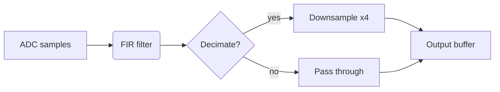

# rustlab-notebook

Render Markdown notebooks with executable rustlab code blocks into HTML
reports, LaTeX documents, PDFs, or GitHub-friendly Markdown with inline
SVG plots.

## Quick Start

```
rustlab notebook render analysis.md              # → analysis.html (default, dark theme)
rustlab notebook render analysis.md -t light     # → analysis.html (light theme)
rustlab notebook render analysis.md -f latex     # → analysis.tex + SVG plots
rustlab notebook render analysis.md -f pdf       # → analysis.pdf (requires pdflatex)
rustlab notebook render analysis.md -f markdown  # → analysis.md + analysis_plots/*.svg
rustlab notebook render analysis.md -f markdown --obsidian  # markdown + iframe to sibling .html (Obsidian)
rustlab notebook render analysis.md -o out.html  # explicit output path
```

The `markdown` output format is purpose-built for committing rendered
notebooks to a repo so they display with inline plots on GitHub — each
captured figure is written as SVG to `<stem>_plots/plot-N.svg` and
referenced inline. See
[`examples/notebooks/README.md`](../examples/notebooks/README.md) for the
source/rendered split design pattern.

### Obsidian integration (`--obsidian`)

Adding `--obsidian` to a `--format markdown` render appends a single HTML
`<iframe>` at the end of the `.md`, pointing at the sibling
`<stem>.html`. The intent is that you render both formats into the same
directory (as `make notebooks` already does), then point an Obsidian
vault at it: Obsidian renders the markdown + inline SVGs as usual, and
the trailing iframe gives you the interactive Plotly view inline.

```
rustlab notebook render notebooks/ -f html        # → <name>.html for each
rustlab notebook render notebooks/ -f markdown --obsidian  # → <name>.md with trailing iframe
```

The iframe is plain raw HTML embedded in markdown:

```html
<iframe src="<stem>.html" width="100%" height="600" style="border: 0;"></iframe>
```

GitHub strips iframes during sanitization, so the *same* `--obsidian`
output is also safe to commit and view on GitHub — the iframe simply
disappears, leaving the static SVG plots inline. There is no separate
"obsidian" output format; the flag is a small augmentation of the
existing `markdown` format, kept under a single name so future
Obsidian-targeted features (callout dialect, wikilinks, frontmatter)
can flow through the same flag.

The standalone `rustlab-notebook` binary accepts the same arguments:

```
rustlab-notebook render analysis.md -t light -f pdf
```

## Notebook Format

Notebooks are standard `.md` files. Any fenced code block tagged
`` ```rustlab `` is executed; everything else is rendered as prose.

````markdown
# My Analysis

Design a 64-tap lowpass filter with cutoff at $f_c = 3\,\text{kHz}$:

```rustlab
h = fir_lowpass(64, 3000, 16000, "hamming");
Hw = freqz(h, 512, 16000);
plot(Hw(1,:), 20*log10(abs(Hw(2,:))))
title("Magnitude Response")
xlabel("Frequency (Hz)")
ylabel("dB")
grid on
```

The passband ripple is well within spec.
````

### What gets rendered

Each code block produces up to three zones in the output:

1. **Source** — the rustlab code (syntax-highlighted in HTML)
2. **Text output** — anything the code prints (`disp()`, `ans =`, etc.)
3. **Plot** — interactive Plotly chart (HTML) or static SVG (LaTeX/PDF)

Errors are shown inline in red. Execution continues with subsequent blocks.

### Variable persistence

Variables persist across code blocks within a notebook. Define a signal
in one block, analyze it in the next:

````markdown
```rustlab
x = sin(2*pi*0.15*(0:1023)) + 0.3*randn(1024);
```

```rustlab
X = fft(x);
plot(abs(X(1:512)))
title("Spectrum")
```
````

### Formulas

Standard LaTeX math syntax works in prose. Inline: `$f_c$` renders as
$f_c$. Display math uses `$$...$$`:

```markdown
$$H(z) = \sum_{k=0}^{N-1} h[k]\,z^{-k}$$
```

In HTML output, formulas are rendered client-side by KaTeX. In LaTeX/PDF
output, they pass through as native LaTeX.

### Tables

Markdown tables render as styled HTML tables or LaTeX `tabular` with
booktabs:

```markdown
| Window      | Main Lobe Width | First Sidelobe |
|-------------|-----------------|----------------|
| Rectangular | $2/N$           | $-13$ dB       |
| Hann        | $4/N$           | $-31$ dB       |
```

### GFM-superset features

The renderer enables the GFM features that GitHub and Obsidian both
render natively, so the same source `.md` looks the same in all three
viewing surfaces.

**Footnotes:**

```markdown
Citation needed[^smith].

[^smith]: Smith et al., 2024.
```

**Task lists:**

```markdown
- [x] Filter design
- [ ] Spectral analysis
```

**Explicit heading IDs** — pin a stable anchor for cross-notebook links:

```markdown
# Filter Analysis {#filters}

See [the filters section](#filters).
```

**Strikethrough:**

```markdown
~~deprecated text~~
```

### Wikilinks and embeds

Obsidian-style `[[Note]]` wikilinks and `![[file]]` embeds are accepted
in source notebooks and transformed to standard markdown links and
images on the way out, so the committed `book/*.md` displays correctly
on GitHub (which would otherwise render `[[Note]]` as literal text).

| Source | Becomes (markdown output) | Becomes (HTML output) |
|---|---|---|
| `[[Foo]]` | `[Foo](Foo.md)` | `<a href="Foo.html">Foo</a>` |
| `[[Foo\|alias]]` | `[alias](Foo.md)` | `<a href="Foo.html">alias</a>` |
| `[[Foo#Section]]` | `[Foo § Section](Foo.md#section)` | `<a href="Foo.html#section">Foo § Section</a>` |
| `[[Foo#Section\|alias]]` | `[alias](Foo.md#section)` | `<a href="Foo.html#section">alias</a>` |
| `![[image.png]]` | `` | `` |
| `![[image.png\|alt]]` | `` | `` |

The target gets a `.md` extension when it has none (notebook reference);
paths that already include an extension (`[[diagram.svg]]`) pass through
verbatim. Anchor slugs use lowercase + non-alphanumeric→`-`, matching
how GitHub and pulldown-cmark generate heading IDs, so
`[[Foo#My Section]]` round-trips to the `#my-section` of the heading.

Wikilink syntax inside fenced code blocks (` ``` `) and inline code
spans (`` ` ``) is preserved verbatim — only narrative prose is
transformed.

## Directives

Directives are a `rustlab-notebook` feature, not standard Markdown. They
use HTML-comment syntax (`<!-- ... -->`) so the source `.md` file stays
portable — any CommonMark viewer (GitHub, VS Code preview, etc.) treats
them as invisible comments. Only `rustlab notebook render` interprets
them as instructions.

### `<!-- hide -->`

Place `<!-- hide -->` on the line immediately before a code block to
hide the source code in the rendered output. The block is still
executed — variables, plots, and text output all appear — but the code
itself is suppressed. Useful for setup code that would distract from
the narrative.

````markdown
<!-- hide -->
```rustlab
% Load data and define constants — reader doesn't need to see this
fs = 16000;
N = 1024;
x = randn(N);
```

The signal has been sampled at 16 kHz. Now we compute the spectrum:

```rustlab
X = fft(x);
plot(abs(X(1:N/2)))
title("Spectrum")
```
````

In the output, only the second block's source code is shown. The plot
from the hidden block (if any) still appears.

### `<!-- details: Title -->`

Wraps a code block's output (text, errors, and plots) in a collapsible
`<details>` disclosure widget with the given summary label. The source
code remains visible above the widget. Useful for long console output
or galleries of diagnostic plots that would otherwise dominate the page.

````markdown
<!-- details: Show sweep results -->
```rustlab
for k = 1:8
    plot(freqz(fir_lowpass(32*k, 3000, 16000)))
end
```
````

### `<!-- grid: N -->`

Arranges the block's plots into an `N`-column CSS grid instead of the
default single-column stack. `N` must be a positive integer. Only affects
layout of the plot zone — text output is unchanged.

````markdown
<!-- grid: 3 -->
```rustlab
figure; plot(x); title("Signal")
figure; plot(abs(fft(x))); title("Spectrum")
figure; plot(angle(fft(x))); title("Phase")
```
````

### Stacking code-block directives

`<!-- hide -->`, `<!-- details: ... -->`, and `<!-- grid: N -->` can all
be stacked on consecutive lines immediately before a ```rustlab fence.
Order within the stack does not matter.

````markdown
<!-- hide -->
<!-- grid: 2 -->
<!-- details: Gallery -->
```rustlab
figure; imagesc(A)
figure; imagesc(B)
```
````

### Mermaid diagrams: ```` ```mermaid ```` blocks

Fenced code blocks tagged `mermaid` are rendered as static SVG diagrams
in all output formats (HTML, Markdown, LaTeX, PDF). Rendering is pure
Rust via the `mermaid-rs-renderer` crate — no browser, no Node, no
internet dependency. Notebooks render offline out of the box.

````markdown

````

Stackable directives:

- `<!-- hide -->` — drop the diagram from output entirely.
- `<!-- details: Title -->` — wrap the diagram in a collapsible
  disclosure (HTML only; LaTeX gets a labelled paragraph).
- `<!-- caption: Text -->` — figure caption. In HTML appears as
  `<figcaption>`; in LaTeX as `\caption{...}` inside the float.

````markdown
<!-- caption: Filter pipeline -->

````

Markdown output emits the original ` ```mermaid ` fence verbatim, so
GitHub, Obsidian, and other Mermaid-aware viewers render the diagram
client-side from the same source.

**HTML output is static SVG**, not interactive. Mermaid.js's click /
zoom / pan are not available — pixel-identical to the LaTeX/PDF render
in exchange for offline rendering.

**Caching.** Each rendered diagram is hashed (BLAKE3) and cached under
`plots/<notebook>/.cache/`. Re-renders only redraw diagrams whose source
has changed. Delete `.cache/` to force a full rebuild.

**Disabling.** Build `rustlab-notebook` with `--no-default-features` to
drop the renderer (and its `resvg`/`usvg`/`fontdb` dep tree). Mermaid
blocks then emit verbatim source plus a one-time warning.

### Callouts: `> [!NOTE]` (preferred), `<!-- note -->` (legacy)

The renderer accepts the GitHub / Obsidian-native blockquote callout
syntax — both targets render it as a styled box natively, so the same
source displays correctly on GitHub, in Obsidian, and through rustlab.

```markdown
> [!NOTE]
> The window length must be a power of two for the radix-2 FFT path.

> [!TIP] Heads up
> Optional title after the type tag.

> [!IMPORTANT]
> Critical fact the reader must not miss.

> [!WARNING]
> `freqz` returns frequencies in Hz only when `fs` is supplied.

> [!CAUTION]
> Lossy operation — verify on a copy first.
```

Recognised types (case-insensitive): `NOTE`, `TIP`, `IMPORTANT`,
`WARNING`, `CAUTION`. Aliases: `INFO` → Note, `HINT` → Tip,
`DANGER` → Caution. The Obsidian-only `+` / `-` foldable suffix
(`> [!WARNING]+`) is parsed and silently consumed — every output
format renders the static box.

The body continues for as many contiguous `>` lines as follow; a blank
line ends the callout. Markdown inside the body (links, inline math,
emphasis) is rendered normally.

**Legacy syntax (still supported).** The original HTML-comment form
keeps working for backward compatibility:

```markdown
<!-- note -->
Single-paragraph callout, ends at blank line or heading.

<!-- tip -->
Or use an explicit closing tag for multi-paragraph bodies.
<!-- /tip -->
```

When the markdown emitter (`-f markdown`) re-renders a notebook, it
emits the GFM-native syntax regardless of which form the source used,
so legacy notebooks auto-migrate on the next render.

In HTML output, each callout renders as a titled box coloured by kind.
In LaTeX/PDF output, callouts render as labelled paragraphs.

### Exercises and solutions: `<!-- exercise -->`, `<!-- solution -->`

`<!-- exercise -->` on its own line begins a numbered exercise block.
Exercises are numbered automatically in document order (Exercise 1,
Exercise 2, ...). An optional `<!-- solution -->` tag inside an exercise
begins a collapsible "Show solution" section.

Blocks auto-close on the next `<!-- exercise -->` or at end of document,
so no explicit closing tag is required.

````markdown
<!-- exercise -->

Design a 32-tap Hamming-window lowpass filter with cutoff at 2 kHz.

<!-- solution -->

```rustlab
h = fir_lowpass(32, 2000, 16000, "hamming");
plot(freqz(h, 512, 16000))
```

<!-- exercise -->

Compare the main-lobe width against a rectangular window of equal length.
````

Solutions render as an HTML `<details>` widget (collapsed by default) so
readers can attempt the exercise before revealing the answer.

## Output Formats

### HTML (default)

Self-contained HTML with:
- Catppuccin dark theme (default) or light theme (`-t light`)
- Interactive Plotly charts (zoom, pan, hover) — chart colors match the theme
- KaTeX formula rendering
- Navigation sidebar from headings
- Syntax-highlighted code blocks (colors adapt to theme)
- Responsive layout (sidebar collapses on mobile)

### LaTeX (`--format latex`)

Produces a `.tex` file and a `plots/<name>/` directory of SVG images.

```
rustlab-notebook render analysis.md -f latex
# → analysis.tex
# → plots/analysis/plot-1.svg, plot-2.svg, ...
```

The `.tex` file uses `article` class with `amsmath`, `booktabs`,
`graphicx`, `svg`, `xcolor`, and `hyperref`. Formulas render natively.
Compile with any LaTeX engine that supports `\includesvg` (e.g.,
lualatex with inkscape, or pdflatex with the svg package).

With `-t light` (default), the output is standard black-on-white LaTeX.
With `-t dark`, the document uses `pagecolor` for a dark background with
light text, matching the Catppuccin Mocha palette.

### PDF (`--format pdf`)

Generates LaTeX then compiles to PDF. Requires `pdflatex` or `tectonic`
in PATH.

```
rustlab-notebook render analysis.md -f pdf
# → analysis.pdf   (single file — intermediates compile in a temp dir)
```

The `.tex` source and SVG plots used during compilation live in a
temporary directory that is deleted on completion, so the only artifact
left behind is the requested `.pdf`. If the build fails, the LaTeX log
is preserved next to the requested PDF path as `<stem>.log` so the
failure is debuggable.

### Plot output layout

Markdown and LaTeX share one rule: plots are written under
`<output-dir>/plots/<stem>/` and referenced from the rendered document
as `plots/<stem>/plot-N.{svg}`. A directory of rendered notebooks
therefore contributes one document file plus one subdirectory under a
single `plots/` umbrella, instead of N siblings of the form
`<stem>_plots/`. HTML embeds plots inline (no on-disk dir), and PDF is
self-contained for the same reason.

Internally, both renderers take two arguments to support this:

- `plot_dir: &Path` — where to write the SVGs on disk
- `plot_href_prefix: &str` — what relative path to embed in the rendered
  document (markdown `` and LaTeX `\includesvg{…}`)

Splitting "where the bytes go" from "what the document references" is
what lets the on-disk layout be reorganised without touching the
emitter. New output formats that include external plot files should
follow the same shape.

## Frontmatter

Optional YAML frontmatter is parsed before rendering. Two keys are
recognised; unknown keys are ignored silently so the block is safe to
use for arbitrary metadata.

```markdown
---
title: Filter Analysis
order: 2
author: Jane Doe      # ignored (unknown key)
---

# Filter Analysis
...
```

- `title:` — used as the HTML page title and as the entry label on the
  directory index page. Overrides the `# H1` fallback.
- `order:` (alias `weight:`) — signed integer that sorts entries on the
  directory index page, ascending. Ties break by filename. Entries
  without `order` sort after entries that have one.
- Quoted values (single or double) are unwrapped.

## Project Layout

A typical analysis project:

```
my-project/
  config.toml              # parameters
  data/
    measurements.csv
  notebooks/
    overview.md            # narrative + code + plots
    filter_design.md
    validation.md
  scripts/
    preprocess.rlab           # standalone rustlab scripts
```

## Multi-Notebook Rendering

Render an entire directory of notebooks at once:

```
rustlab notebook render notebooks/                # → *.html + index.html (dark)
rustlab notebook render notebooks/ -t light       # → *.html + index.html (light)
rustlab notebook render notebooks/ -f pdf         # → *.pdf
rustlab notebook render notebooks/ --title "Lab"  # custom index page title
```

This produces one output file per `.md` file plus an `index.html` linking
to all notebooks (HTML format only). Each notebook gets its own independent
evaluator — variables do not leak between notebooks.

### Index page

The auto-generated `index.html` can be customised three ways (first match
wins):

1. `--title <STRING>` — CLI override (directory mode only).
2. `index.md` in the directory — its H1 (or frontmatter `title:`) becomes
   the index page title, and its markdown body is rendered as an intro
   above the list of notebooks. `index.md` itself is excluded from the
   list. Code fences in `index.md` are **not executed** — keep executable
   content in regular notebooks and link to them.
3. Parent directory name — fallback when neither of the above is set.

Entries are sorted by frontmatter `order:` ascending (see Frontmatter
above), with filename as a tiebreaker.

### Cross-notebook links

Links to other `.md` files are automatically rewritten to `.html` in
the rendered output:

```markdown
See [Filter Design](filter_design.md) for details.
```

becomes `<a href="filter_design.html">` in the HTML output.

### Page navigation

When rendering a directory, each notebook page drops the sidebar and gets
two lightweight navigation aids instead:

- A **sticky breadcrumb** at the top: `← Index / <Page Title>`.
- A **Previous · Index · Next** bar at the bottom of the page, wired
  to the adjacent notebooks in sort order. The first notebook has no
  "Previous" link; the last has no "Next" link.

Single-file renders (`rustlab notebook render file.md`) keep the classic
sidebar layout with an in-page TOC — there's no sibling set to navigate.

## Template Interpolation

Embed computed values in markdown prose using `${expr}` syntax:

```markdown
```rustlab
n = 1024;
fs = 16000;
```

This analysis uses **${n}** samples at ${fs} Hz,
giving a duration of ${n / fs:%.3f} seconds.
```

Expressions are evaluated against the shared notebook environment, so
any variable defined in a prior code block is available.

### Syntax reference

| Pattern | Meaning |
|---|---|
| `${expr}` | Evaluate `expr`, insert value as plain text. |
| `${expr:format}` | Same, then apply `sprintf` (e.g. `%,.2f`, `%.3e`). |
| `${expr}$` | **Math-wrap shorthand** when in plain text — emits `$<value>$` so the value renders as inline math. |
| `$X = ${expr}$` | Inside an open `$...$` math span, `${expr}` is emitted bare and the trailing `$` closes the span — output: `$X = <value>$`. |
| `\${...}` | Literal `${...}` (escapes interpolation). |
| `\$` | Literal `$` for currency. Does *not* toggle the inline-math tracker, so `\$5 plus ${tax}$ tax` correctly renders the second `$...$` as math. |
| `$$display$$` | Display math passes through verbatim and does not affect the inline-math tracker. |

### Authoring guidance for math-heavy notebooks

The renderer aims to produce markdown that displays correctly on **both**
GitHub (KaTeX) and Obsidian (MathJax). A few conventions help:

- **Inside markdown tables, replace raw `|` in math with `\lvert ... \rvert`.**
  Raw `|` in a table cell — even inside `$...$` — terminates the cell on
  GitHub. `\lvert x \rvert` renders identically (proper absolute-value
  bars) and survives table parsing. Same for `\lVert x \rVert` for norms.
- **Use `\$` for currency** (`\$5`, `\$1,200`). Both GitHub and Obsidian
  honor the markdown escape; the rustlab interpolator passes it through
  without toggling math state.
- **Don't mix interpolation with currency in the same input** unless you
  use `\$` — bare `$` toggles the math tracker.
- **Display math `$$...$$` should be on its own paragraph line** so all
  three renderers (GitHub, Obsidian, KaTeX) recognise it as a block.

## String Arrays

String arrays use brace syntax and enable categorical bar chart labels:

````markdown
```rustlab
months = {"Jan", "Feb", "Mar"};
sales = [120, 95, 140];
bar(months, sales, "Monthly Sales")
```

Total sales: ${sum(sales):%,.0f} units.
````

See `docs/functions.md` → Cell Arrays for full reference.

## Examples

See `examples/notebooks/` for working examples:

- **quick_look.md** — minimal one-block notebook (random signal + plot)
- **filter_analysis.md** — FIR filter design with frequency response plots
- **spectral_estimation.md** — periodogram vs. windowed PSD, tables, display math
- **template_interpolation.md** — embedding computed values with `${expr}` and format specs
- **string_arrays.md** — string arrays, categorical bar charts, `iscell()`
- **multi_notebook.md** — directory rendering and cross-notebook links
