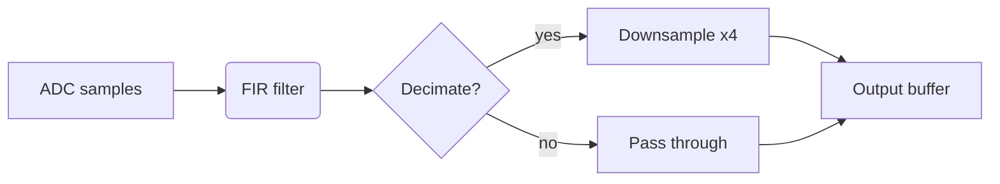
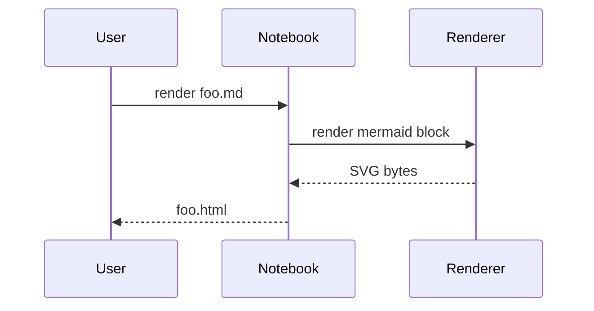
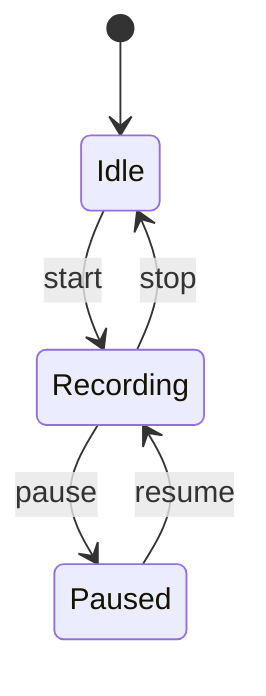
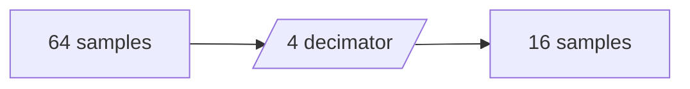

# Mermaid Diagrams

Pure-Rust Mermaid rendering. Diagrams are rendered server-side to SVG —
HTML embeds inline, LaTeX/PDF reference an SVG file, Markdown emits the
verbatim ` ```mermaid ` fence so GitHub and Obsidian render it
themselves.

## Flowchart

A simple signal-processing pipeline:

<!-- caption: ADC → FIR → decimator → buffer -->


## Sequence diagram



## Collapsible diagram

The next diagram lives behind a disclosure widget:

<!-- details: State machine -->


## Inline rustlab + diagram

Code blocks and diagrams compose:

```rustlab
N = 64;
M = N / 4;
print("Decimation: ${N} samples → ${M} samples")
```


