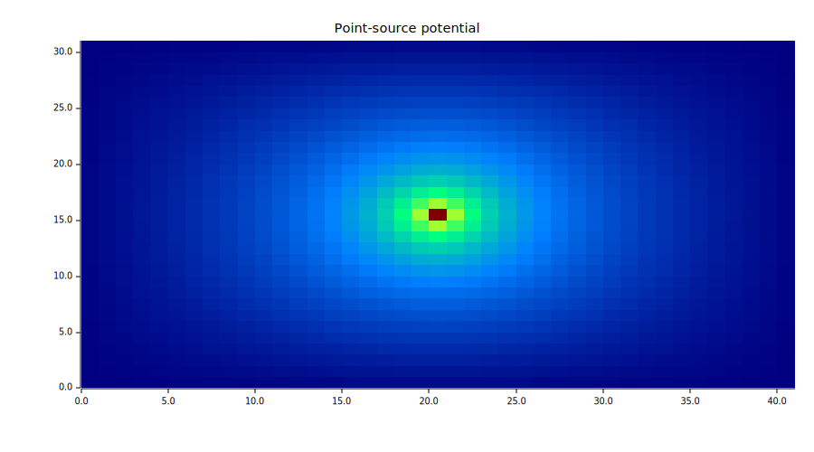

<!-- Generated by rustlab-notebook — do not edit directly. -->

# The Sparse Laplacian

The 5-point Laplacian stencil is the single most-reused object in numerical
PDE work. `laplacian_2d(nx, ny [, dx, dy])` returns the sparse matrix $L$
such that $LV \approx \nabla^2 V$ on a uniform grid with homogeneous
Dirichlet boundary conditions. Pair it with `spsolve` and you have Poisson
solvers, Laplace BVPs, eigenmode problems, and anything else built on the
discrete Laplacian.

## Building the stencil

```rustlab
nx = 5; ny = 4;
L = laplacian_2d(nx, ny);
print(issparse(L))
print(nnz(L))
```

```text
1
82
```

The returned $L$ is `(nx·ny) × (nx·ny)` sparse. For the 5×4 grid above,
that's 20×20 with 5 non-zeros per interior row (self + 4 neighbours) and
fewer on the boundary rows — the stencil simply drops cross-boundary
entries, which is equivalent to assuming $V = 0$ outside the grid.

## The column-major convention

The single most error-prone detail in any sparse Laplacian: which way do
you flatten $V_{ij}$ into a long vector? rustlab uses **column-major**
(Octave convention):

$$V(i, j) \to k = (j-1) \cdot n_y + i \quad (\text{1-based})$$

so `V(:)` walks down the first column, then the second, and so on. This
composes naturally with `reshape` — the two operations are inverses of
each other when applied to a `(ny, nx)` grid:

```
V_grid = reshape(v_flat, ny, nx)   % flat → 2-D, column-major
v_flat = V_grid(:)'                % 2-D → flat (row), then transpose to column
```

`V(:)` returns a **row** vector in rustlab; the trailing `'` (transpose)
turns it into the column vector that `spsolve` and matrix-vector products
expect.

## Index sugar — `ij2k` and `k2ij`

`ij2k(i, j, ny)` and `k2ij(k, ny)` give you the conversion without
reshape. Note the third argument is **`ny`** — the row count — not `nx`.
That's the usual footgun when porting code from a row-major convention.

```rustlab
ny = 6;
k = ij2k(3, 4, ny)
[i, j] = k2ij(k, ny)
```

## Solving Poisson with a known analytic solution

A Dirichlet sine eigenfunction is the cleanest test because it's an exact
eigenfunction of the discrete Laplacian on our grid:

```rustlab
nx = 33; ny = 25;
dx = 0.1;  dy = 0.1;
L = laplacian_2d(nx, ny, dx, dy);
Lx = (nx + 1) * dx;
Ly = (ny + 1) * dy;

V_exact = zeros(ny, nx);
for jj = 1:nx
  for ii = 1:ny
    V_exact(ii, jj) = sin(pi*ii*dx/Lx) * sin(pi*jj*dy/Ly);
  end
end
v_exact = V_exact(:)';

% Apply L to v_exact, then solve — should recover v_exact to 1e-10.
rhs = full(L) * v_exact;
v_solved = spsolve(L, rhs);
rel_err = norm(v_solved' - v_exact) / norm(v_exact);
print(rel_err)
```

```text
0.0000000000000015586270713641888
```

You should see a residual on the order of `1e-15` — machine precision.

## A point-source Poisson solve

`L` approximates $+\nabla^2$, so Poisson $\nabla^2 V = -\rho/\varepsilon_0$
solves as `V = spsolve(L, -rho/eps0)`. Put a unit charge at the grid
centre and visualise the resulting potential:

```rustlab
nx = 41; ny = 31;
L = laplacian_2d(nx, ny);

rho = zeros(ny, nx);
rho(round(ny/2), round(nx/2)) = 1.0;

V_flat = spsolve(L, -rho(:)');
V = reshape(V_flat, ny, nx);

imagesc(V, "jet")
title("Point-source potential")
xlabel("j"); ylabel("i")
```



The monotone decay away from the central cell is the discrete Green's
function — the same shape you'd see from a point charge in 2-D.

## Cheat sheet

| Form                                   | Returns         | Notes                                             |
|----------------------------------------|-----------------|---------------------------------------------------|
| `laplacian_2d(nx, ny)`                 | `SparseMatrix`  | `dx = dy = 1`                                     |
| `laplacian_2d(nx, ny, dx, dy)`         | `SparseMatrix`  | Uniform anisotropic spacing                       |
| `ij2k(i, j, ny)`                       | `Scalar`        | Third arg is **ny**, not nx                       |
| `k2ij(k, ny)`                          | `[i, j]` tuple  | Destructurable                                    |

**Sign:** `L ≈ +∇²`. For Poisson $\nabla^2 V = f$, solve as
`V = spsolve(L, f_flat)`; for the physics convention
$\nabla^2 V = -\rho/\varepsilon_0$, use
`V = spsolve(L, -rho(:)' / eps0)`.

**Boundary:** homogeneous Dirichlet (`V = 0` outside the grid). Neumann
and periodic BCs are not supported in v1 — encode non-zero Dirichlet
values in the right-hand side, or build a custom stencil via `spdiags` /
`sparse(I, J, V, ...)`.

**Ordering:** column-major `(j-1)*ny + i` everywhere. The third argument
of `ij2k` / `k2ij` is `ny`.

