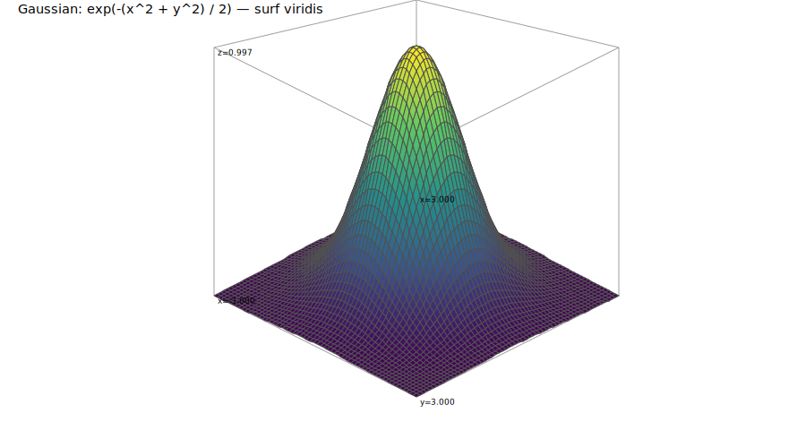
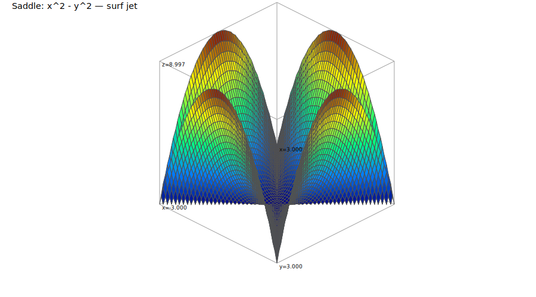
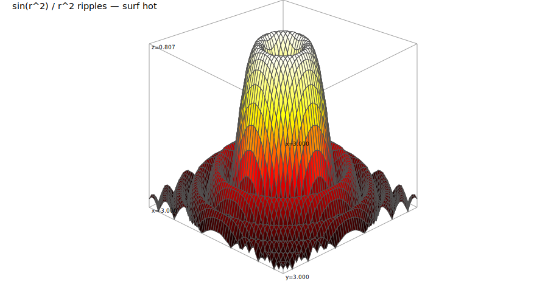
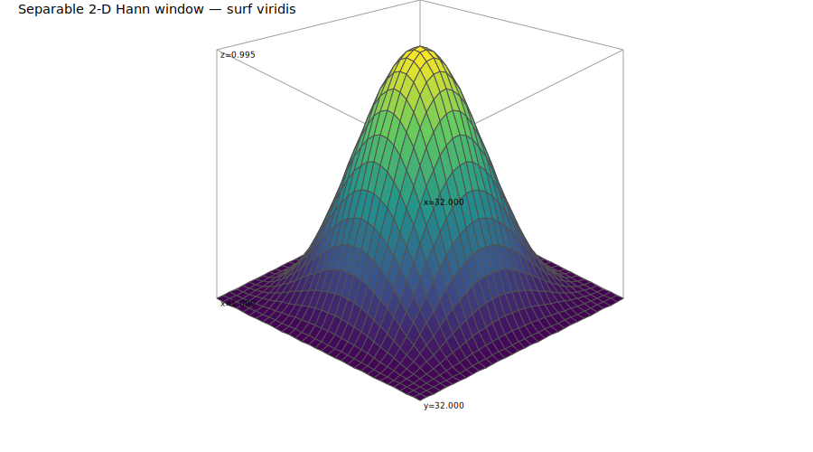

<!-- Generated by rustlab-notebook — do not edit directly. -->

# Surface Plots

Three-dimensional surface visualisation with `meshgrid` and `surf`. The
notebook renderer emits Plotly 3D surfaces into the HTML output, so every
figure below is fully draggable in the browser.

## Grid construction with meshgrid

`meshgrid(x, y)` returns two matrices, `X` and `Y`, whose elements are the
x- and y-coordinates of every point on an evaluation grid. Shape is
$\text{length}(y) \times \text{length}(x)$ — so `X`, `Y`, and any
$Z = f(X, Y)$ all share the same dimensions:

```rustlab
x = linspace(-3, 3, 60);
y = linspace(-3, 3, 60);
[X, Y] = meshgrid(x, y);
print(size(X))     % → [60, 60]
```

```text
[1×2]  60.000000  60.000000
```

## A Gaussian bump

The simplest surface: $Z = e^{-(x^2 + y^2) / 2}$. Radial, smooth, and
useful for visualising how `surf` colours the height value:

$$Z = e^{-\tfrac{x^2 + y^2}{2}}$$

```rustlab
Z = exp(-(X.^2 + Y.^2) / 2.0);
surf(X, Y, Z)
title("Gaussian: exp(-(x^2 + y^2) / 2)")
xlabel("x"); ylabel("y")
```



In the terminal this falls back to a heatmap of $Z$; in HTML (and in the
rendered notebook) you get an interactive 3D surface.

## A saddle

The hyperbolic paraboloid $Z = x^2 - y^2$ has a saddle point at the origin —
curving up along one axis and down along the other:

$$Z = x^2 - y^2$$

```rustlab
Zs = X.^2 - Y.^2;
surf(X, Y, Zs, "jet")
title("Saddle: x^2 - y^2")
xlabel("x"); ylabel("y")
```



`surf(X, Y, Z, "jet")` overrides the default `"viridis"` colormap. The full
set is `"viridis"`, `"jet"`, `"hot"`, `"gray"`.

## Radial ripples

A classic test surface — rapidly-varying away from the origin:

$$Z = \frac{\sin(x^2 + y^2)}{x^2 + y^2 + \tfrac{1}{10}}$$

```rustlab
Zr = sin(X.^2 + Y.^2) ./ (X.^2 + Y.^2 + 0.1);
surf(X, Y, Zr, "hot")
title("sin(r^2) / r^2 ripples")
xlabel("x"); ylabel("y")
```



## surf(Z) — matrices as surfaces

When the grid itself is the thing you want to visualise, `surf(Z)` accepts
just a matrix; the axes default to `1..ncols` and `1..nrows`. Useful for
looking at 2-D kernels, spectrogram slices, or covariance matrices:

```rustlab
W = outer(window("hann", 32), window("hann", 32));
surf(W)                      % 1-arg form: axes default to 1..ncols, 1..nrows
title("Separable 2-D Hann window")
```



The 1-arg `surf(Z)` form is the right call here: `outer(hann, hann)` starts
its first row and column with zeros (because `hann[0] = 0`), so passing
`W` as the X, Y, *and* Z arguments — `surf(W, W, W)` — would extract those
zero-valued first row/column as the coordinate axes and collapse the
surface to a single point. When the matrix itself *is* the data and you
just want index axes, use `surf(Z)`.

## Why meshgrid matters

Element-wise ops on `X` and `Y` let you express `Z = f(X, Y)` directly —
no nested loops. Everything you'd write in a scalar `f(x, y)` works on
the full grid:

| Scalar form | Grid form |
|-------------|-----------|
| `sqrt(x^2 + y^2)` | `sqrt(X.^2 + Y.^2)` |
| `atan2(y, x)`     | `atan2(Y, X)`       |
| `exp(-x^2) * cos(y)` | `exp(-X.^2) .* cos(Y)` |

Under the hood this is the same vectorisation that makes Octave and NumPy
fast for array workloads — and it's how `surf` expects its arguments.

