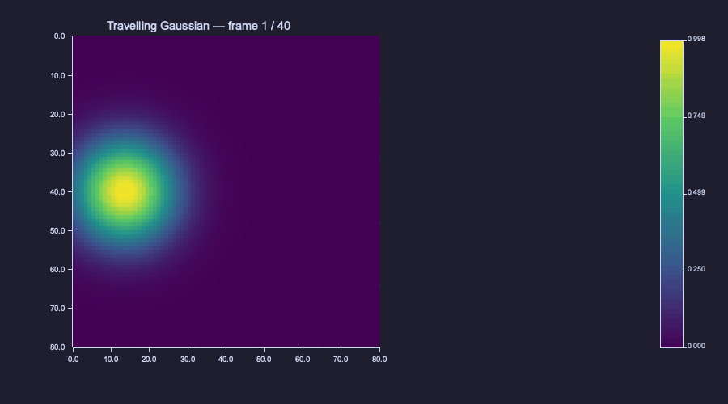

<!-- Generated by rustlab-notebook — do not edit directly. -->

# Multi-Frame Animation with `frame()` and `saveanim()`

A single SVG snapshot can show one moment of a time-evolving simulation —
but FDTD wave propagation, scattering, and dispersion only read as a
movie. `frame()` and `saveanim()` are the smallest viable API for capturing
a sequence of figure snapshots and flushing them as a single artefact:
either a self-contained **Plotly HTML** animation (interactive zoom + play
/ pause + slider) or an **animated GIF** (portable, embeds in markdown
and PDFs natively).

The output format is picked by the path extension `saveanim()` is called
with: `.html` / `.htm` for Plotly, `.gif` for GIF. Both views appear inline
in the HTML version of this notebook; the committed Markdown view embeds
the GIF directly (GitHub renders animated GIFs in ``) and replaces
the Plotly animation with a placeholder note (the multi-MB Plotly bundle
is too bulky to commit, and GitHub strips iframes anyway).

## The pattern

`frame()` clones the current figure into a per-thread buffer, then strips
trace data so the next loop iteration starts on a clean canvas. Subplot
layout, axis labels, titles, axis limits, hold state, and grid setting are
preserved across the call — only the trace data (`series`, `heatmap`,
`surface`, `contours`, `quivers`, `streamlines`) is wiped. `saveanim(path,
fps)` flushes the buffer.

### Plotly HTML output

```rustlab
[X, Y] = meshgrid(linspace(-3, 3, 80), linspace(-3, 3, 80));

figure()
n_frames = 40;
for k = 1:n_frames
  c = -2 + 4 * (k - 1) / (n_frames - 1);
  Z = exp(-((X - c).^2 + Y.^2));
  imagesc(Z, "viridis")
  title(sprintf("Travelling Gaussian — frame %d / %d", k, n_frames))
  frame()
end
saveanim("wave.html", 30)
```

<!-- rustlab:output-start -->
```text
2
```

> ▶ **Animation: 40 frames at 30 fps** — open the HTML version of this notebook to view.

<!-- rustlab:output-end -->

### Same loop, animated GIF

```rustlab
figure()
for k = 1:n_frames
  c = -2 + 4 * (k - 1) / (n_frames - 1);
  Z = exp(-((X - c).^2 + Y.^2));
  imagesc(Z, "viridis")
  title(sprintf("Travelling Gaussian — frame %d / %d", k, n_frames))
  frame()
end
saveanim("wave.gif", 30)
```

<!-- rustlab:output-start -->
```text
3
```



<!-- rustlab:output-end -->

The path argument to `saveanim` is **ignored when the script is rendered
inside a notebook** — the notebook renderer captures the frame buffer and
writes the artefact under the gallery's plot directory using the path
extension to pick the format. When you run the same script standalone
(`rustlab run examples/plot/animation_wave.rlab`), the path is honoured.

## Title placement

`imagesc()` clears the subplot title at hold-off — same as every other
plotting builtin. To get a per-frame title, set it **after** `imagesc()`:

```rustlab
figure()
[X, Y] = meshgrid(linspace(0, 1, 60), linspace(0, 1, 60));
omega = 2 * pi;
for k = 1:24
  t = (k - 1) / 24;
  Z = sin(omega * (X - t)) .* cos(omega * Y);
  imagesc(Z, "viridis")            % first
  title(sprintf("t = %.2f", t))    % then title
  frame()
end
saveanim("standing_wave.html", 24)
```

<!-- rustlab:output-start -->
```text
4
```

> ▶ **Animation: 24 frames at 24 fps** — open the HTML version of this notebook to view.

<!-- rustlab:output-end -->

## Why `frame()` clears traces

If `frame()` left the previous heatmap on the figure, the next iteration's
`imagesc()` (with `hold` off — the default) would clear it anyway, but the
intermediate state would briefly hold both. By stripping trace data inside
`frame()` we make the loop deterministic: every iteration starts in a
known-empty canvas, decorations and limits intact.

If you genuinely want overlay-style animation (e.g. tracing a streamline
that grows over time), call `hold("on")` once before the loop and skip the
implicit clear by setting `hold("on")` again at the top of every
iteration.

## Memory budget

`frame()` clones the full `FigureState` — every plotted vector, every
heatmap matrix. Back-of-the-envelope:

- 100 × 100 heatmap = 80 KB per frame
- 120 frames ≈ 10 MB resident before flush
- 200 × 200 heatmap × 500 frames ≈ 160 MB resident — Plotly handles it,
  but the browser JS heap on load is the practical bottleneck

For curriculum-scale demos (~100 × 100 grids, 30–120 frames) the resident
set stays well under 50 MB. If you hit a memory wall, reduce frame count
or drop the grid resolution before increasing it; delta-only frame
emission is a documented follow-up that would help.

## What's not supported

- **MP4 export.** Pure-Rust H.264 encoders are scarce and the cleanest
  path is shelling out to `ffmpeg`, which violates the workspace's pure-
  Rust + zero-FFI policy. For shareable video, render to GIF and convert
  externally if needed.
- **Animated SVG / APNG.** SVG animation via SMIL is browser-deprecated;
  CSS-keyframed `<g>` toggling is fragile across viewers; APNG support
  is uneven. GIF and HTML cover the use cases.
- **Subplot grids that change frame-to-frame.** Plotly cannot animate a
  grid whose subplot count changes mid-animation, and the GIF encoder
  errors out if frame canvas size differs. The first frame's layout is
  canonical.
- **Per-frame delta emission.** v1 emits the full trace set per frame,
  which keeps the renderer simple but inflates Plotly bundle size for
  large heatmap animations. Delta-only frame emission is a documented
  follow-up.

## Standalone script

A standalone version of the wave demo (no notebook prose, just the
script) lives at `examples/plot/animation_wave.rlab`. Run with:

```sh
cargo run --release -p rustlab-cli -- run examples/plot/animation_wave.rlab
```

It writes both `gallery/animation_wave.html` (gitignored — open locally)
and `gallery/animation_wave.gif` (committed — viewable on GitHub).
