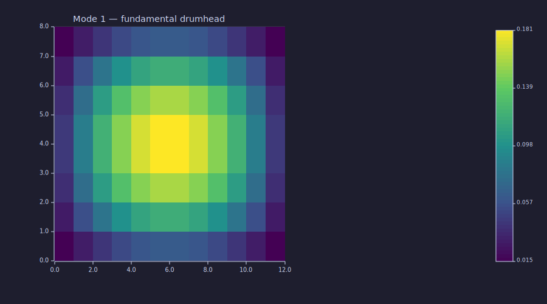
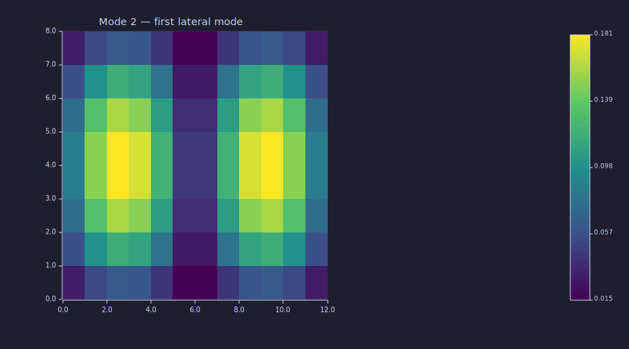
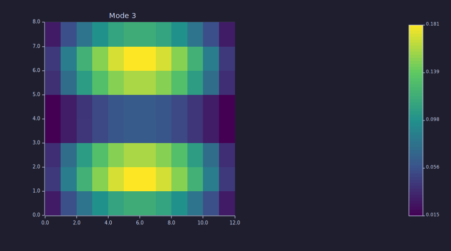

<!-- Generated by rustlab-notebook — do not edit directly. -->

# Sparse Eigensolves — `eigs`

For curriculum-scale problems, the dense `eig` builtin scales as
$O(N^3)$ in time and $O(N^2)$ in memory — fine on small matrices but
prohibitive on a Lesson-12-style 200×200 cavity (40 000 unknowns where
the dense matrix alone is 25 GB). The sparse partial eigensolver
`eigs` returns just the `n` eigenpairs of interest while keeping the
matrix sparse end to end.

This notebook walks through Laplacian eigenmodes — the canonical use
case for `eigs` — and shows the smallest-vs-largest selector and the
generalized form `A x = λ B x`.

## A Hermitian-positive-definite operator

```rustlab
clf
nx = 12; ny = 8;
dx = 0.05; dy = 0.05;
L = -1 * laplacian_2d(nx, ny, dx, dy);    % SPD form: -∇²
n = nx * ny;
print(issparse(L))     % → 1
print(n)               % → 96
```

```text
1
96
```

`L` is the negated 5-point Laplacian on a 12×8 grid. The grid is non-
square on purpose — square grids have multiplicity-2 eigenvalue
degeneracies that simple Lanczos can't enumerate without restart.

## Smallest eigenmodes — `eigs(L, n, "sm")`

The four smallest eigenvalues are the four lowest "drumhead modes" of
the grid. With Dirichlet boundaries and unit spacing, the analytic
eigenvalues are

$$\lambda_{m,n} = \frac{2}{dx^2}\bigl(1 - \cos\tfrac{m\pi}{n_x + 1}\bigr) + \frac{2}{dy^2}\bigl(1 - \cos\tfrac{n\pi}{n_y + 1}\bigr).$$

The smallest is at $(m, n) = (1, 1)$.

```rustlab
[V, D] = eigs(L, 4, "sm");
print(length(D))      % → 4
print(D)              % four smallest eigenvalues, sorted by |λ|
```

```text
4
[1×4]  71.492449  139.881083  210.411322  249.661367
```

`V` is a `n_rows × n` dense matrix; column `k` is the eigenvector for
`D(k)`. The eigenvectors are stored in the column-major flat-index
ordering `k = (j-1)·ny + i` — same as `laplacian_2d`, `reshape`, etc.

## Visualising the eigenmodes

Reshape each eigenvector back to the `(ny, nx)` grid and plot:

```rustlab
clf
mode1 = real(V(:, 1));
M1 = reshape(mode1, ny, nx);
imagesc(M1);
title("Mode 1 — fundamental drumhead");
```



The fundamental mode `(1, 1)` is positive everywhere with a single
maximum near the centre — the lowest-frequency standing wave that
satisfies Dirichlet boundaries.

```rustlab
clf
mode2 = real(V(:, 2));
M2 = reshape(mode2, ny, nx);
imagesc(M2);
title("Mode 2 — first lateral mode");
```



The second mode has one nodal line; with the 12×8 grid asymmetry, that
line is along the longer (x) axis.

```rustlab
clf
mode3 = real(V(:, 3));
M3 = reshape(mode3, ny, nx);
imagesc(M3);
title("Mode 3");
```



## Largest-magnitude eigenmodes — `"lm"`

Switching the selector reaches the high end of the spectrum:

```rustlab
[Vlm, Dlm] = eigs(L, 1, "lm");
print(Dlm(1))     % largest eigenvalue
```

```text
3128.5075505695595
```

For grid Laplacians, the largest eigenvalue lives at $(m, n) =
(n_x, n_y)$ — the highest-frequency standing wave that fits on the
grid before aliasing.

## Generalized eigenproblem — `eigs(A, B, n)`

For two symmetric matrices `A` and `B` with `B` Hermitian
positive-definite, the generalized problem $A x = \lambda B x$ shows
up routinely in physics — most commonly in finite-element / finite-
volume vibration and waveguide problems where `B` is a mass matrix.

`eigs(A, B, n[, which])` reduces to a standard problem internally via
the `SparseChol` factor of `B` and routes through Arnoldi. The
eigenvalues are real because the operator $B^{-1}A$ is similar to a
symmetric matrix.

```rustlab
B = 2 * speye(n);          % B = 2I — eigenvalues should be eigs(A)/2
[Vg, Dg] = eigs(L, B, 1, "sm");
print(Dg(1))               % smallest λ ≈ smallest eigs(L) / 2
```

```text
69.94033793580886
```

In a Lesson-12 cavity-mode problem, `B` would be the mass matrix from
the FEM assembly and `A` the stiffness matrix. The smallest few
generalized eigenvalues are the cavity's resonance frequencies.

## Defaults and convergence

The default Krylov dimension is `min(n_rows, max(6n+10, 40))`. Lanczos
with full reorthogonalization typically resolves the smallest few
eigenvalues to high accuracy at this dimension. If you have closely-
spaced eigenvalues (say a near-degenerate problem) and convergence
appears poor, the next planned enhancements are:

- **Implicit restart** (IRAM) — restart Arnoldi/Lanczos with a
  smaller basis after the unwanted eigenvalues are filtered out.
- **Shift-invert** — solve $(A - \sigma I)^{-1} v$ as the matvec,
  which converts "smallest" to "largest" and accelerates convergence
  by a factor of the spectral gap. Leverages the existing
  `SparseLU::factor` from `sparse_solve`.

Both are deferred to a follow-up cycle; see
`dev/plans/em_requests_queue.md` for the queue.

## Cheat sheet

| Form                                       | What it does                                       |
|-------------------------------------------|---------------------------------------------------|
| `e = eig(A)`                                | dense, all eigenvalues (column vector)            |
| `[V, D] = eig(A)`                           | dense, all eigenpairs; `D` is a diagonal matrix   |
| `e = eig(A, B)`                             | dense generalized `A·v = λ·B·v` (B invertible)    |
| `[V, D] = eig(A, B)`                        | dense generalized eigenpairs                      |
| `eig(A, "vector")` / `eig(A, "matrix")`     | output-form flag: force `D` to a column vector or a diagonal matrix regardless of nargout |
| `[V, D] = eigs(A, n)`                       | sparse, n smallest (default)                      |
| `[V, D] = eigs(A, n, "sm")`                 | same                                              |
| `[V, D] = eigs(A, n, "lm")`                 | sparse, n largest                                 |
| `[V, D] = eigs(A, B, n)`                    | sparse generalized (B SPD), smallest              |
| `[V, D] = eigs(A, B, n, "lm")`              | sparse generalized, largest                       |

The sparse forms (`eigs`) require both `A` and `B` to be sparse — call
`sparse(A)` first if you have a dense matrix. The dense form (`eig`)
works directly on `Value::Matrix` inputs and returns *all* eigenpairs.

## Background — why hand-rolled

Per project policy (`AGENTS.md` Rule 9), core numerical algorithms in
rustlab are written in pure Rust without large library dependencies.
This implementation is:

- Symmetric Lanczos with full reorthogonalization (Saad,
  *Numerical Methods for Large Eigenvalue Problems*, ch. 6).
- Arnoldi for general matrices (Saad ch. 8).
- Small dense symmetric subproblem via cyclic Jacobi.
- Small dense Hessenberg subproblem via shifted QR + inverse iteration
  for eigenvectors.

No `arpack-ng-sys`, no Fortran FFI, no large library dependency.

