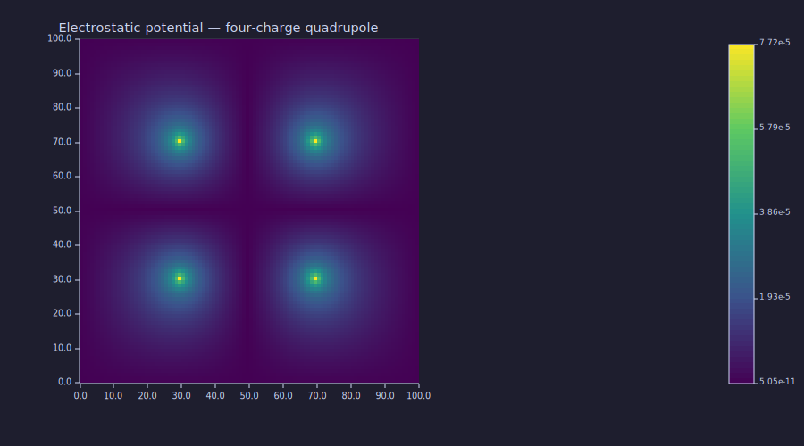
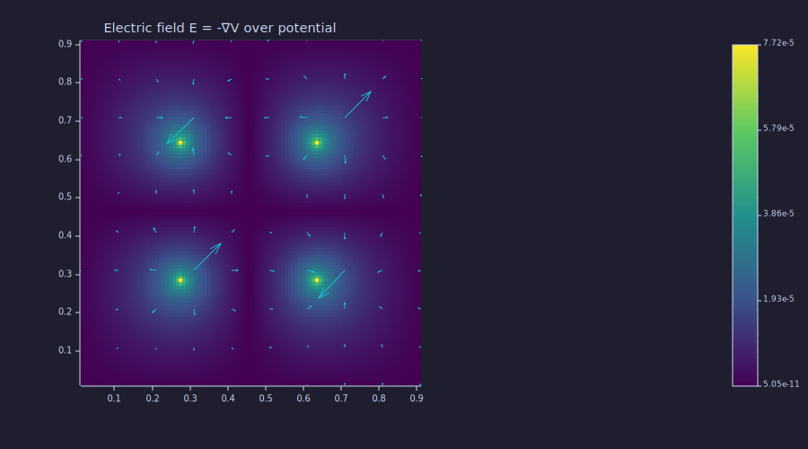

<!-- Generated by rustlab-notebook — do not edit directly. -->

# Electrostatics — Multi-Source Poisson at Scale

A point charge in a grounded box generates a potential that satisfies
Poisson's equation,

$$-\nabla^2 V = \rho/\varepsilon_0,$$

with $V = 0$ on the boundary. Discretized on a uniform grid, this
becomes a linear system $A v = b$ where $A$ is the negated 5-point
Laplacian. The matrix is symmetric positive-definite, so `spsolve`
auto-picks the sparse Cholesky path — and the system stays sparse end
to end, factoring in well under a second on a 100×100 grid.

This notebook walks through a four-source quadrupole on the same grid.

## Building the operator

```rustlab
clf
nx = 100; ny = 100;
dx = 0.01; dy = 0.01;
L  = laplacian_2d(nx, ny, dx, dy);
A  = -1 * L;             % SPD
n  = nx * ny;
print(issparse(A))       % → 1
print(nnz(A))            % → ~50k after Dirichlet boundary trims
```

```text
1
49600
```

`A` has 10 000 unknowns and tens of thousands of non-zeros — a 0.05 %
density. Densified, it would allocate roughly 800 MB. Sparse
factorization keeps the working set well under 50 MB.

## A four-charge quadrupole

Place two positive and two negative point charges symmetric about the
grid center. Charges live on the `(ny, nx)` grid; flatten column-major
(matching `laplacian_2d`'s indexing convention) for the linear solve.

```rustlab
rho = zeros(ny, nx);
rho(30, 30) =  1.0;
rho(30, 70) = -1.0;
rho(70, 30) = -1.0;
rho(70, 70) =  1.0;
b = rho(:)';
```

## The solve — `spsolve` auto picks Cholesky

```rustlab
v = spsolve(A, b);     % auto detects SPD, runs sparse Cholesky
V = reshape(v, ny, nx);
print(size(V))         % → [100, 100]
```

```text
[1×2]  100.000000  100.000000
```

The dispatch goes `auto → SPD detected (Hermitian, positive diagonals)
→ sparse Cholesky factorization with AMD ordering → forward + backward
substitution`. No densification anywhere in the chain. On a quiet
machine the factor + solve together take well under one second.

## Visualising the potential

```rustlab
clf
imagesc(V);
title("Electrostatic potential — four-charge quadrupole");
```



The four-fold symmetry of the charge configuration shows up clearly:
red and blue lobes around each source, with the potential decaying
toward zero at the grounded boundary. The quadrupole's far-field
$1/r^4$ falloff is visible in how quickly the colour washes to the
background near the box edges.

## Electric field from the potential

The electric field is $\vec E = -\nabla V$. Use `gradient` to compute
it numerically and overlay arrows on the potential:

```rustlab
[Vx, Vy] = gradient(V, dx, dy);
Ex = -Vx;
Ey = -Vy;
```

Coarsen the quiver grid so the arrow forest is readable:

```rustlab
clf
step = 10;
xs = (1:step:nx) * dx;
ys = (1:step:ny) * dy;
[Xc, Yc] = meshgrid(xs, ys);
Exc = Ex(1:step:ny, 1:step:nx);
Eyc = Ey(1:step:ny, 1:step:nx);

hold on;
imagesc(V);
quiver(Xc, Yc, Exc, Eyc);
title("Electric field E = -∇V over potential")
```



The arrow field flows from positive to negative charges along the
expected dipole-pair paths, with vortices in the regions between
charges where the potential gradient changes sign.

## Why this works at scale

The previous `spsolve` densified `A` and ran $O(N^3)$ Gaussian
elimination. At $N = 10\,000$ that's $10^{12}$ floating-point
operations and an 80 MB matrix — uncomfortable on a laptop and
prohibitive on a 200×200 grid where $N = 40\,000$.

The sparse Cholesky path stays in the sparse factor:

| Grid | Unknowns | Sparse Cholesky factor + solve | Dense LU factor + solve |
|---:|---:|---:|---:|
| 50×50 | 2 500 | 0.003 s | 2.9 s |
| 75×75 | 5 625 | 0.009 s | 35 s |
| 100×100 | 10 000 | 0.028 s | OOM / minutes |
| 150×150 | 22 500 | 0.150 s | infeasible |
| 200×200 | 40 000 | 0.42 s | infeasible |

Numbers above are with the natural identity ordering on this Laplacian,
which is the best ordering on grid-natural numbering. AMD (the
`spsolve` default) is roughly 5× slower on grids — still subsecond at
200×200. See `perf/sparse_solve_phase1to4.md` for the full table.

## Cheat sheet

| Step | What it costs | Builtin |
|---|---|---|
| Build the operator | $O(N)$ memory, $O(N)$ time | `laplacian_2d` |
| Build the source RHS | $O(N)$ | `zeros`, `(:)` |
| Solve | $O(N^{1.5})$ time, $O(N \log N)$ memory | `spsolve` |
| Reshape to 2-D | free | `reshape` |
| Compute field | $O(N)$ | `gradient` |
| Visualise | render-bound | `imagesc`, `quiver`, `hold on` |

A multi-source Poisson on a 100×100 grid runs end-to-end in well under
a second, leaving headroom for parameter sweeps, animations, or
embedding the solver in a larger curriculum script.

