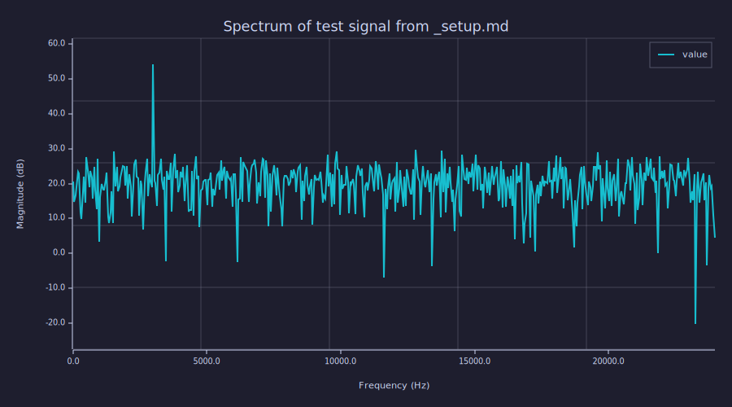

<!-- Generated by rustlab-notebook — do not edit directly. -->

# File Embeds Demo

Obsidian-style `![[file]]` transclusion: pull content from a sibling
markdown file at the embed point. Three forms — whole file, section
under a heading, paragraph tagged with a block id. Embedded
` ```rustlab ` blocks **execute** in the host notebook's evaluator, so
a shared `_setup.md` is the natural way to factor out boilerplate.

The full feature reference lives in `docs/notebooks.md` § "File
embeds (transclusion)".

## 1. Whole-file embed

The line below is `![[_setup]]` in the source. It transcludes
`_setup.md` (defining `Fs`, `N`, and `x`) so this notebook can use
those names without repeating the setup code.


## Shared Setup

This file is **not** rendered as a standalone notebook in the gallery —
its leading underscore filename and the absence of an `order:` field
are conventions; lessons embed it via `![[_setup]]`.

It defines a sample rate, a window length, and a noisy test signal that
downstream lessons can rely on.

```rustlab
Fs = 48000;
N  = 1024;
seed(7);
x = sin(2*pi*3000*(0:N-1)/Fs) + 0.4*randn(N);
```

Lessons that embed this file gain `Fs`, `N`, and `x` for use in
subsequent code blocks.


`Fs`, `N`, and `x` are now in scope. Verify:

```rustlab
disp(sprintf("Fs = %d Hz", Fs))
disp(sprintf("N  = %d",    N))
disp(sprintf("x is %d samples", length(x)))
```

```text
Fs = 48000 Hz
N  = 1024
x is 1024 samples
```

## 2. Use the embedded variables

Plot the magnitude spectrum of `x` defined in the embedded setup:

```rustlab
clf
X = fft(x);
freq = (0:N/2-1)*Fs/N;
plot(freq, 20*log10(abs(X(1:N/2))))
xlabel("Frequency (Hz)")
ylabel("Magnitude (dB)")
title("Spectrum of test signal from _setup.md")
grid on
```



The single tone defined in `_setup.md` shows up as a peak at 3 kHz.

## 3. Block-id transclusion

Block-id embeds let you reference a single paragraph or list item
across notebooks without copying the text. The next paragraph in this
notebook ends with a `^` marker that the source uses to make it
referenceable. The marker is invisible in the rendered output of
*every* notebook — including this one.

## 4. Error callouts (graceful failure)

If an embed target is missing, the renderer drops a `[!CAUTION]`
callout at the embed site and prints a one-line warning to stderr,
rather than aborting the render. The same shape applies to missing
headings (`![[doc#NoSuchSection]]`), missing block ids
(`![[doc#^missing]]`), and embed cycles. The render continues for
the rest of the notebook regardless.

That's the whole feature — narrative prose and code blocks compose as
usual; the embed pass just runs first.

