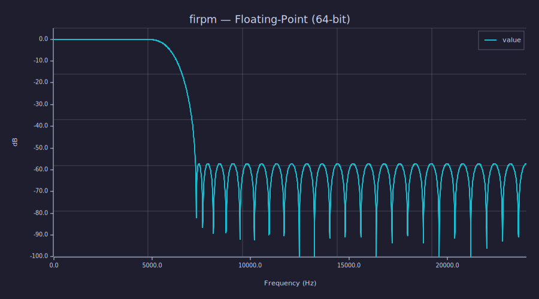
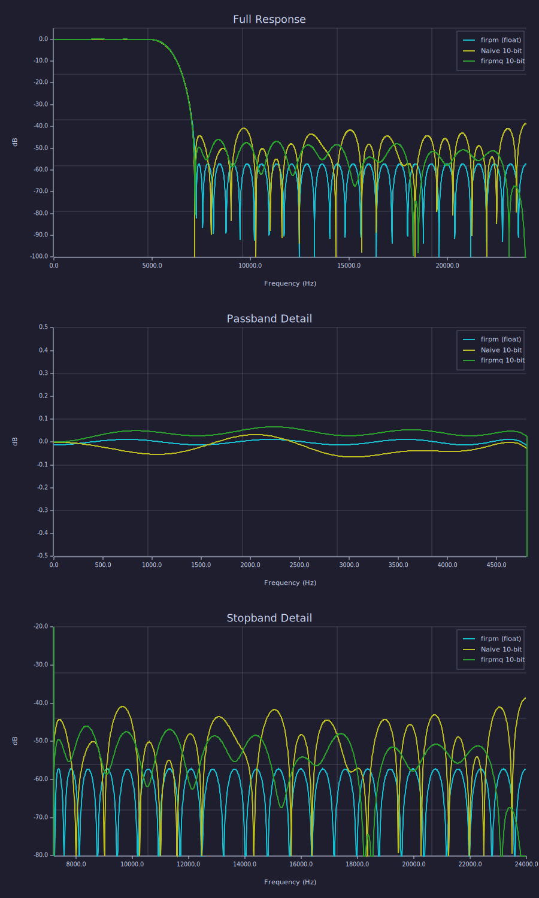

<!-- Generated by rustlab-notebook — do not edit directly. -->

# FIR Filter Quantization: firpm vs firpmq

This notebook designs a lowpass FIR filter with `firpm`, quantizes its
coefficients to 10 bits by simple rounding, then compares against `firpmq`
which optimizes directly in the integer domain.

## Spec

| Parameter         | Value         |
|-------------------|---------------|
| Sample rate       | 48,000 Hz |
| Taps              | 63     |
| Passband          | 0 – 0.20 Nyquist (4,800 Hz) |
| Stopband          | 0.30 – 1.00 Nyquist (7,200 Hz) |
| Coefficient bits  | 10       |

## Step 1 — Floating-point design with `firpm`

```rustlab
h_float = firpm(n_taps, [0.0, 0.20, 0.30, 1.0], [1.0, 1.0, 0.0, 0.0]);
Hz_float = freqz(h_float, n_fft, fs);
```

```rustlab
plot(Hz_float(1,:), 20*log10(abs(Hz_float(2,:))))
title("firpm — Floating-Point (64-bit)")
xlabel("Frequency (Hz)")
ylabel("dB")
grid on
ylim([-100, 5])
```

<!-- rustlab:output-start -->


<!-- rustlab:output-end -->

## Step 2 — Naïve quantization to 10 bits

Scale the floating-point taps by $2^{b-1}$ and round to the nearest
integer. This is the simplest approach — and the one most commonly used
in practice — but it throws away the equiripple optimality.

```rustlab
scale = 2^(bits - 1);
h_naive_int = round(h_float * scale);
h_naive = h_naive_int / sum(h_naive_int);
Hz_naive = freqz(h_naive, n_fft, fs);
```

## Step 3 — Optimized quantization with `firpmq`

`firpmq` runs the Remez exchange in a loop, requantizing the coefficients
after each iteration so the optimizer can compensate for rounding errors.
The result is an integer-tap filter that is optimal *at the target bitwidth*.

```rustlab
h_q_int = firpmq(n_taps, [0.0, 0.20, 0.30, 1.0], [1.0, 1.0, 0.0, 0.0], [1.0, 1.0], bits, 12);
h_q = h_q_int / sum(h_q_int);
Hz_q = freqz(h_q, n_fft, fs);
```

## Comparison

```rustlab
subplot(3, 1, 1)

% Full range
plot(Hz_float(1,:), 20*log10(abs(Hz_float(2,:))), 'b')
hold on
plot(Hz_naive(1,:), 20*log10(abs(Hz_naive(2,:))), 'r')
plot(Hz_q(1,:), 20*log10(abs(Hz_q(2,:))), 'g')
hold off
legend("firpm (float)", "Naive 10-bit", "firpmq 10-bit")
title("Full Response")
xlabel("Frequency (Hz)")
ylabel("dB")
grid on
ylim([-100, 5])

% Passband detail
subplot(3, 1, 2)
plot(Hz_float(1,:), 20*log10(abs(Hz_float(2,:))), 'b')
hold on
plot(Hz_naive(1,:), 20*log10(abs(Hz_naive(2,:))), 'r')
plot(Hz_q(1,:), 20*log10(abs(Hz_q(2,:))), 'g')
hold off
legend("firpm (float)", "Naive 10-bit", "firpmq 10-bit")
title("Passband Detail")
xlabel("Frequency (Hz)")
ylabel("dB")
grid on
xlim([0, 0.20 * fs / 2])
ylim([-0.5, 0.5])

% Stopband detail
subplot(3, 1, 3)
plot(Hz_float(1,:), 20*log10(abs(Hz_float(2,:))), 'b')
hold on
plot(Hz_naive(1,:), 20*log10(abs(Hz_naive(2,:))), 'r')
plot(Hz_q(1,:), 20*log10(abs(Hz_q(2,:))), 'g')
hold off
legend("firpm (float)", "Naive 10-bit", "firpmq 10-bit")
title("Stopband Detail")
xlabel("Frequency (Hz)")
ylabel("dB")
grid on
xlim([0.30 * fs / 2, fs / 2])
ylim([-80, -20])
```

<!-- rustlab:output-start -->


<!-- rustlab:output-end -->

## Results

```rustlab
% Passband: indices 1 .. round(0.20 * n_fft)
% Stopband: indices round(0.30 * n_fft)+1 .. n_fft
pass_end   = round(0.20 * n_fft);
stop_start = round(0.30 * n_fft) + 1;

% Peak-to-peak passband ripple (dB)
ripple_float = max(20*log10(abs(Hz_float(2, 1:pass_end)))) - min(20*log10(abs(Hz_float(2, 1:pass_end))));
ripple_naive = max(20*log10(abs(Hz_naive(2, 1:pass_end)))) - min(20*log10(abs(Hz_naive(2, 1:pass_end))));
ripple_q     = max(20*log10(abs(Hz_q(2,     1:pass_end)))) - min(20*log10(abs(Hz_q(2,     1:pass_end))));

% Peak stopband level (dB)
stop_float = max(20*log10(abs(Hz_float(2, stop_start:n_fft))));
stop_naive = max(20*log10(abs(Hz_naive(2, stop_start:n_fft))));
stop_q     = max(20*log10(abs(Hz_q(2,     stop_start:n_fft))));

% Improvements (positive = firpmq better than naive)
ripple_improvement = ripple_naive - ripple_q;
stop_improvement   = stop_naive   - stop_q;
```

| Filter                | Passband ripple (dB) | Stopband peak (dB) |
|-----------------------|----------------------|--------------------|
| `firpm` (float)       | 0.024 | -56.18 |
| Naïve 10-bit     | 0.098 | -38.66 |
| `firpmq` 10-bit  | 0.067     | -45.99     |

`firpmq` reduces passband ripple by **0.031 dB** and
lowers the peak stopband level by **7.3 dB** versus
naïve quantization at the same bitwidth.

**Legend (plot colors):** blue = `firpm` (float), red = naïve 10-bit
quantization, green = `firpmq` 10-bit optimized.

The naïve approach degrades both the passband ripple and the stopband
floor because rounding destroys the equiripple property. `firpmq`
recovers most of the loss by re-optimizing with quantization in the loop.

