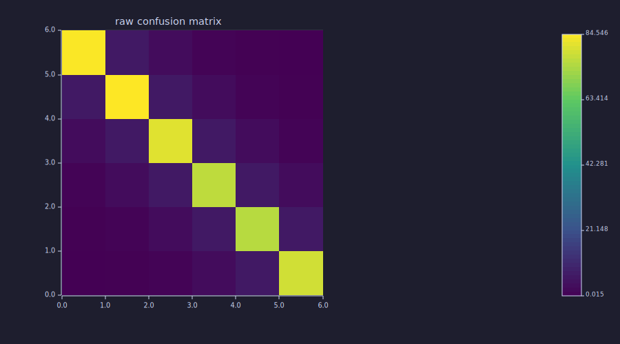
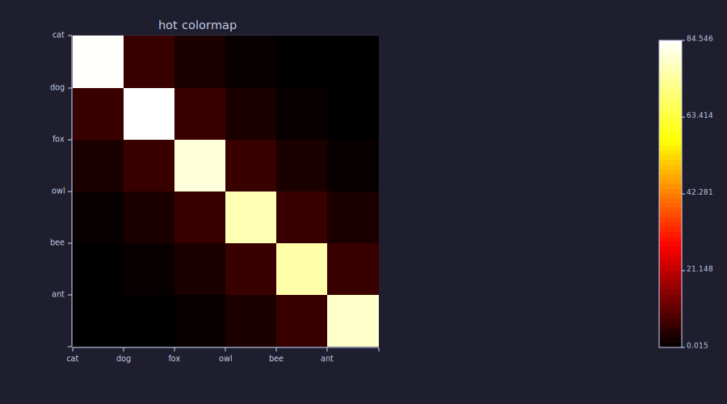
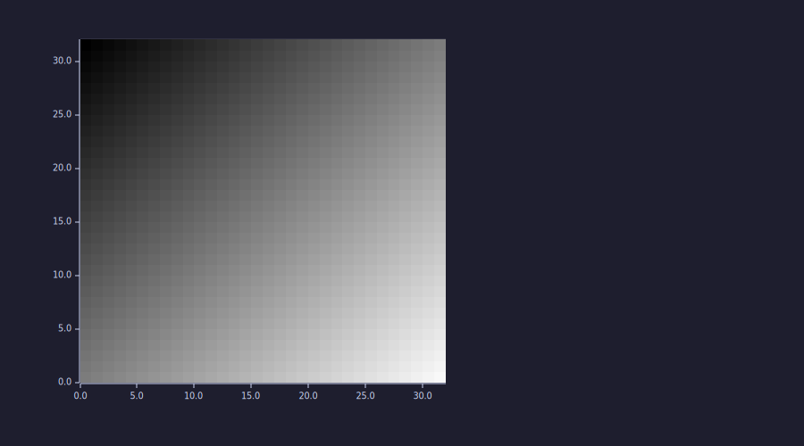
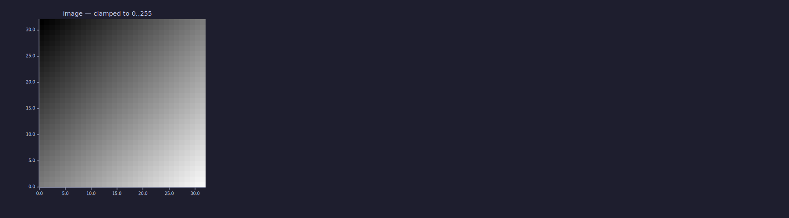
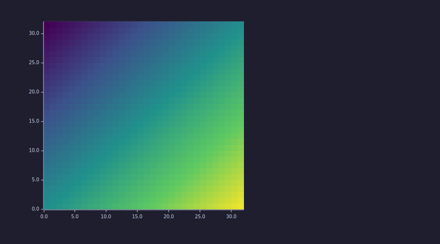
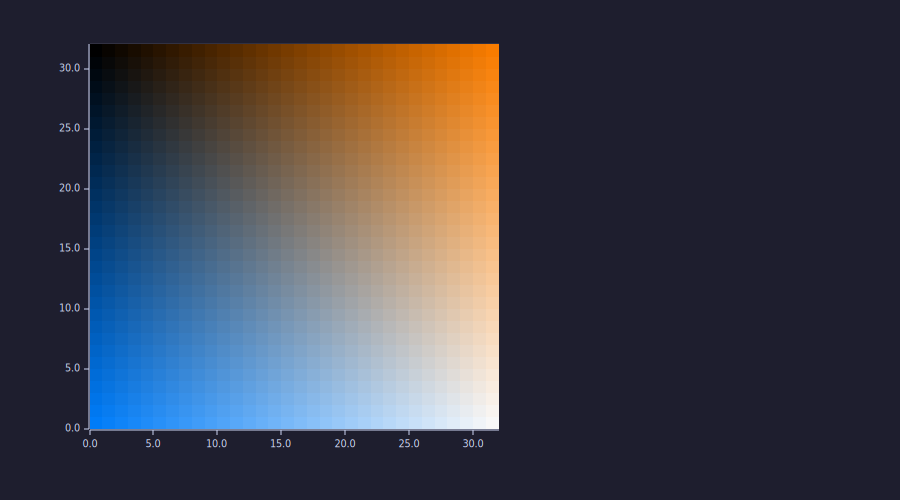

<!-- Generated by rustlab-notebook — do not edit directly. -->

# Heatmaps and Images

`heatmap()` and `image()` are two siblings of `imagesc()`, each tuned for a
specific job:

- `imagesc(M)` — auto-normalises the data range to fill the colormap. Best
  for fields whose absolute value isn't meaningful (gradients, divergences,
  smoothed densities).
- `heatmap(M)` — same colormap rendering plus optional **categorical axis
  labels**. The natural choice for confusion matrices, correlation tables,
  schedules, and anything indexed by name rather than coordinate.
- `image(M)` — **raw pixel display**, no normalisation. Values clamp to
  `[0, 255]`. The natural choice when bytes already mean pixel intensity:
  loaded images, procedural textures, RGB channel matrices.

All three render row 0 at the top (image / data orientation) in SVG output.

> **Note:** `heatmap` HTML output flips the y-axis with `autorange: "reversed"` so
> notebook plots match SVG. `imagesc` HTML output keeps Plotly's default
> upward y-axis; this is a pre-existing inconsistency tracked separately.

## A confusion matrix

The classic case for `heatmap` is a 2-D table indexed by class names. We
build a 6×6 toy confusion matrix with a strong diagonal and dim
off-diagonal noise:

```rustlab
clf
classes = {"cat", "dog", "fox", "owl", "bee", "ant"};
n = length(classes);
C = zeros(n, n);
for i = 1:n
  for j = 1:n
    if i == j
      C(i, j) = 80 + 5*sin(i);
    else
      C(i, j) = 8 * exp(-((i-j)^2) / 4);
    end
  end
end
print(size(C))
```

```text
[1×2]  6.000000  6.000000
```

Without labels, `heatmap` indexes axes numerically — useful as a quick
sanity check before naming things:

```rustlab
clf
heatmap(C, "raw confusion matrix")
```



## Add categorical labels

Wrapping the matrix with two string arrays gives every row and column a
name. The bright diagonal now reads off cleanly:

```rustlab
clf
heatmap(classes, classes, C, "confusion matrix (viridis)")
```


The `xlabels` array indexes columns left-to-right; `ylabels` indexes rows
top-to-bottom. Length mismatches are caught at the call site:
`heatmap({"A","B"}, {"X","Y","Z"}, C)` raises a clear type error rather
than silently truncating.

## Choose a different colormap

A fifth positional argument names the colormap. The supported names are
`"viridis"` (default), `"jet"`, `"hot"`, and `"gray"`:

```rustlab
clf
heatmap(classes, classes, C, "hot colormap", "hot")
```



## Raw-pixel display with `image`

`image` is for matrices whose values *already* represent pixel intensity.
Build a smooth diagonal gradient with values in `[0, 248]`:

```rustlab
clf
[II, JJ] = meshgrid(0:31, 0:31);
G = (II + JJ) * 4;
print([min(min(G)), max(max(G))])
```

```text
[1×2]  0.000000  248.000000
```

Display it without normalisation:

```rustlab
clf
image(G)
```



The same data through `imagesc` would auto-normalise — useful for
arbitrary fields, but wrong if your data already encodes brightness.
The contrast is easiest to see side-by-side:

```rustlab
clf
subplot(1, 2, 1)
image(G); title("image — clamped to 0..255")
subplot(1, 2, 2)
imagesc(G); title("imagesc — auto-normalised")
```



When the matrix happens to span the full `0..255` range (as ours does),
the two look almost identical. They diverge as soon as the data range
shifts: try `image(G * 0.3)` versus `imagesc(G * 0.3)` and the `image`
output goes dark while `imagesc` re-fills the colormap.

## Single channel through a colormap

The 2-argument form `image(M, "colormap")` clamps to `[0, 255]` *and*
maps each value through the named colormap. Same gradient as above,
through viridis:

```rustlab
clf
image(G, "viridis")
```



This is the right tool when you've already encoded an intensity image
(e.g. converted a photo to grayscale) and want a false-colour
visualisation rather than auto-rescaled greys.

## True-colour RGB from three matrices

The 3-argument form takes a separate matrix for each channel and clamps
each to `[0, 255]`. This is how you display loaded image data — or
construct procedural textures from scratch:

```rustlab
clf
R  = II * 8;          % red rises with x
B  = JJ * 8;          % blue rises with y
Gc = (II + JJ) * 4;   % green rises along the diagonal
image(R, Gc, B)
```



You should see a familiar RGB-corner gradient: red brightens to the right,
blue brightens downward, green brightens along the diagonal.

> **Tip:** The R, G, B matrices must be **real** and share the same shape. Passing
> a complex matrix raises an error rather than silently dropping the imag
> part — a common foot-gun when channels were computed via FFT or filtering.

## Cheat sheet

| Form                                               | Returns | Notes                                                   |
|----------------------------------------------------|---------|---------------------------------------------------------|
| `heatmap(M)`                                       | `None`  | Numeric indices on both axes                            |
| `heatmap(M, "title")`                              | `None`  | As above with a panel title                             |
| `heatmap(xlabels, ylabels, M)`                     | `None`  | Categorical labels; length must match matrix shape      |
| `heatmap(xlabels, ylabels, M, "title")`            | `None`  | Categorical + title                                     |
| `heatmap(xlabels, ylabels, M, "title", "cmap")`    | `None`  | Categorical + title + explicit colormap                 |
| `image(M)`                                         | `None`  | Grayscale, values clamped to `[0, 255]`                 |
| `image(M, "cmap")`                                 | `None`  | Single channel through a named colormap, clamped 0..255 |
| `image(R, G, B)`                                   | `None`  | True-colour RGB; channels must be real, identical shape |

| Builtin   | Normalises? | Labels?     | Pixel data? | Best for                                  |
|-----------|-------------|-------------|-------------|-------------------------------------------|
| `imagesc` | yes (min..max) | numeric  | no          | Arbitrary scalar fields                   |
| `heatmap` | yes (min..max) | optional categorical | no | Tables indexed by name                |
| `image`   | no (clamp 0..255) | numeric | yes        | Loaded images, procedural textures, RGB   |

Terminal rendering for both is best-effort coloured-block characters and
labels are *not* drawn in the TUI; HTML / SVG / viewer output is the
primary pretty path. Empty matrices return a clear runtime error rather
than rendering nothing.

