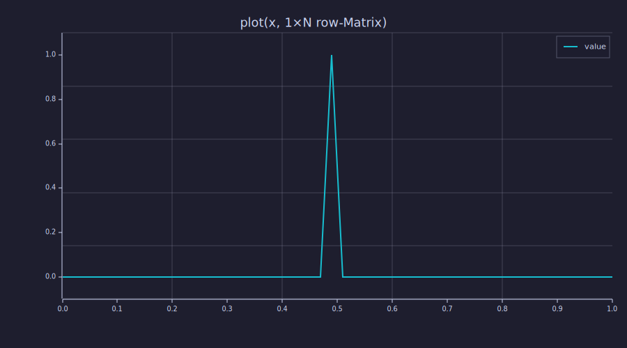

<!-- Generated by rustlab-notebook — do not edit directly. -->

# rustlab v0.3.4 — Language ergonomics

Five small ergonomics landed in v0.3.4 to close gaps that downstream
projects (notably `rustlab_llm`) hit when porting MATLAB/Octave code
or writing scientific scripts. Each one removes a documented
workaround.

| Gap | Workaround pre-0.3.4 | Form in 0.3.4 |
|---|---|---|
| `length(scalar)` | `length([x])` | `length(x)` |
| `rand()` / `randn()` zero-arg | `rand(1)(1)` | `rand()`, `randn()` |
| `A(i, :) = vec` row-write | `A(i) = vec` | `A(i, :) = vec` (preferred) |
| Strided LHS into a vector | element-by-element loop | `v(1:2:6) = [...]` |
| `plot(x, zeros(1, N))` | reshape to a Vector first | passes through |

The first four are MATLAB-compat improvements; the last is a
plotting-pipeline fix.

## 1. `length(scalar)` returns 1

Pre-0.3.4 `length(x)` only worked for Vectors / Matrices / Strings, so
any helper that needed to handle "a scalar OR a vector" had to box the
scalar as `[x]` first. The MATLAB convention is `length(scalar) = 1`;
rustlab now matches.

```rustlab
print("length(42):", length(42));            % → 1
print("length(3 + j):", length(3 + j));      % → 1
print("length(true):", length(true));        % → 1
print("length(zeros(7)):", length(zeros(7))); % → 7
print("length(zeros(3, 5)):", length(zeros(3, 5))); % → 5 (longest axis)
```

<!-- rustlab:output-start -->
```text
length(42): 1
length(3 + j): 1
length(true): 1
length(zeros(7)): 7
length(zeros(3, 5)): 5
```

<!-- rustlab:output-end -->

Use `numel(x)` for total element count and `size(x)` for full shape.

## 2. `rand()` and `randn()` accept zero arguments

A single uniform draw is now `rand()`, and a single standard-normal
draw is `randn()`. The pre-0.3.4 `rand(1)(1)` boxing hack — request a
1×1 matrix, then chain-index the scalar — is no longer required.

```rustlab
seed(42);
u = rand();
z = randn();
print("rand():", u);
print("randn():", z);
```

<!-- rustlab:output-start -->
```text
rand(): 0.5265574090027738
randn(): 0.13293812199412544
```

<!-- rustlab:output-end -->

The shaped forms still work unchanged:

```rustlab
seed(7);
v = rand(8);                  % length-8 vector
M = randn(3, 4);              % 3×4 matrix
print("rand(8) shape:", size(v));
print("randn(3, 4) shape:", size(M));
```

<!-- rustlab:output-start -->
```text
rand(8) shape: [1×2]  1.000000  8.000000
randn(3, 4) shape: [1×2]  3.000000  4.000000
```

<!-- rustlab:output-end -->

## 3. Region writes into a matrix

`A(rows, cols) = ...` now supports any combination of Scalar / `:` /
Vector indices on the LHS, mirroring the read forms. The most useful
case in transformer-style numerics is the **row write** — symmetric
with `A(i, :)` row reads — which previously had to be spelled
`A(i) = vec` via the M(scalar) legacy form.

### Row write — `A(i, :) = vec`

```rustlab
A = zeros(3, 3);
A(2, :) = [10, 20, 30];
print("A:");
print(A);
```

<!-- rustlab:output-start -->
```text
A:
Matrix(3x3)
  [0.000000, 0.000000, 0.000000]
  [10.000000, 20.000000, 30.000000]
  [0.000000, 0.000000, 0.000000]
```

<!-- rustlab:output-end -->

### Column write — `A(:, j) = vec`

```rustlab
B = zeros(3, 3);
B(:, 1) = [7, 8, 9];
print("B:");
print(B);
```

<!-- rustlab:output-start -->
```text
B:
Matrix(3x3)
  [7.000000, 0.000000, 0.000000]
  [8.000000, 0.000000, 0.000000]
  [9.000000, 0.000000, 0.000000]
```

<!-- rustlab:output-end -->

### Submatrix region write — `A(rows, cols) = matrix`

```rustlab
C = zeros(3, 3);
C(1:2, 2:3) = [1, 2; 3, 4];
print("C:");
print(C);
```

<!-- rustlab:output-start -->
```text
C:
Matrix(3x3)
  [0.000000, 1.000000, 2.000000]
  [0.000000, 3.000000, 4.000000]
  [0.000000, 0.000000, 0.000000]
```

<!-- rustlab:output-end -->

### Scalar broadcast — `A(:, :) = scalar`

A scalar (or complex) RHS broadcasts to every position in the target
region. Useful for "zero out a row" / "fill a region" patterns.

```rustlab
D = ones(3, 3);
D(2, :) = 0;                  % blank out row 2
D(:, 3) = 9;                  % set column 3 to all-9
print("D:");
print(D);
```

<!-- rustlab:output-start -->
```text
D:
Matrix(3x3)
  [1.000000, 1.000000, 9.000000]
  [0.000000, 0.000000, 9.000000]
  [1.000000, 1.000000, 9.000000]
```

<!-- rustlab:output-end -->

Shape mismatches hard-error with both shapes named, so a typo doesn't
silently corrupt the matrix:

```rustlab
% A(2, :) = [10, 20] would error: "RHS vector length 2 does not match
% target region 1×3 (3 elements)".
```

Note: the legacy `M(t) = vec` row write (rustlab 0.3.0 → 0.3.3 form)
still works for backward compatibility. New code should prefer the
symmetric `M(t, :) = vec` for clarity.

## 4. Strided / vector-index writes into a vector

Pre-0.3.4 `v(idx_set) = rhs` only accepted a scalar index — anything
else hit `expected scalar, got vector`. Now any non-scalar index set
selects positions to write:

### Strided LHS

```rustlab
v = zeros(6);
v(1:2:6) = [10, 20, 30];
print("v:");
print(v);
```

<!-- rustlab:output-start -->
```text
v:
[1×6]  10.000000  0.000000  20.000000  0.000000  30.000000  0.000000
```

<!-- rustlab:output-end -->

### Explicit index list

```rustlab
w = zeros(5);
w([1, 3, 5]) = [100, 300, 500];
print("w:");
print(w);
```

<!-- rustlab:output-start -->
```text
w:
[1×5]  100.000000  0.000000  300.000000  0.000000  500.000000
```

<!-- rustlab:output-end -->

### Scalar broadcast across the whole vector

```rustlab
u = zeros(4);
u(:) = 9;
print("u:");
print(u);
```

<!-- rustlab:output-start -->
```text
u:
[1×4]  9.000000  9.000000  9.000000  9.000000
```

<!-- rustlab:output-end -->

The RHS Vector length must match the index count. Length mismatches
hard-error.

## 5. `plot()` no longer renders an empty axis for 1×N row matrices

`zeros(1, N)` returns a 1×N row Matrix, not a length-N Vector. Pre-0.3.4
`plot(x, zeros(1, N))` silently rendered an empty axis — the plot
Matrix arm treated each column as its own series, producing `N`
degenerate single-point series. Now `plot` / `stem` / `bar` /
`scatter` flatten 1×N (and N×1) matrices to a Vector before
dispatching, so a single-row source-injection vector renders as one
line series with the expected `x` axis.

```rustlab
x = linspace(0, 1, 50);
y = zeros(1, 50);             % 1×N row Matrix — pre-0.3.4 plotted as empty
y(25) = 1;                    % impulse at index 25 (1-based)
clf;
plot(x, y, "spike");
title("plot(x, 1×N row-Matrix)")
```

<!-- rustlab:output-start -->


<!-- rustlab:output-end -->


Genuine `m × n` matrices (m > 1 *and* n > 1) are unaffected — they
still dispatch to the Matrix arm as multi-series data.

## See also

- `dev/plans/closed/parmap_nonscalar_outputs.md` — the 0.3.3 step
  that extended `parmap` to accept vector- and matrix-returning
  lambdas; the four named blocked sites (per-row attention softmax,
  per-position FFN, multi-head attention, batched sampling) now
  compose with the indexed-assignment forms here for clean,
  one-pass implementations.
- `examples/notebooks/parallel_montecarlo.md` — the parmap
  gallery, including the vector-output and matrix-output sections.
- `examples/notebooks/language_v0_3.md` — the v0.3 language
  additions (multi-output user fns, `&&`/`||`, `M(k)` / `M(I)`
  linear gather, `layernorm(M)` matrix overload).
