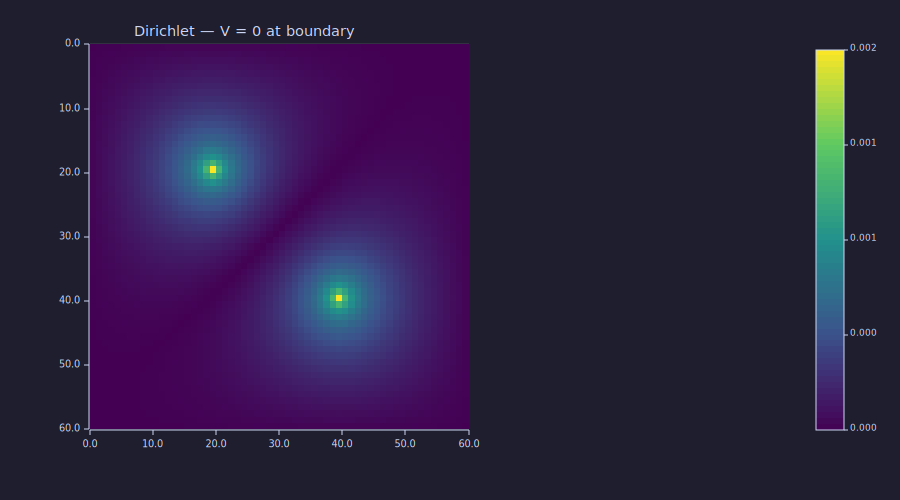

<!-- Generated by rustlab-notebook — do not edit directly. -->

# Laplacian Boundary Conditions

The `laplacian_2d`, `laplacian_1d`, and `laplacian_3d` builders accept
an optional trailing string argument that selects the boundary
condition: `"dirichlet"` (the default), `"neumann"`, or `"periodic"`.
The choice changes both the *structure* of the resulting sparse matrix
and the kind of system you can solve with it.

## The three boundary conditions

| BC | Physics | Matrix property |
|---|---|---|
| `"dirichlet"` | $V = 0$ outside the grid | Non-singular; `spsolve` solves directly |
| `"neumann"` | $\partial V / \partial n = 0$ at boundary | **Singular** — constants in null space |
| `"periodic"` | grid wraps to the opposite side | **Singular** — constants in null space |

Singular systems require a *pin-and-solve* idiom: zero one row of the
matrix, set its diagonal to 1, and pin the corresponding right-hand
side. That fixes the constant-shift ambiguity. We don't show the
script-level pinning here (it's currently awkward without
slice-assignment helpers); we focus on what the BC selector buys at
the operator level.

## A common grid + source

```rustlab
clf
nx = 60; ny = 60;
dx = 0.05; dy = 0.05;
src = zeros(ny, nx);
src(20, 20) =  1.0;
src(40, 40) = -1.0;
b = src(:)';
```

A two-charge dipole on a 60×60 grid.

## Dirichlet — direct solve

The Dirichlet operator is non-singular. `spsolve` auto-detects SPD on
$-L$ and runs sparse Cholesky end-to-end:

```rustlab
A_d = -1 * laplacian_2d(nx, ny, dx, dy, "dirichlet");
v_d = spsolve(A_d, b);
V_d = reshape(v_d, ny, nx);
imagesc(V_d);
title("Dirichlet — V = 0 at boundary")
```

<!-- rustlab:output-start -->


<!-- rustlab:output-end -->

The potential decays smoothly to zero at the grid edges — exactly the
"grounded box" pattern you'd expect for a charge configuration in a
conductor-walled cavity.

## Neumann — the operator has a null space

Switching to `"neumann"` returns a singular operator. We can verify
the null-space property without solving anything: applying the
Laplacian to a vector of all ones should give zero, since constants
satisfy zero-flux trivially.

```rustlab
A_n = laplacian_2d(nx, ny, dx, dy, "neumann");
ones_vec = ones(ny * nx, 1);
test_n = full(A_n) * ones_vec;
print(norm(test_n))      % → ~3e-12 (machine precision)
```

<!-- rustlab:output-start -->
```text
0.0000000000034557806778981703
```

<!-- rustlab:output-end -->

The residual is at floating-point noise — confirming the null space.
A practical Neumann solve requires pin-and-solve to remove the
constant-shift ambiguity; see the `examples/pde/laplacian_bc.rlab` script
for the (slightly verbose) idiom.

## Periodic — wrap-around

The periodic operator wraps the boundary to the opposite side. Same
null-space property as Neumann (constants satisfy any periodic
operator):

```rustlab
A_p = laplacian_2d(nx, ny, dx, dy, "periodic");
test_p = full(A_p) * ones(ny * nx, 1);
print(norm(test_p))      % → ~3e-12
```

<!-- rustlab:output-start -->
```text
0.0000000000034299716484259964
```

<!-- rustlab:output-end -->

The use case is problems with translational symmetry: Bloch states in
a periodic medium, periodic-replication boundary conditions for
crystal lattices, FFT-friendly discretizations.

## Structural difference — `nnz` per BC

Each BC produces a slightly different sparsity pattern. Dirichlet and
Neumann share the same off-diagonal structure (Neumann just rebalances
the diagonal of boundary cells); Periodic adds wrap-around entries:

```rustlab
print([nnz(A_d), nnz(A_n), nnz(A_p)])
```

<!-- rustlab:output-start -->
```text
[1×3]  17760.000000  17760.000000  18000.000000
```

<!-- rustlab:output-end -->

Dirichlet and Neumann nnz are identical (the Neumann boundary cells
absorb missing coefficients into the diagonal, so the off-diagonal
pattern is unchanged). Periodic adds one entry per boundary face that
wraps around — for a 60×60 grid that's 240 extra entries.

## 1-D Laplacian — the same BC selector

`laplacian_1d` takes the same string argument:

```rustlab
L1_d = laplacian_1d(8, 1.0, "dirichlet");
L1_n = laplacian_1d(8, 1.0, "neumann");
L1_p = laplacian_1d(8, 1.0, "periodic");
print([nnz(L1_d), nnz(L1_n), nnz(L1_p)])
% → [22, 22, 24]
```

<!-- rustlab:output-start -->
```text
[1×3]  22.000000  22.000000  24.000000
```

<!-- rustlab:output-end -->

Useful for 1-D heat / diffusion problems, lattice Hamiltonians, and as
the ingredient for tensor-product 2-D / 3-D operators on
non-rectangular domains.

## 3-D Laplacian — `laplacian_3d`

The 3-D variant takes seven possible argument shapes:

```rustlab
L = laplacian_3d(8, 8, 8);                          % unit spacing, Dirichlet
L = laplacian_3d(8, 8, 8, "neumann");               % unit spacing, Neumann
L = laplacian_3d(8, 8, 8, 0.1, 0.1, 0.05);          % anisotropic spacing
L = laplacian_3d(8, 8, 8, 0.1, 0.1, 0.05, "periodic")
```

Flat indexing follows the `Tensor3` convention: axis 0 = y (rows),
axis 1 = x (cols), axis 2 = z (pages). The companion helpers
`ijk2k(i, j, kk, ny, nx)` and `k2ijk(k, ny, nx)` convert between
1-based grid indices and the column-major-of-pages flat index.

## Cheat sheet

| Form | Notes |
|---|---|
| `laplacian_1d(n)` | dx = 1, Dirichlet |
| `laplacian_1d(n, dx)` | explicit spacing, Dirichlet |
| `laplacian_1d(n, dx, bc)` | full form |
| `laplacian_1d(n, bc)` | unit spacing with bc |
| `laplacian_2d(nx, ny)` | dx = dy = 1, Dirichlet |
| `laplacian_2d(nx, ny, dx, dy)` | uniform spacing |
| `laplacian_2d(nx, ny, dx, dy, bc)` | full form |
| `laplacian_2d(nx, ny, bc)` | unit spacing with bc |
| `laplacian_3d(nx, ny, nz)` | unit spacing, Dirichlet |
| `laplacian_3d(nx, ny, nz, bc)` | unit spacing with bc |
| `laplacian_3d(nx, ny, nz, dx, dy, dz)` | anisotropic spacing |
| `laplacian_3d(nx, ny, nz, dx, dy, dz, bc)` | full form |

The `bc` string is always one of `"dirichlet"`, `"neumann"`, or `"periodic"`.
