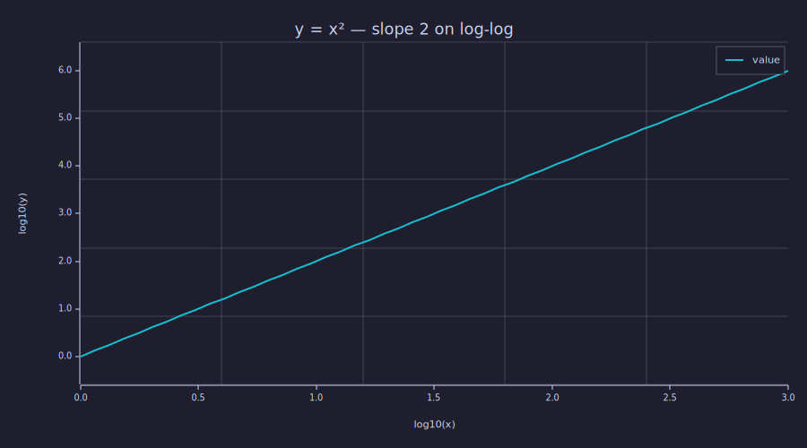
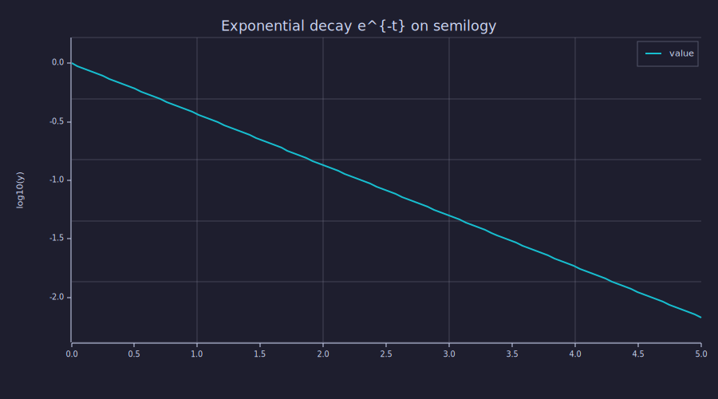
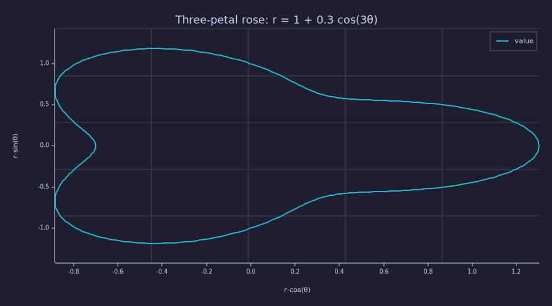
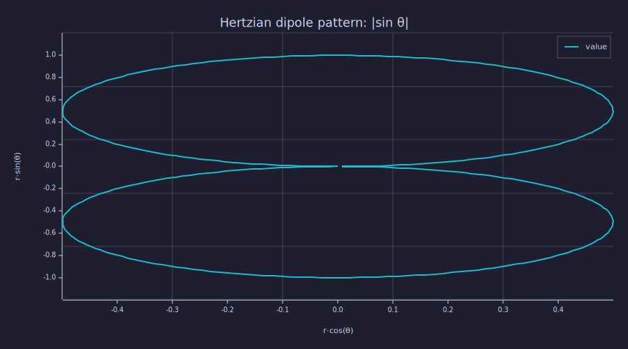

<!-- Generated by rustlab-notebook — do not edit directly. -->

# Log-Axis and Polar Plots

The plot family includes four pre-transform shims for problems where
linear axes obscure the structure: `loglog`, `semilogx`, `semilogy`,
and `polar`. Each one transforms its arguments before passing them to
the existing `plot()` machinery and labels the axes accordingly. The
result captures the shape information the curriculum needs (straight
lines on power-law data, closed shapes on polar data) — a future
enhancement will swap in proper LogCoord-style axes with decade-based
tick labels and radial gridlines.

## Power laws on loglog

```rustlab
clf
x = logspace(0, 3, 50);
y = x .^ 2;
loglog(x, y);
title("y = x² — slope 2 on log-log");
```

<!-- rustlab:output-start -->


<!-- rustlab:output-end -->

A power law `y = x^a` plots as a straight line of slope `a` on log-log
axes. The shim labels the axes `log10(x)` and `log10(y)` so the
transform is explicit; the slope-2 visual confirms the relationship.

`loglog` requires both `x` and `y` to be **strictly positive** —
negatives or zeros produce a clear error rather than NaN-ing through
the plot.

## Exponential decay on semilogy

```rustlab
clf
t = linspace(0, 5, 100);
y = exp(-1 * t);
semilogy(t, y);
title("Exponential decay e^{-t} on semilogy");
```

<!-- rustlab:output-start -->


<!-- rustlab:output-end -->

`semilogy` log-transforms only the y-axis. Exponential decay shows up
as a straight line of slope `-log10(e) ≈ -0.434` per unit `t`.

## Bode-style frequency response

`semilogx` is the canonical filter-design view: log-spaced frequencies
on the x-axis, linear (often dB) magnitude on the y-axis. Combine it
with `freqz` and `mag2db` to get a Bode plot.

```rustlab
% Conceptual: the actual filter design is in the DSP notebooks.
% f = logspace(0, 4, 200);
% H = freqz_eval(...);
% semilogx(f, 20 * log10(abs(H)));
```

## Polar — the three-petal rose

`polar(theta, r)` plots the curve in polar coordinates by transforming
to Cartesian: `(r·cos θ, r·sin θ)`. The classic textbook rose curve
`r = 1 + 0.3·cos(3θ)` has three lobes:

```rustlab
clf
theta = linspace(0, 2*pi, 360);
r = 1 + 0.3 * cos(3 * theta);
polar(theta, r);
title("Three-petal rose: r = 1 + 0.3 cos(3θ)");
```

<!-- rustlab:output-start -->


<!-- rustlab:output-end -->

## Hertzian dipole radiation pattern

The far-field radiation pattern of a Hertzian dipole is `|sin θ|` —
the canonical antenna-pattern textbook example:

```rustlab
clf
theta = linspace(-pi, pi, 360);
r = abs(sin(theta));
polar(theta, r);
title("Hertzian dipole pattern: |sin θ|");
```

<!-- rustlab:output-start -->


<!-- rustlab:output-end -->

Two lobes along the broadside direction, nulls along the dipole axis.

## What's next

The current implementation uses **pre-transform shims** that emit
plots through the standard Cartesian backend. That gets the shapes
right but the tick labels are the log-transformed values themselves
(0, 1, 2, 3 instead of 1, 10, 100, 1000) and polar plots don't have
radial gridlines. The follow-on enhancement, which integrates with the
plotters / Plotly / ratatui backends to produce true log-scale axes
and a polar coord system, is tracked in
`dev/plans/em_requests_queue.md`.

For visual verification of physical relationships — Bode plots,
antenna lobes, decay curves — the pre-transform shims are sufficient.

## Cheat sheet

| Form                                   | Pre-transform                  | Notes                                       |
|----------------------------------------|--------------------------------|---------------------------------------------|
| `loglog(x, y [, opts])`                | `log10(x)`, `log10(y)`         | both x and y must be > 0                    |
| `semilogx(x, y [, opts])`              | `log10(x)`                     | x must be > 0                               |
| `semilogy(x, y [, opts])`              | `log10(y)`                     | y must be > 0                               |
| `polar(theta, r [, opts])`             | `(r·cos θ, r·sin θ)`           | theta in radians, both real-valued          |

All four accept the same option syntax as `plot()` — color, label,
style, title — and honour `hold on` for overlay with other plot kinds.
