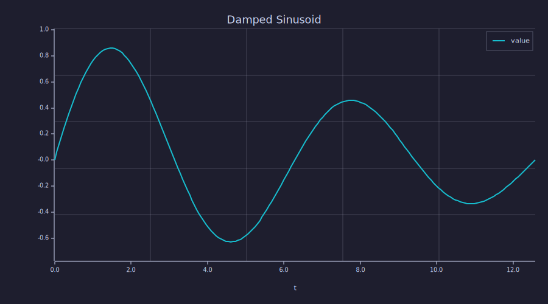

<!-- Generated by rustlab-notebook — do not edit directly. -->

# Multi-Notebook Rendering

This notebook demonstrates directory rendering and cross-notebook linking.

## Directory Rendering

Render all notebooks in a directory at once:

```
rustlab-notebook render examples/notebooks/
```

This produces:
- One `.html` file per `.md` file
- An `index.html` linking to all notebooks

## Cross-Notebook Links

Links to other `.md` files are automatically rewritten to `.html` in the
rendered output. For example:

- [Filter Analysis](filter_analysis.md) — FIR lowpass design
- [Spectral Estimation](spectral_estimation.md) — PSD methods
- [Template Interpolation](template_interpolation.md) — embedding computed values
- [String Arrays](string_arrays.md) — categorical bar charts

## Quick Example

```rustlab
x = linspace(0, 4*pi, 200);
plot(x, sin(x) .* exp(-x/10))
title("Damped Sinusoid")
xlabel("t")
grid on
```

<!-- rustlab:output-start -->


<!-- rustlab:output-end -->

The signal decays with time constant $\tau = 10$.
