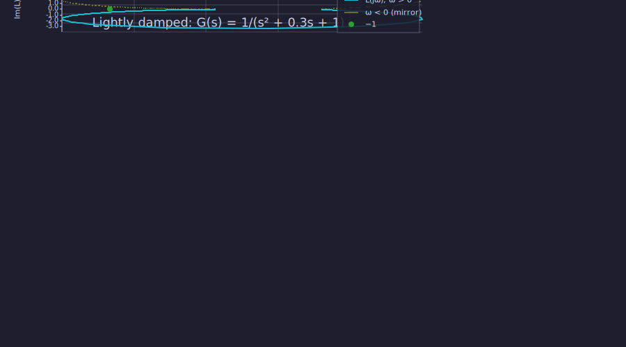
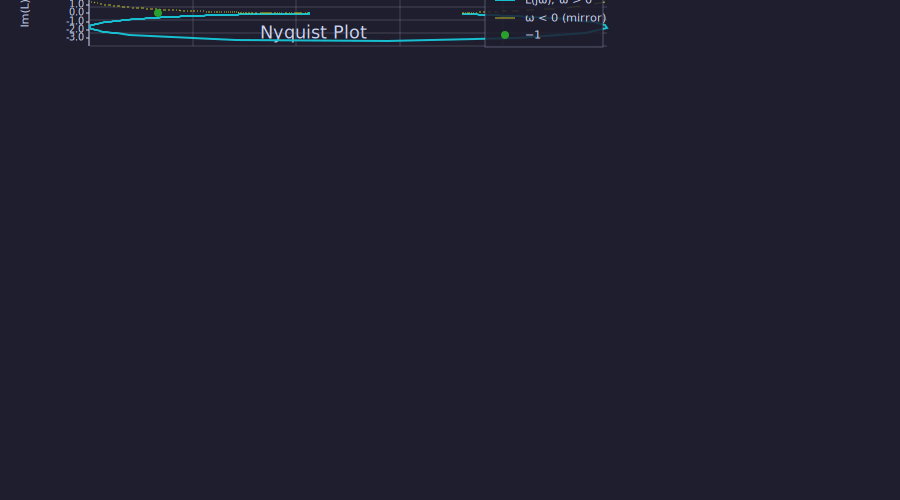
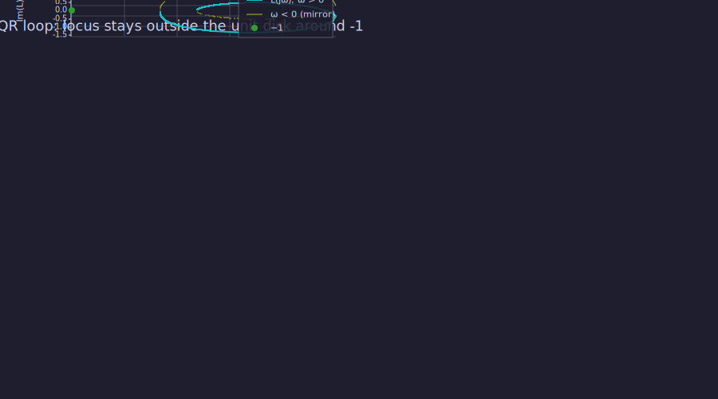
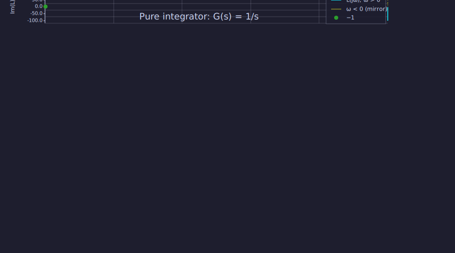
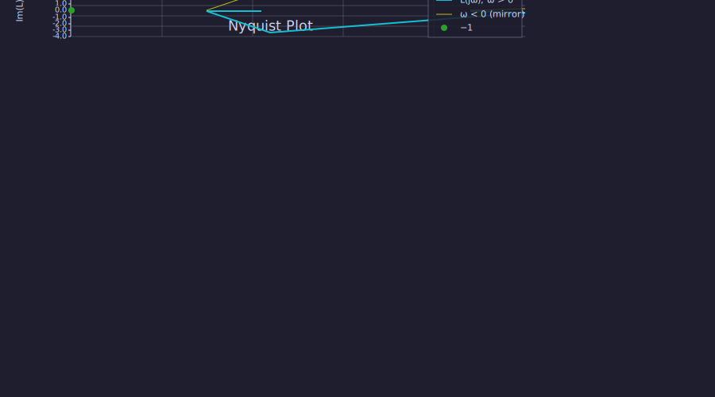

<!-- Generated by rustlab-notebook — do not edit directly. -->

# Nyquist Plots & Closed-Loop Stability — `nyquist`

Bode plots tell you the magnitude and phase of a loop transfer
function $L(j\omega)$ as two separate curves. The Nyquist plot fuses
them into a single locus in the complex plane: $\text{Re}\,L(j\omega)$
on the horizontal axis, $\text{Im}\,L(j\omega)$ on the vertical. From
that one picture, three robustness facts read off geometrically:

1. **Closed-loop stability** — the number of times the locus encircles
   the point $-1 + 0j$, taken with sign, is the Nyquist criterion.
2. **Sensitivity peak** — the closest distance from the locus to $-1$
   is $1/M_S$, where $M_S = \max_\omega |1/(1 + L(j\omega))|$ is the
   sensitivity-function peak. Small distance ⇒ poor robustness.
3. **Kalman frequency-domain inequality** — for a locus that stays
   outside the unit disk centered at $-1$, $|1 + L(j\omega)| \geq 1$
   for all $\omega$, which guarantees a 6 dB gain margin and 60° phase
   margin simultaneously.

The `nyquist(G)` builtin handles the conventional decorations
automatically: positive-frequency locus, conjugate-mirror image,
$-1$ marker, equal aspect ratio, and a two-pass densification of the
frequency grid near $-1$ so the closest-approach reading is clean.

## A first-order plant — the canonical Nyquist circle

```rustlab
clf
s = tf("s");
G1 = 1 / (s + 1);
nyquist(G1)
title("First-order: G(s) = 1/(s+1)")
```

```text
([1×1991]  0.999900  0.999899  0.999898  0.999897  0.999896  0.999895  0.999894  0.999893  ... (1991 total), [1×1991]  -0.009999  -0.010045  -0.010092  -0.010139  -0.010186  -0.010233  -0.010281  -0.010328  ... (1991 total), [1×1991]  0.010000  0.010046  0.010093  0.010140  0.010187  0.010234  0.010282  0.010329  ... (1991 total))
```


The locus is a circle of radius $0.5$ centered at $(0.5, 0)$. Algebraically,
$G(j\omega) = 1/(1 + j\omega) = (1 - j\omega) / (1 + \omega^2)$ has
$|G - 0.5| = 0.5$ for every $\omega$. The locus passes through $(1, 0)$
at $\omega = 0$ and tends to the origin as $\omega \to \infty$.

The closest approach to $-1$ is exactly $1.0$, attained as
$\omega \to \infty$:

$$|1 + G(j\omega)|^2 = \frac{\omega^2 + 4}{\omega^2 + 1} \longrightarrow 1.$$

So $M_S \to 1$: the smallest possible sensitivity peak. A first-order
plant is unconditionally robust, which is exactly what the locus says
visually — it skirts the open right half plane and never approaches $-1$.

## A lightly-damped second-order plant — sensitivity peak

```rustlab
clf
s = tf("s");
G2 = 1 / (s^2 + 0.3*s + 1);          % zeta = 0.15, omega_n = 1
nyquist(G2)
title("Lightly damped: G(s) = 1/(s² + 0.3s + 1)")
```

```text
([1×1082]  1.000091  1.000100  1.000110  1.000120  1.000132  1.000145  1.000159  1.000174  ... (1082 total), [1×1082]  -0.003001  -0.003143  -0.003292  -0.003448  -0.003611  -0.003782  -0.003962  -0.004149  ... (1082 total), [1×1082]  0.010000  0.010474  0.010970  0.011490  0.012034  0.012604  0.013201  0.013826  ... (1082 total))
```



This locus dips much closer to $-1$. Damping ratio $\zeta = 0.15$ is
the textbook "sharp resonance" regime; the closest approach happens
near $\omega \approx 1.5$ rad/s and is well below 1. Capture the
locus and read off the peak directly:

```rustlab
[re, im, w] = nyquist(G2);
d = sqrt((re + 1).^2 + im.^2);
[d_min, k_min] = min(d);
Ms = 1 / d_min;
fprintf("min |1+G| = %.4f at omega = %.4f rad/s\n", d_min, w(k_min));
fprintf("Sensitivity peak Ms = %.3f\n", Ms);
```

```text
min |1+G| = 0.3768 at omega = 1.4548 rad/s
Sensitivity peak Ms = 2.654
```



$M_S \approx 2.65$ — a sensitivity peak of more than 8 dB above unity,
which means disturbances near the resonance frequency are amplified
by the closed loop rather than suppressed. The geometric statement
"the locus comes within 0.38 units of $-1$" is the same fact; it's
just easier to see on the plot than to extract from a Bode magnitude
curve.

## The Kalman frequency-domain inequality

For a stable closed loop with $|1 + L(j\omega)| \geq 1$ everywhere —
the locus stays outside the unit disk around $-1$ — the gain margin
is at least $6$ dB and the phase margin is at least $60°$ at the
crossover. This is the inequality optimal LQR designs naturally
satisfy.

Build a simple LQR-style loop in-notebook to verify:

```rustlab
clf
A = [0, 1; -1, -0.5];        % open-loop plant: 2nd order, mild damping
B = [0; 1];
Q = eye(2);                  % unit state weights
R = 1;                       % unit control weight
[K, S, e] = lqr(ss(A, B, [1, 0], 0), Q, R);
L = tf(A, B, K, 0);          % loop transfer L(s) = K(sI − A)^(-1) B
nyquist(L)
title("LQR loop: locus stays outside the unit disk around -1")
```

```text
([1×1856]  0.414292  0.414292  0.414293  0.414294  0.414295  0.414295  0.414296  0.414297  ... (1856 total), [1×1856]  0.007346  0.007380  0.007414  0.007449  0.007483  0.007518  0.007553  0.007588  ... (1856 total), [1×1856]  0.010000  0.010046  0.010093  0.010140  0.010187  0.010234  0.010282  0.010329  ... (1856 total))
```



Then quantify it:

```rustlab
[re, im, w] = nyquist(L);
d = sqrt((re + 1).^2 + im.^2);
fprintf("min |1+L(jw)| over the grid = %.4f\n", min(d));
```

```text
min |1+L(jw)| over the grid = 1.0001
```


The loop transfer satisfies $|1 + L(j\omega)| \geq 1$ on the entire
sampled grid. For an LQR design this isn't a numerical coincidence —
it's a consequence of the Riccati solution. The geometric
interpretation: the locus stays outside the unit disk centered at
$-1$, which guarantees the $6$ dB gain margin and $60°$ phase margin
simultaneously. Other controller designs need not satisfy this;
checking the locus is a quick visual robustness audit.

## Integrators and the DC singularity

A pure integrator $G(s) = 1/s$ has $|G(j\omega)| \to \infty$ as
$\omega \to 0$, so the Nyquist locus runs off to infinity along the
negative imaginary axis at low frequency. The builtin filters
samples whose magnitude exceeds $10^6$ — keeping the plot bounded
without introducing artifacts:

```rustlab
clf
nyquist(1 / tf("s"))
title("Pure integrator: G(s) = 1/s")
```

```text
([1×1208]  0.000000  0.000000  0.000000  0.000000  0.000000  0.000000  0.000000  0.000000  ... (1208 total), [1×1208]  -100.000000  -95.477161  -91.158883  -87.035914  -83.099419  -79.340967  -75.752503  -72.326339  ... (1208 total), [1×1208]  0.010000  0.010474  0.010970  0.011490  0.012034  0.012604  0.013201  0.013826  ... (1208 total))
```



The textbook Nyquist contour for an integrator includes a small
indentation around $s = 0$ to keep the contour well-defined. The
builtin omits that indentation — the open-ended locus reads
correctly without it for stability analysis.

## Working with state-space inputs

`nyquist` accepts state-space systems directly; it converts them to a
transfer function internally and evaluates via Horner's method:

```rustlab
A = [0, 1; -1, -0.3];
B = [0; 1];
C = [1, 0];
D = 0;
sys = ss(A, B, C, D);
[re_s, im_s, w] = nyquist(sys, [0.1, 0.5, 1.0, 2.0, 5.0]);

% Same plant via tf(...)
G = tf(A, B, C, D);
[re_t, im_t, w] = nyquist(G, [0.1, 0.5, 1.0, 2.0, 5.0]);

fprintf("max |re_s - re_t| = %.2e\n", max(abs(re_s - re_t)));
fprintf("max |im_s - im_t| = %.2e\n", max(abs(im_s - im_t)));
```

```text
max |re_s - re_t| = 0.00e+00
max |im_s - im_t| = 0.00e+00
```



The two paths agree to machine precision.

## API reference

| Form                          | Meaning |
|-------------------------------|---------|
| `nyquist(G)`                  | Plot only; auto frequency grid + densification near $-1$. |
| `nyquist(G, w)`               | Plot using the supplied frequency vector (rad/s). |
| `nyquist(G, "pos-only")`      | Omit the negative-frequency mirror image. |
| `[re, im, w] = nyquist(G)`    | Capture the **positive-frequency** locus. |

`G` may be a `tf` (from `tf(...)`) or an `ss` (from `ss(...)` or
`ss(A, B, C, D)`).

The plot panel is automatically rendered with `axis("equal")` so the
unit circle around $-1$ reads as round across all four backends —
terminal, viewer, static SVG, and interactive Plotly HTML. Geometric
shape matters here, and the framework respects that.

