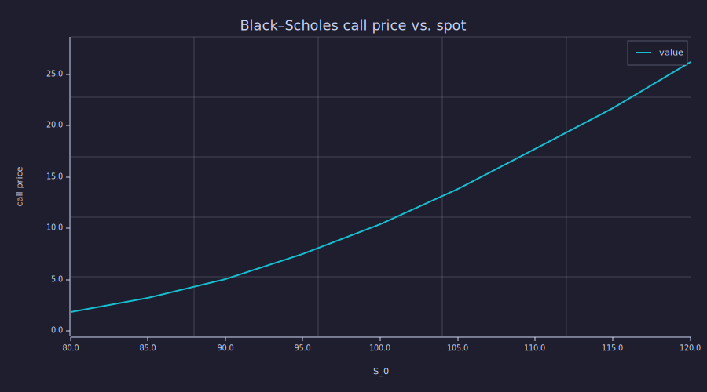
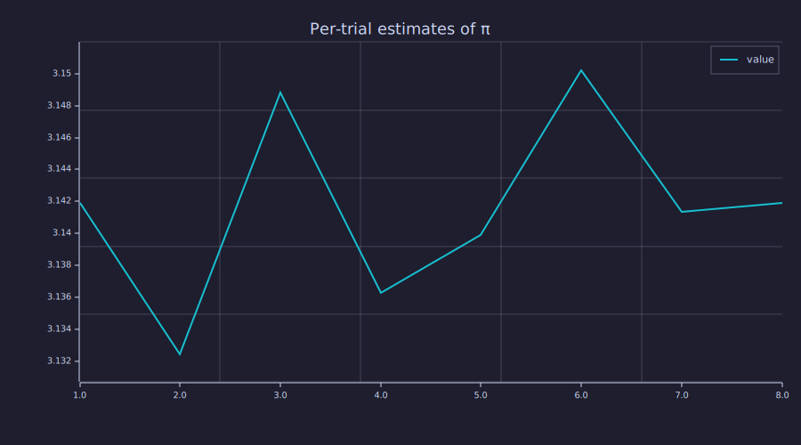

<!-- Generated by rustlab-notebook — do not edit directly. -->

# Parallel Monte Carlo with `parmap`

A canonical Monte Carlo workflow that scales linearly with CPU count, using
[`parmap`](../docs/quickref.md) — rustlab's parallel-map primitive backed
by rayon's thread pool.

The script-side surface is small:

- `parmap(f, xs)` — apply `f` to each element of `xs` across the rayon
  pool; returns a `Vector` of results.
- `nproc()` — how many threads the pool will use.
- `seed(N)` — set the master seed; per-task seeds are deterministically
  derived inside parmap, so the same `seed(N) + parmap(...)` is
  bit-identical across runs.

## How many cores

```rustlab
n = nproc();
print("running parmap on")
print(n)
print("logical CPUs")
```

<!-- rustlab:output-start -->
```text
running parmap on
14
logical CPUs
```

<!-- rustlab:output-end -->

## π by random sampling — the hello world of Monte Carlo

Each trial draws $N$ uniform-random points in the unit square; the
fraction landing inside the unit disk is an estimate of $\pi/4$.

```rustlab
function p = pi_trial(k)
  N = 200000;
  X = rand(N);
  Y = rand(N);
  d2 = (X - 0.5).^2 + (Y - 0.5).^2;
  inside = sum(d2 < 0.25);
  p = 4 * inside / N;
end

seed(42);                                  % deterministic across runs
estimates = parmap(@pi_trial, 1:24);       % 24 independent trials, in parallel
mu = mean(estimates);
se = std(estimates) / sqrt(length(estimates));
print("mean estimate of pi:")
print(mu)
print("standard error:")
print(se)
```

<!-- rustlab:output-start -->
```text
mean estimate of pi:
3.140941666666667
standard error:
0.0007083998263760792
```

<!-- rustlab:output-end -->

With 24 trials of 200 000 samples each, the mean lands on
$\pi \approx 3.1416$ and the standard error is small enough that
the 1.96 σ confidence interval covers the truth. Re-running the same
script produces bit-identical numbers because `seed(42)` fixes the
per-task RNG streams deterministically.

## Black–Scholes call price across spot prices

Each trial prices a European call by simulating the underlying's
terminal distribution under risk-neutral dynamics. The spot price
varies; everything else is held constant.

```rustlab
function price = bs_call(S0)
  K = 100; r = 0.05; sigma = 0.2; T = 1.0; N = 100000;
  Z = randn(N);
  ST = S0 * exp((r - 0.5 * sigma^2) * T + sigma * sqrt(T) * Z);
  % Element-wise max(x, 0) via mask: (x > 0) is a 0/1 vector,
  % multiplied with x gives the positive-only payoff.
  diff = ST - K;
  payoff = diff .* (diff > 0);
  price = exp(-r * T) * mean(payoff);
end

spots = 80:5:120;                          % 9 spot values
seed(7);
prices = parmap(@bs_call, spots);

clf;
plot(spots, prices, "MC call price");
xlabel("S_0");
ylabel("call price");
title("Black–Scholes call price vs. spot")
```

<!-- rustlab:output-start -->


<!-- rustlab:output-end -->


The price rises monotonically with spot and approaches the deep-in-the-money
asymptote `S_0 - K·exp(-rT)` for large `S_0`.

## Vector outputs — per-row softmax stacks into a Matrix

If the lambda returns a vector of length `d`, `parmap` stacks the `N`
results into an `N × d` Matrix — per-call index lives on the row axis,
matching `arrayfun`. The natural use case is anything "do this row-wise
operation in parallel": per-row softmax on an attention matrix,
per-position FFN, batched autoregressive sampling.

```rustlab
seed(11);
T = 6;
S = randn(T, T);                              % logits, T rows × T cols

% Each trial returns a length-T row vector; parmap returns a T×T Matrix.
P = parmap(@(t) softmax(S(t, :)), 1:T);
print("output shape:", size(P));

% Sanity check: each row sums to ~1.
print("row sums:", sum(P, 2)');
```

<!-- rustlab:output-start -->
```text
output shape: [1×2]  6.000000  6.000000
row sums: Matrix(1x6)
  [1.000000, 1.000000, 1.000000, 1.000000, 1.000000, 1.000000]
```

<!-- rustlab:output-end -->

## Matrix outputs — per-head computations stack into a Tensor3

If the lambda returns an `m × n` Matrix, `parmap` stacks the `N`
results into a Tensor3 of shape `(m, n, N)` where the per-call index
is the *trailing* (pages) axis. Use `result(:, :, k)` to extract the
k-th per-call matrix — this matches the existing `cat(3, ...)` page-
stacking convention.

```rustlab
T = 4; d_v = 3; n_heads = 3;
seed(5);
X = randn(T, d_v);

function H = head_scale(h, X)
  % Toy "head": scale the input by h. Each call returns a T × d_v Matrix.
  H = h * X;
end

% Each trial returns a T × d_v Matrix; result is a T × d_v × n_heads Tensor3.
heads = parmap(@(h) head_scale(h, X), 1:n_heads);
print("output shape:", size(heads));
% Per-page extraction: heads(:, :, k) is the k-th per-call matrix.
% In this toy, page 2 should equal 2 * page 1.
err = norm(heads(:, :, 2) - 2 * heads(:, :, 1));
print("page-2 == 2 * page-1 residual:", err);
```

<!-- rustlab:output-start -->
```text
output shape: [1×3]  4.000000  3.000000  3.000000
page-2 == 2 * page-1 residual: 0
```

<!-- rustlab:output-end -->

The shape rule — "all trials must return the same shape" — is hard-
enforced; mixing shapes (some trials returning a vector, some a
matrix) errors at the first divergent trial with a message that names
the index and both shapes.

## What `parmap` won't do — the pure-lambda contract

`parmap` requires the lambda to be "pure": no plotting, no file writes,
no audio, no `seed()` from inside the lambda. The contract is enforced
at runtime — try one of those operations and you get a clear error:

```rustlab
% This errors at the first trial: 'parmap: cannot fprintf from a
% parallel lambda — the lambda must be pure'.
%
% parmap(@(k) fprintf("trial %d\n", k), 1:5);
```

The reason: those builtins mutate global state (the figure, the audio
sink, the RNG master), and running them concurrently from rayon workers
would produce undefined output. The right pattern is to do the **compute**
in parallel and the **I/O** sequentially in the main thread:

```rustlab
% Compute in parallel:
results = parmap(@pi_trial, 1:8);

% Plot serially in main thread:
clf;
plot(1:length(results), results, "MC π estimates");
title("Per-trial estimates of π")
```

<!-- rustlab:output-start -->


<!-- rustlab:output-end -->


This isn't a limitation so much as an honest separation: parallel = compute,
serial = I/O. The contract makes that boundary impossible to cross by
accident.

## See also

- [`dev/plans/parmap_parreduce.md`](../dev/plans/parmap_parreduce.md) —
  v1 implementation plan, deferred phases (`parreduce`, cluster backend),
  open design questions.
- [`dev/plans/parmap_nonscalar_outputs.md`](../dev/plans/parmap_nonscalar_outputs.md) —
  vector/matrix output extension (the "stacks into Matrix / Tensor3" rule
  used above).
- [`docs/quickref.md`](../docs/quickref.md) — one-line reference card.
- `help parmap` and `help nproc` in the REPL.

