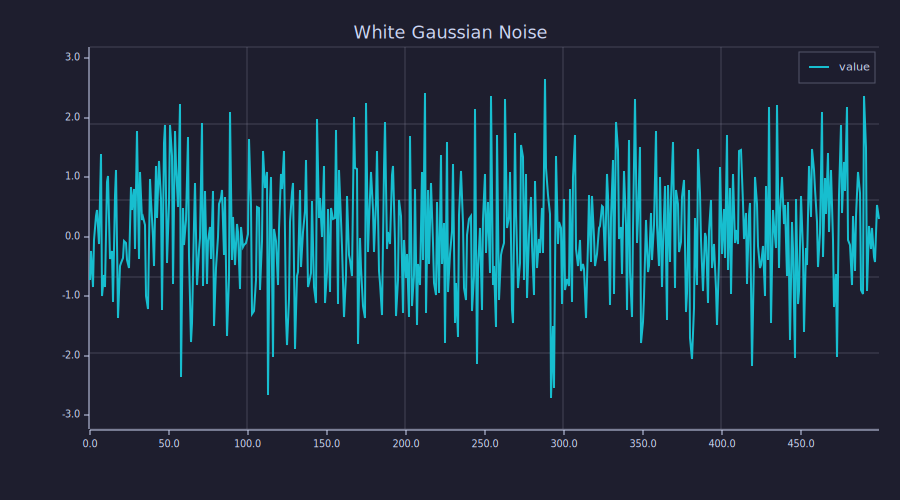

<!-- Generated by rustlab-notebook — do not edit directly. -->

# Quick Look: Random Data

A minimal notebook — just one code block to verify the pipeline works.

```rustlab
clf
seed(42)
x = randn(500);
plot(x)
title("White Gaussian Noise")
grid on
```



Looks like noise to me.

