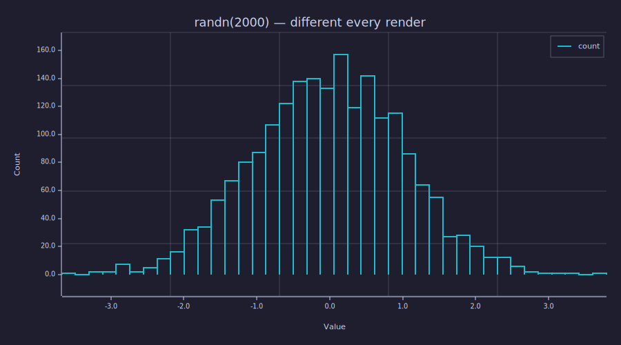
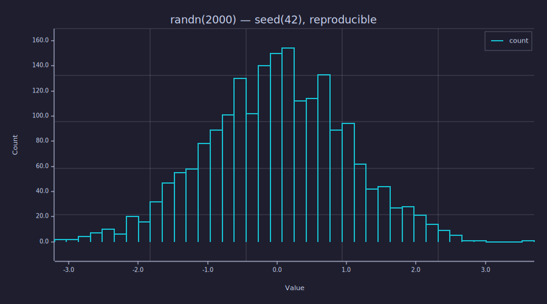

<!-- Generated by rustlab-notebook — do not edit directly. -->

# Reproducible Random Data with `seed()`

Notebooks that use `rand`, `randn`, `randi`, `rand3`, `randn3`, or `sprand`
draw from a thread-local RNG that's normally seeded from OS entropy — so
every render produces a different sequence and the committed `.md` /
`*.svg` artefacts churn for no reason.

`seed(N)` re-seeds that RNG with a non-negative integer and makes every
subsequent random draw deterministic across runs.

## Without a seed: every render differs

```rustlab
clf;
x = randn(2000);
hist(x, 40);
title("randn(2000) — different every render")
```

<!-- rustlab:output-start -->


<!-- rustlab:output-end -->

Without a `seed()` call this notebook produces a slightly different
histogram every time `make notebooks` runs.

## With a seed: bit-stable output

```rustlab
seed(42);
x = randn(2000);
hist(x, 40);
title("randn(2000) — seed(42), reproducible")
```

<!-- rustlab:output-start -->


<!-- rustlab:output-end -->

Re-running this block produces the *same* histogram every time. Combined
with the inline-SVG markdown renderer, `git diff` after a re-render is
empty unless the data, the plot code, or the renderer changed.

## Using a seed for matrices and integers

`seed()` covers every random builtin — uniform, normal, integer,
sparse, rank-3:

```rustlab
seed(7);
M = rand(3, 4)
v = randi(100, 5)
```

Both `M` and `v` come out the same on every run.

## Re-randomizing mid-notebook

Calling `seed()` with no arguments re-seeds from OS entropy — useful if
you want the second half of a notebook to be non-deterministic again
after a deterministic warm-up:

```rustlab
seed(123);
calibration = rand(4)        % reproducible: same numbers every render
seed();
sample = randn(4)            % freshly random: different every render
```

## When to seed

Use `seed(N)` when:
- the notebook commits rendered SVG / MD output to git, and you want
  re-renders to be no-ops unless something actually changed.
- you're documenting a numerical experiment and want the example to
  reproduce exactly.
- you're writing a tutorial that references specific numbers in the
  prose ("the third sample is 1.234…") — the prose stays accurate.

Skip `seed()` when:
- the noise *is* the demonstration (e.g. showing variability across
  trials).
- the notebook isn't being committed and re-render churn doesn't matter.

