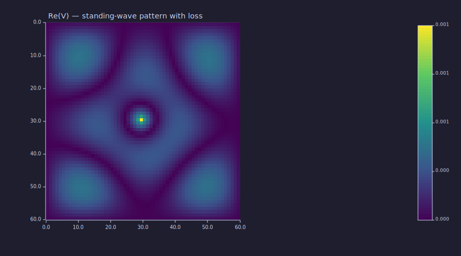
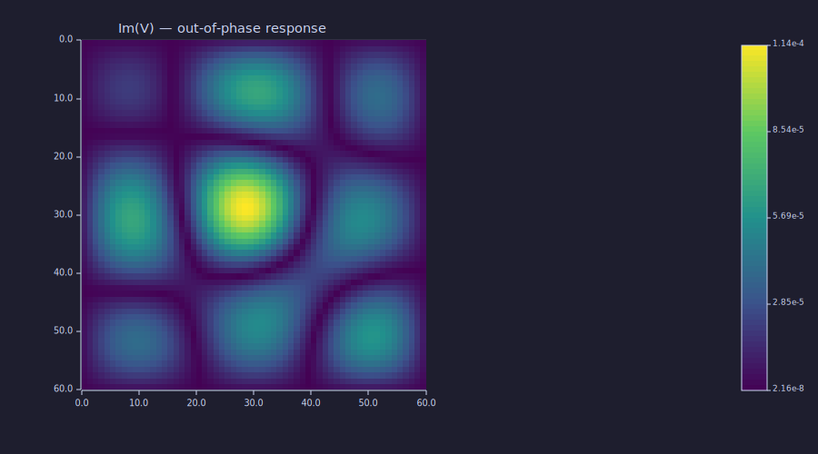
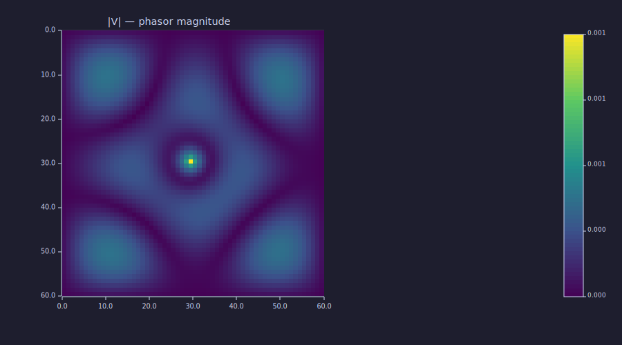

<!-- Generated by rustlab-notebook — do not edit directly. -->

# Complex-Valued Sparse Solves

Frequency-domain wave problems and FDFD-style assemblies routinely
produce complex-valued sparse matrices. The `spsolve` builtin handles
them transparently: the sparse LU path operates on `Complex<f64>` CSC
storage, with auto-routing that picks the real `f64` solver only when
every entry of both `A` and `b` has negligible imaginary part.

This notebook walks through a small lossy Helmholtz assembly to
demonstrate the complex path.

## A complex-valued shifted Helmholtz operator

The operator $-\nabla^2 - (k_0^2 - j\alpha) I$ models a scalar wave at
wavenumber $k_0$ with a small bulk loss $\alpha$ (skin-depth-style
absorption). The imaginary diagonal term breaks Hermitian symmetry,
so the SPD pre-check rejects the matrix and `spsolve` routes the
factorization through the sparse LU path.

```rustlab
clf
nx = 60; ny = 60;
dx = 0.05; dy = 0.05;
L_neg = -1 * laplacian_2d(nx, ny, dx, dy);

n = nx * ny;
k0 = 4.0;             % wavenumber
alpha = 0.5;          % bulk loss
shift = -1 * (k0 * k0) + j * alpha;
A = L_neg + shift * speye(n);
print(issparse(A))    % → 1
print(nnz(A))         % → ~17k for a 5-point stencil + diagonal shift
```

<!-- rustlab:output-start -->
```text
1
17760
```

<!-- rustlab:output-end -->

## Driving a point source

A point source at the grid centre, laid out on the `(ny, nx)` grid and
flattened column-major to match `laplacian_2d`'s indexing:

```rustlab
src = zeros(ny, nx);
src(ny/2, nx/2) = 1.0;
b = src(:)';
```

## Auto dispatch picks the sparse LU path

```rustlab
v = spsolve(A, b);     % auto rejects SPD (imag diag), runs sparse LU
V = reshape(v, ny, nx);
print(size(V))         % → [60, 60]
```

<!-- rustlab:output-start -->
```text
[1×2]  60.000000  60.000000
```

<!-- rustlab:output-end -->

The dispatch sequence is `auto → SPD pre-check fails (Hermitian violated
by imaginary diagonal) → sparse LU with partial pivoting and AMD
ordering → forward + backward substitution`. The factorization stores
both $L$ and $U$ as `SparseCsc<Complex<f64>>` and propagates conjugation
correctly during the partial-pivoting search.

The 3600 × 3600 complex system factors and solves in well under a
second on a laptop; the same problem under the dense fallback would
allocate ~200 MB of complex storage and run in cubic time.

## Inspecting the phasor solution

In a frequency-domain wave problem, $V$ is a phasor: real and imaginary
parts encode in-phase and out-of-phase responses, and $|V|$ is what an
intensity sensor measures.

```rustlab
clf
imagesc(real(V));
title("Re(V) — standing-wave pattern with loss")
```

<!-- rustlab:output-start -->


<!-- rustlab:output-end -->

The real part shows a damped standing-wave centred on the source —
concentric rings whose amplitude decays radially due to $\alpha$.

```rustlab
clf
imagesc(imag(V));
title("Im(V) — out-of-phase response")
```

<!-- rustlab:output-start -->


<!-- rustlab:output-end -->

The imaginary part is the phase-quadrature companion: zero where the
real part peaks, and vice versa. Without the loss term it would be
essentially zero everywhere; here it carries a small but non-trivial
out-of-phase amplitude.

```rustlab
clf
imagesc(abs(V));
title("|V| — phasor magnitude")
```

<!-- rustlab:output-start -->


<!-- rustlab:output-end -->

The magnitude $|V|$ is the smoothest of the three plots — radial
falloff from the source, with the standing-wave structure averaged
out across the phase circle.

## Verifying the residual

```rustlab
r = A * transpose(v) - b;
print(norm(r))      % → ~1e-14
```

<!-- rustlab:output-start -->
```text
0.000000000000009661377855580665
```

<!-- rustlab:output-end -->

Convert the row-vector solve result to a column vector (`transpose`,
not the conjugate-transpose `'`) and check $\|A v - b\|$. The residual
sits at machine precision for this size and conditioning.

## When the matrix is Hermitian but complex

If you build a complex Hermitian-positive-definite matrix (real
positive diagonals, conjugate-symmetric off-diagonals), the SPD
pre-check passes and `spsolve` routes through the sparse Cholesky path
instead. That path uses the `Complex<f64>` Cholesky variant with
proper conjugation in the off-diagonal updates — slightly cheaper than
LU and exact preservation of the Hermitian structure.

```rustlab
clf
% A 3x3 Hermitian SPD: conjugate-symmetric off-diagonal, real diagonal.
H = [3,    1+j,  0;
     1-j,  4,    2-j;
     0,    2+j,  5];
b = [1; 2-j; 0.5];
x = spsolve(sparse(H), b, "cholesky");   % force Cholesky to confirm
print(x);
print(norm(H * x' - b))                   % residual
```

<!-- rustlab:output-start -->
```text
[1×3]  0.042857-0.128571j  0.628571-0.242857j  -0.200000-0.028571j
3.0145226717965663
```

<!-- rustlab:output-end -->

## Cheat sheet

| Property of A | Path the `auto` dispatch picks |
|---|---|
| Hermitian + real-positive diagonal | sparse Cholesky |
| Anything else (sparse) | sparse LU with partial pivoting |
| Dense `Value::Matrix` | legacy dense Gaussian elimination |

The sparse paths handle both real and complex inputs; the dispatch
auto-detects "essentially real" matrices (every imag part below
$10^{-12}$) and routes them through the 4×-faster real solver.

For a deeper walk-through of the full dispatch and orderings, see
`gallery/sparse_solve.md`.

