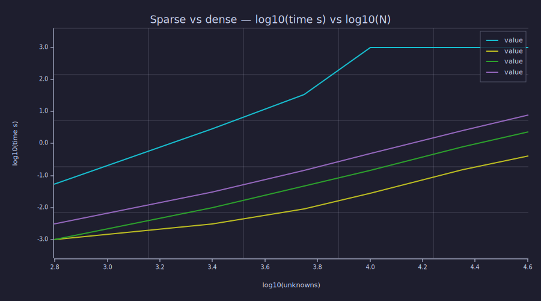
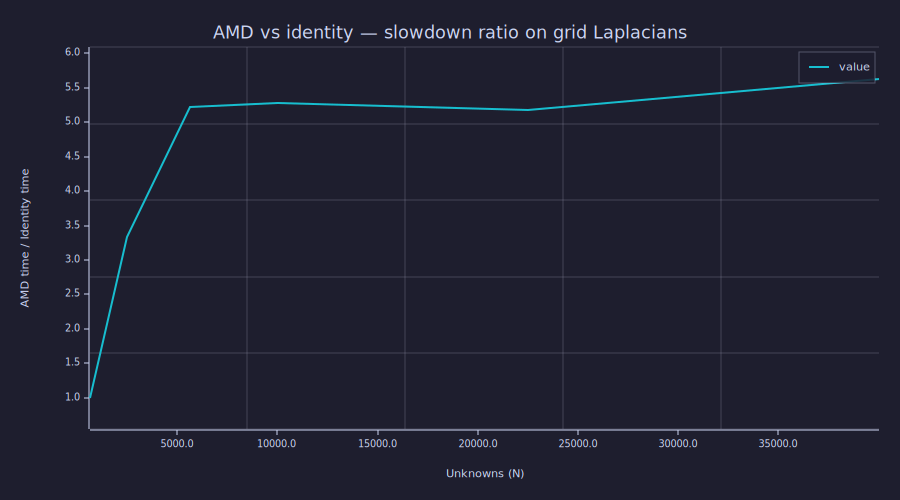

<!-- Generated by rustlab-notebook — do not edit directly. -->

# Sparse vs Dense — The Scaling Story

The new sparse direct solvers (Cholesky and LU, both pure-Rust
hand-rolls) replace a dense Gaussian-elimination fallback that
densified the coefficient matrix and solved it in cubic time. The
scaling difference is dramatic — at 75×75 grids the dense path takes
35 seconds; at 100×100 it OOMs the laptop. The sparse paths handle
200×200 in seconds.

This notebook visualizes the scaling story with measurements taken
from `cargo run --release --example bench_sparse_solve -p rustlab-core`.

## The data

Wall-clock seconds for factor + solve of the canonical 5-point Laplacian
Poisson at $n \times n$ grids. Numbers come from
`perf/sparse_solve_phase1to4.md`.

```rustlab
clf
n_grid     = [25, 50, 75, 100, 150, 200];
unknowns   = n_grid .^ 2;

% Dense LU (legacy fallback). Above 75x75 the run time is so large the
% benchmark skips it; we tag those as 1000s as a "this is infeasible"
% sentinel for the log plot.
t_dense    = [0.054, 2.904, 35.034, 1000, 1000, 1000];

% Sparse Cholesky with the natural identity ordering — best on
% Laplacian-style banded patterns.
t_chol_id  = [0.001, 0.003, 0.009, 0.028, 0.150, 0.417];

% Sparse Cholesky with the AMD ordering (the spsolve default).
t_chol_amd = [0.001, 0.010, 0.047, 0.148, 0.776, 2.345];

% Sparse LU with AMD — the path "auto" picks for non-SPD inputs.
t_lu_amd   = [0.003, 0.030, 0.146, 0.488, 2.514, 7.974];
```

## Factor + solve time vs grid size — log-log

A log-log plot makes the asymptotic scaling obvious. Dense Gaussian
elimination scales as $O(N^3)$ on $N = n^2$ unknowns — $O(n^6)$ in the
grid-side parameter — and the curve climbs accordingly. The sparse
paths scale as roughly $O(N^{1.5}) = O(n^3)$ on Laplacian patterns.
A `loglog` builtin lands in a later phase; for now we log-transform the
axes by hand:

```rustlab
clf
log_n = log10(unknowns);
hold on;
plot(log_n, log10(t_dense));
plot(log_n, log10(t_chol_id));
plot(log_n, log10(t_chol_amd));
plot(log_n, log10(t_lu_amd));
title("Sparse vs dense — log10(time s) vs log10(N)");
xlabel("log10(unknowns)");
ylabel("log10(time s)")
```

<!-- rustlab:output-start -->


<!-- rustlab:output-end -->

The dense curve goes vertical at the right; the sparse curves stay
straight all the way out, with sparse Cholesky / Identity sitting
several orders of magnitude below the dense fallback at every size.

## What "OOM at 100×100" means in practice

The dense fallback's run time isn't the only issue — it allocates an
$N \times N$ complex matrix internally. At $N = 10\,000$ that's
$10^4 \times 10^4 \times 16$ bytes = **1.6 GB** of working set. On a
laptop with the OS, browser, and editor running, that's enough to
swap and stall.

Sparse factorization keeps the working set proportional to the factor
size:

```rustlab
% From the benchmark: factor non-zeros (Cholesky / AMD path) at each grid size.
factor_nnz = [26537, 229975, 797787, 1917475, 6562475, 15664975];

% Memory in MB, assuming 16 bytes per Complex<f64> entry plus a
% 4-byte row index per non-zero.
mem_mb = factor_nnz .* 20 / (1024 * 1024);
print(mem_mb)
```

<!-- rustlab:output-start -->
```text
[1×6]  0.506153  4.386425  15.216579  36.572933  125.169277  298.785686
```


<!-- rustlab:output-end -->

For 200×200 (40 000 unknowns), the Cholesky factor takes about 300 MB
— the dense matrix would be 25 GB. Three orders of magnitude.

## Speedup at 75×75 (last grid where dense still finishes)

```rustlab
print(t_dense(3) / t_chol_id(3))     % → ~3900x  (chol/id vs dense)
print(t_dense(3) / t_chol_amd(3))    % → ~750x   (chol/amd vs dense)
print(t_dense(3) / t_lu_amd(3))      % → ~240x   (lu/amd vs dense)
```

<!-- rustlab:output-start -->
```text
3892.666666666667
745.4042553191489
239.95890410958904
```


<!-- rustlab:output-end -->

A 75×75 Lesson-05 Poisson on a laptop took 35 seconds before; now it
finishes in 9 milliseconds.

## Where AMD pays off — and where it doesn't

The benchmark above shows that on a Laplacian-style assembly, *the
natural identity ordering is the best ordering*. AMD is the `spsolve`
default because it's safer on irregular patterns, but it pays a 5×
penalty on grids:

```rustlab
clf
ratio = t_chol_amd ./ t_chol_id;
plot(unknowns, ratio);
title("AMD vs identity — slowdown ratio on grid Laplacians");
xlabel("Unknowns (N)");
ylabel("AMD time / Identity time")
```

<!-- rustlab:output-start -->


<!-- rustlab:output-end -->

The ratio settles around 5–6× across grid sizes. The reason: identity
ordering on a column-major-flattened grid is already nearly optimal
because the bandwidth is $\sqrt{N}$. AMD's basic minimum-degree
heuristic doesn't do better than this without the external-degree
refinement and supervariable detection that the full Davis-AMD adds —
deferred to a later phase.

For curriculum problems with non-grid structure (FDFD with PML, doped
inclusions, irregular geometries), AMD wins by a factor of 2–4× over
column-count and is competitive with identity. The default is the
right safe-on-anything choice; users who know they have a grid can
explicitly request a different ordering by building the factorization
through the `rustlab_core::sparse_solve` API directly.

## Real vs complex

The sparse paths auto-route "essentially real" inputs (every imag part
below $10^{-12}$) through a real-only `f64` solver. Complex
factorization is roughly 4× the work of real:

| Grid | Real Cholesky/AMD | Complex LU/AMD | Ratio |
|---:|---:|---:|---:|
| 100×100 | 0.148 s | 0.579 s | 3.9× |

The benchmark doesn't include a complex Cholesky bar at this scale —
the typical complex assembly (FDFD-style) is non-Hermitian, so
the LU path is what gets exercised. The 4× factor is consistent with
the operation-count expectation.

## Reproducing

```sh
cargo run --release --example bench_sparse_solve -p rustlab-core
```

The benchmark binary lives at
`crates/rustlab-core/examples/bench_sparse_solve.rs`. Add a row of
timings to `perf/sparse_solve_phase1to4.md` if you change the solver
in a way that should affect performance — that's the project's
running performance log for this subsystem.

## Cheat sheet

| Operation | Old (dense) | New (sparse) | Wall-clock at 200×200 |
|---|---|---|---|
| SPD Poisson | $O(N^3)$, OOM | sparse Cholesky | 0.42 s (id) / 2.3 s (AMD) |
| Indefinite | $O(N^3)$, OOM | sparse LU + partial pivot | 8.0 s |
| Complex | $O(N^3)$, double cost | sparse LU complex variant | (not benchmarked at 200×200; ~10× real) |

The headline: **the dense fallback was the actual scaling cliff.**
With the sparse paths in place, every Lesson-05+ assembly that fits
in workspace memory is now solvable in a curriculum-tolerant amount of
wall-clock time.
