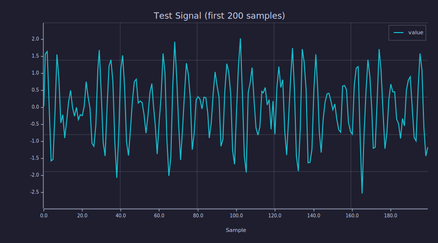
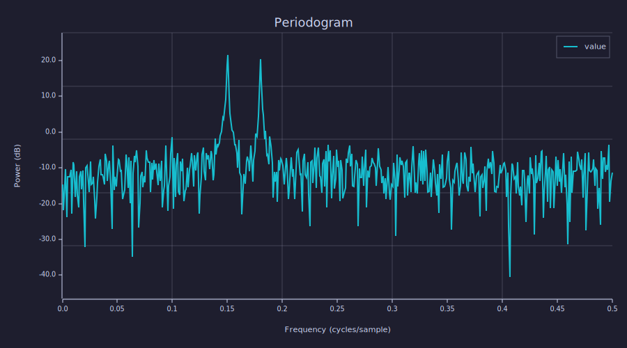
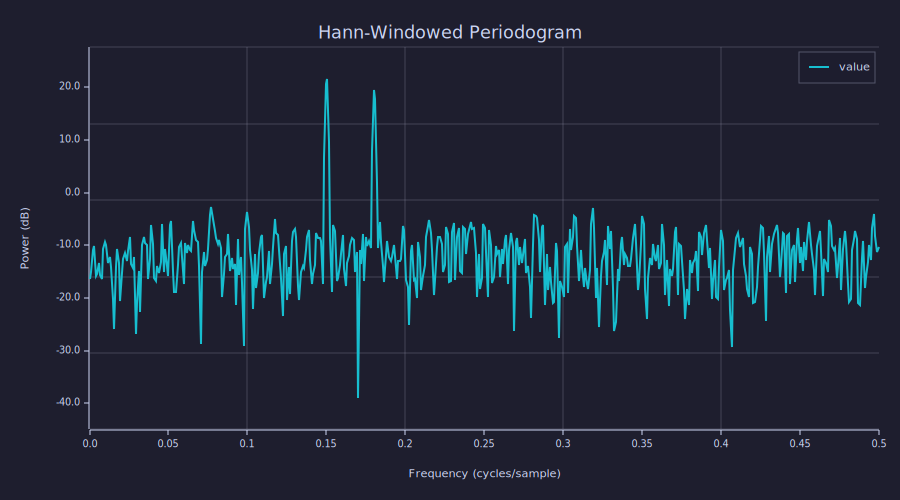
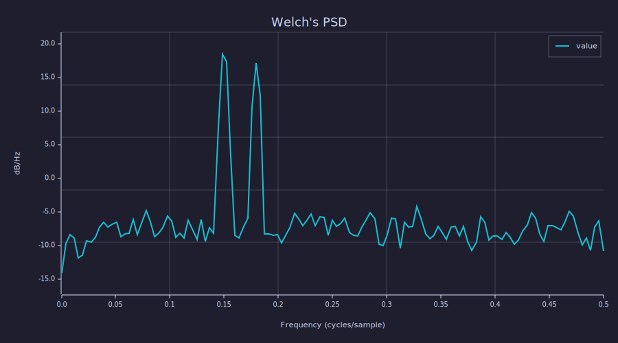
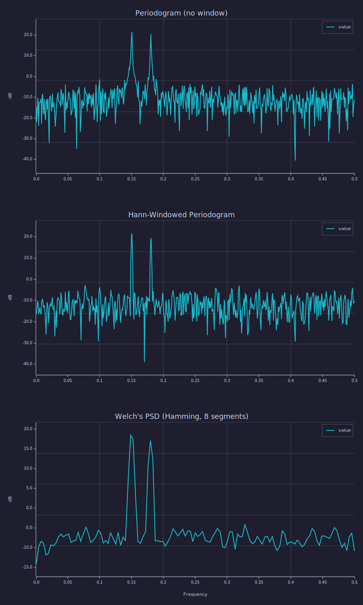

<!-- Generated by rustlab-notebook — do not edit directly. -->

# Spectral Estimation

Comparing two approaches to estimating the power spectral density of a
noisy multi-tone signal.

## Test Signal

Two sinusoids at $f_1 = 0.15$ and $f_2 = 0.18$ cycles/sample, plus
additive white Gaussian noise:

$$x[n] = \sin(2\pi f_1 n) + 0.8\sin(2\pi f_2 n) + 0.3\,w[n]$$

These frequencies are intentionally close together to test resolution.

```rustlab
seed(42)
N = 1024;
n = 0:N-1;
x = sin(2*pi*0.15*n) + 0.8*sin(2*pi*0.18*n) + 0.3*randn(N);
plot(x(1:200))
title("Test Signal (first 200 samples)")
xlabel("Sample")
grid on
```

<!-- rustlab:output-start -->


<!-- rustlab:output-end -->

## Direct FFT (Periodogram)

The periodogram estimates the PSD as the magnitude-squared DFT, normalized
by $N$:

$$\hat{P}_{xx}[k] = \frac{1}{N} \left| \sum_{n=0}^{N-1} x[n]\,e^{-j2\pi kn/N} \right|^2$$

```rustlab
X = fft(x);
Pxx = abs(X(1:N/2)).^2 / N;
f = linspace(0, 0.5, N/2);
plot(f, 10*log10(Pxx))
title("Periodogram")
xlabel("Frequency (cycles/sample)")
ylabel("Power (dB)")
grid on
```

<!-- rustlab:output-start -->


<!-- rustlab:output-end -->

Both tones are visible, but the periodogram is noisy due to spectral
leakage from the implicit rectangular window.

## Windowed FFT (Hann)

Applying a Hann window $w[n] = 0.5 - 0.5\cos(2\pi n / N)$ reduces
sidelobe leakage at the cost of slightly wider main lobes:

$$\hat{P}_{ww}[k] = \frac{1}{\sum w[n]^2} \left| \sum_{n=0}^{N-1} x[n]\,w[n]\,e^{-j2\pi kn/N} \right|^2$$

```rustlab
w = window("hann", N);
xw = x .* w;
Xw = fft(xw);
Pww = abs(Xw(1:N/2)).^2 / sum(w.^2);
plot(f, 10*log10(Pww))
title("Hann-Windowed Periodogram")
xlabel("Frequency (cycles/sample)")
ylabel("Power (dB)")
grid on
```

<!-- rustlab:output-start -->


<!-- rustlab:output-end -->

The noise floor drops and the two tones at $f_1$ and $f_2$ are clearly
resolved.

## Welch's Method

A windowed periodogram is still based on one segment, so its variance
is fixed. **Welch's method** splits the signal into overlapping
segments, windows each, computes a periodogram per segment, and
averages them:

$$\hat{P}_{\text{welch}}[k] = \frac{1}{K} \sum_{i=0}^{K-1} \hat{P}_{ww}^{(i)}[k]$$

Averaging $K$ independent (or near-independent) periodograms cuts the
variance by roughly $1/K$ at the cost of widening each effective
frequency bin. The `pwelch` builtin handles the segmentation,
windowing, and averaging in one call.

```rustlab
[Pw, fw] = pwelch(x, 1.0)
plot(fw, 10*log10(Pw))
title("Welch's PSD")
xlabel("Frequency (cycles/sample)")
ylabel("dB/Hz")
grid on
```

<!-- rustlab:output-start -->


<!-- rustlab:output-end -->

Defaults match MATLAB's `pwelch`: a **Hamming** window of length
$\lfloor 2N/9 \rfloor$ (so the signal divides into eight segments at
50 % overlap), `nfft` equal to the segment length, no detrending, and
one-sided output for real input. Calling `pwelch(x, fs)` without
capture would auto-plot the dB PSD on the current subplot; the
multi-return form `[Pw, fw] = ...` captures the data without plotting.

## Comparison

```rustlab
subplot(3,1,1)
plot(f, 10*log10(Pxx))
title("Periodogram (no window)"); ylabel("dB"); grid on
subplot(3,1,2)
plot(f, 10*log10(Pww))
title("Hann-Windowed Periodogram"); ylabel("dB"); grid on
subplot(3,1,3)
plot(fw, 10*log10(Pw))
title("Welch's PSD (Hamming, 8 segments)"); ylabel("dB"); xlabel("Frequency"); grid on
```

<!-- rustlab:output-start -->


<!-- rustlab:output-end -->

The two tones become progressively easier to read as we move from raw
periodogram to windowed periodogram to Welch averaging — at the cost
of frequency resolution (fewer bins on the x-axis under pwelch).

| Method                 | Variance Reduction | Frequency Resolution |
|------------------------|--------------------|----------------------|
| Periodogram            | None               | Highest              |
| Hann-Windowed          | None               | Slightly reduced     |
| Welch's PSD (`pwelch`) | ~ $1/K$ for $K$ segments | Reduced by ~$1/K$ |

| Window      | Main Lobe Width | First Sidelobe |
|-------------|-----------------|----------------|
| Rectangular | $2/N$           | $-13$ dB       |
| Hann        | $4/N$           | $-31$ dB       |
| Hamming     | $4/N$           | $-41$ dB       |

## See also

`pwelch` assumes the signal is stationary — its spectrum doesn't change
with time. When that assumption breaks (chirps, transients, speech,
modulated RF) reach for the **Short-Time Fourier Transform** and its
heatmap visualisation, the spectrogram. See the companion notebook
[Time-Frequency Analysis](time_frequency.md).
