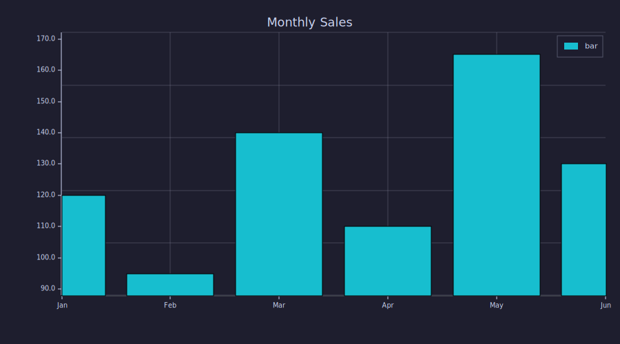
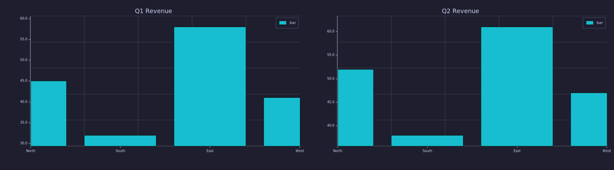

<!-- Generated by rustlab-notebook — do not edit directly. -->

# String Arrays and Categorical Charts

String arrays are ordered collections of strings created with brace syntax.
They enable categorical axis labels on bar charts and other data labeling.

## String Array Basics

```rustlab
months = {"Jan", "Feb", "Mar", "Apr", "May", "Jun"};
disp(months)
disp(length(months))
```

<!-- rustlab:output-start -->
```text
{1×6} "Jan", "Feb", "Mar", "Apr", "May", "Jun"
6
```

<!-- rustlab:output-end -->

String arrays support 1-based indexing:

```rustlab
disp(months(1))
disp(months(end))
disp(months(2:4))
```

<!-- rustlab:output-start -->
```text
Jan
Jun
{1×3} "Feb", "Mar", "Apr"
```

<!-- rustlab:output-end -->

## Categorical Bar Charts

When the first argument to `bar()` is a string array, it becomes the
x-axis labels:

```rustlab
sales = [120, 95, 140, 110, 165, 130];
bar(months, sales, "Monthly Sales")
```

<!-- rustlab:output-start -->


<!-- rustlab:output-end -->

## Grouped Comparison

```rustlab
regions = {"North", "South", "East", "West"};
q1 = [45, 32, 58, 41];
q2 = [52, 38, 61, 47];

figure()
subplot(1,2,1)
bar(regions, q1, "Q1 Revenue")
subplot(1,2,2)
bar(regions, q2, "Q2 Revenue");
```

<!-- rustlab:output-start -->
```text
12
```



<!-- rustlab:output-end -->

## Type Checking

```rustlab
labels = {"a", "b", "c"};
numbers = [1, 2, 3];
disp(iscell(labels))
disp(iscell(numbers))
```

<!-- rustlab:output-start -->
```text
true
false
```

<!-- rustlab:output-end -->

`iscell()` returns `true` for string arrays, `false` for everything else.

## Summary

```rustlab
n_months = length(months);
total = sum(sales);
avg = total / n_months;
best_month = months(argmax(sales));
```

Across 6 months, total sales were **760** units
(average 126.7/month). Best month: **May**.

