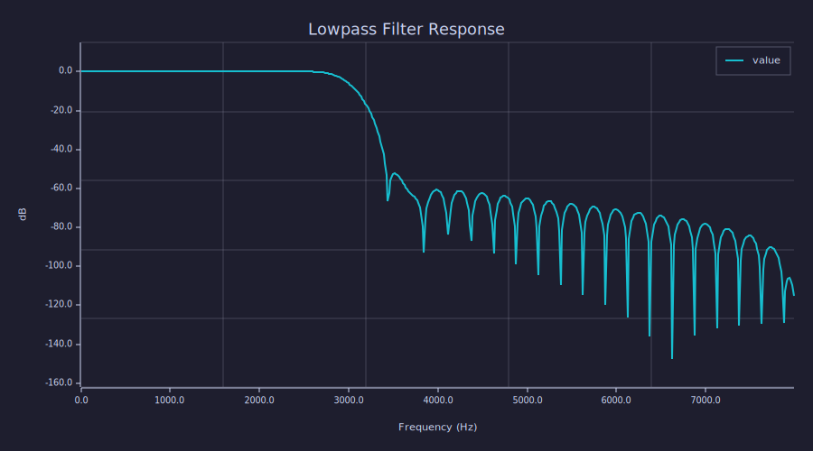

<!-- Generated by rustlab-notebook — do not edit directly. -->

# Template Interpolation

Notebook markdown cells can embed computed values using `${expr}` syntax.
The expressions are evaluated against the shared notebook environment.

## Basic Usage

```rustlab
n_samples = 1024;
fs = 16000;
duration = n_samples / fs;
```

This analysis uses **1024** samples at a sample rate of
16000 Hz, giving a total duration of 0.064 seconds.

## Expressions in Templates

Templates can contain any valid rustlab expression, not just variables:

```rustlab
x = randn(n_samples);
signal_power = sum(x .* x) / length(x);
```

The signal has 1024 samples with mean power 0.9542.
The Nyquist frequency is 8000 Hz.

## Format Specifiers

Use `${expr:format}` to control formatting. The format spec uses
`sprintf` syntax:

```rustlab
big_number = 1234567.89;
ratio = 1/3;
```

| Format | Syntax | Result |
|--------|--------|--------|
| Commas | `${big_number:%,.2f}` | 1,234,567.89 |
| Scientific | `${big_number:%.3e}` | 1.235e+06 |
| Percentage | `${ratio:%.1f%%}` | 0.3% |
| Integer | `${n_samples:%d}` | 1024 |

## Escaping

Use `${...}` for literal dollar-brace in the output: ${not_evaluated}.

## Filter Design Summary

```rustlab
n_taps = 64;
fc = 3000;
h = fir_lowpass(n_taps, fc, fs, "hamming");
Hw = freqz(h, 512, fs);
w = Hw(1,:);
H = Hw(2,:);
plot(w, 20*log10(abs(H)))
title("Lowpass Filter Response")
xlabel("Frequency (Hz)")
ylabel("dB")
grid on
```



Designed a **64-tap** FIR lowpass filter with cutoff at
3000 Hz. The filter has 64 coefficients and its DC gain
is 1.000000.

