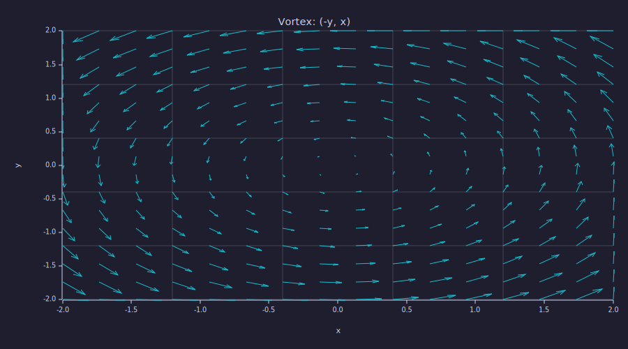
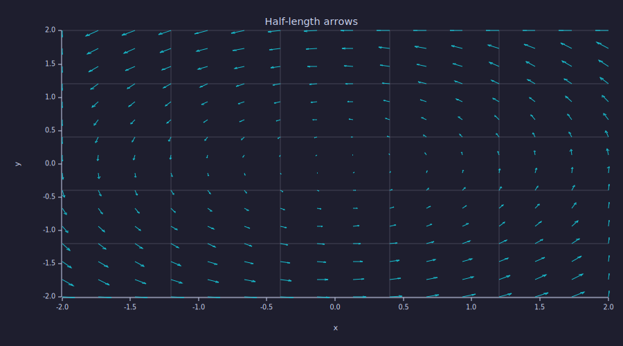
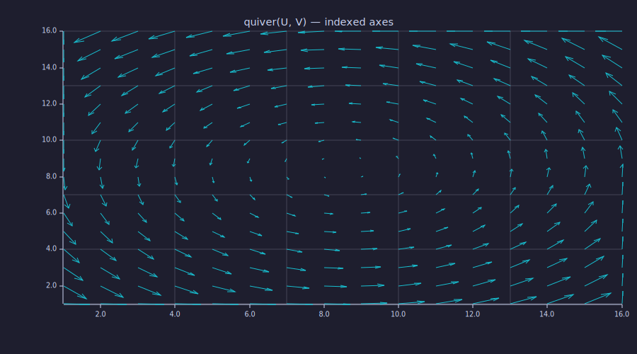
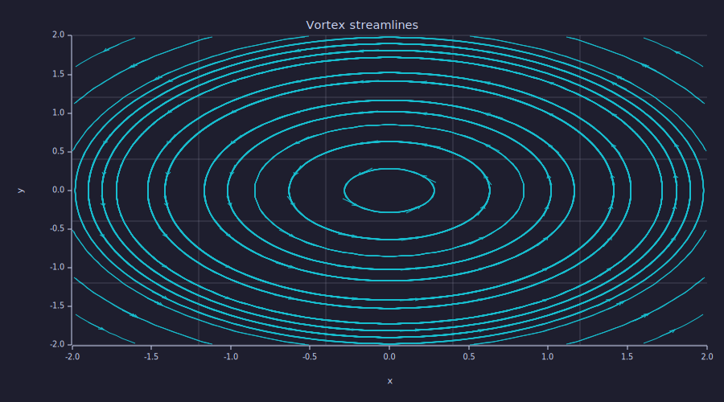
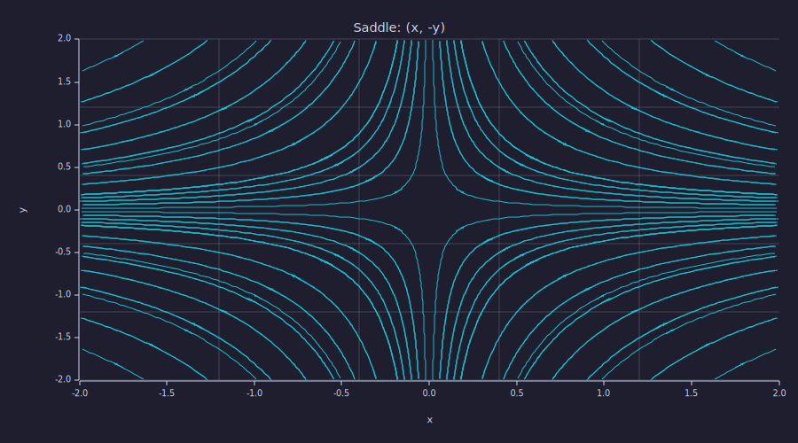
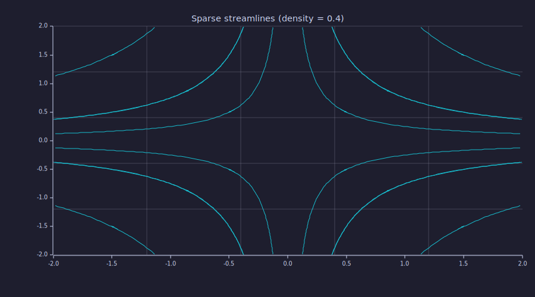
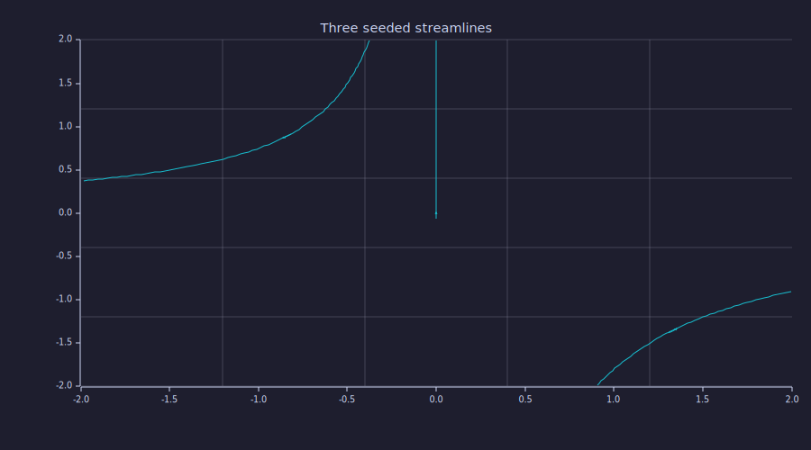
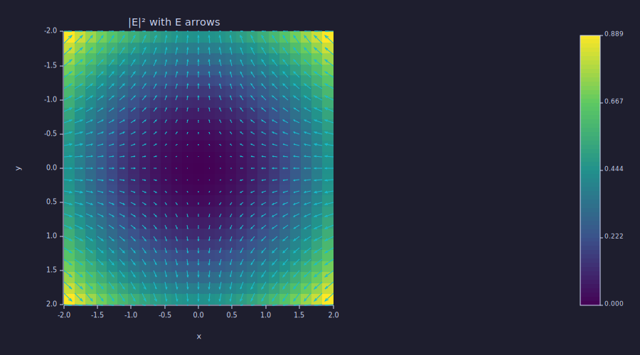
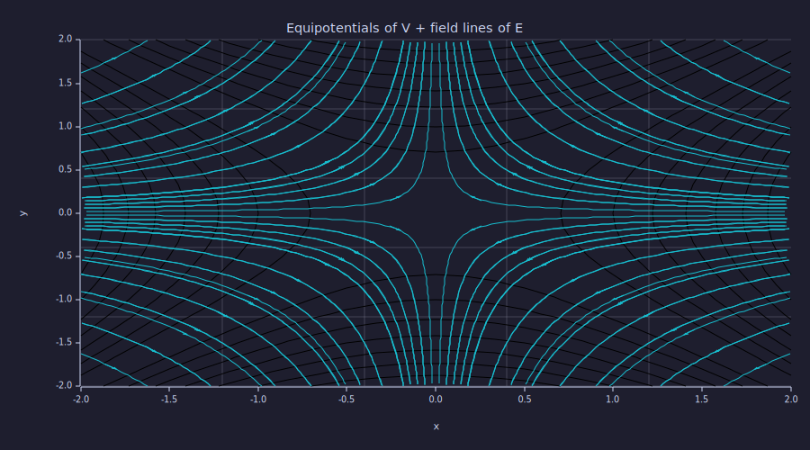

<!-- Generated by rustlab-notebook — do not edit directly. -->

# Quiver and Streamplot

`quiver` draws arrows at each grid point of a 2-D vector field; `streamplot`
integrates continuous streamlines from a seed grid. Both are the natural
tools for visualising $\mathbf{E}$, $\mathbf{B}$, $\mathbf{v}$, $-\nabla V$
— anywhere you sample a vector field on a mesh. Under `hold on` they stack
on `imagesc` heatmaps and `contour` overlays to make the classic
field-plus-equipotentials diagram.

## A vector field to play with

Start with the vortex $\mathbf{F} = (-y, x)$ on a 16×16 grid: its arrows
rotate about the origin, which is easy to read visually.

```rustlab
clf
[X, Y] = meshgrid(linspace(-2, 2, 16), linspace(-2, 2, 16));
U = -Y;
V = X;
print(size(U))     % → [16, 16]
```

<!-- rustlab:output-start -->
```text
[1×2]  16.000000  16.000000
```

<!-- rustlab:output-end -->

## Arrows with `quiver`

`quiver(X, Y, U, V)` places one arrow per grid point. The plot auto-scales
so the longest arrow equals the nearest-neighbour cell distance; arrows
never overlap even when the field varies widely in magnitude.

```rustlab
clf
quiver(X, Y, U, V)
title("Vortex: (-y, x)")
xlabel("x"); ylabel("y")
```

<!-- rustlab:output-start -->


<!-- rustlab:output-end -->

Pass a scalar to scale the auto-sized arrows — useful when you want
longer or shorter glyphs on top of the auto-scale:

```rustlab
clf
quiver(X, Y, U, V, 0.5)
title("Half-length arrows")
xlabel("x"); ylabel("y")
```

<!-- rustlab:output-start -->


<!-- rustlab:output-end -->

## The 2-argument shortcut

`quiver(U, V)` defaults `X` and `Y` to `1..ncols` and `1..nrows`. Handy for
quick inspections when you haven't built a `meshgrid` yet:

```rustlab
clf
quiver(U, V)
title("quiver(U, V) — indexed axes")
```

<!-- rustlab:output-start -->


<!-- rustlab:output-end -->

## Streamlines with `streamplot`

`streamplot` traces continuous curves that follow the field. An RK4
integrator steps forward and backward from each seed until it leaves the
domain, hits a NaN sample, or the field magnitude drops to effectively
zero. A midpoint arrowhead shows direction:

```rustlab
clf
streamplot(X, Y, U, V)
title("Vortex streamlines")
xlabel("x"); ylabel("y")
```

<!-- rustlab:output-start -->


<!-- rustlab:output-end -->

Saddle fields $\mathbf{F} = (x, -y)$ produce hyperbolic streamlines
emanating from and flowing into the saddle point:

```rustlab
clf
[X, Y] = meshgrid(linspace(-2, 2, 30), linspace(-2, 2, 30));
Us = X;
Vs = -Y;
streamplot(X, Y, Us, Vs)
title("Saddle: (x, -y)")
xlabel("x"); ylabel("y")
```

<!-- rustlab:output-start -->


<!-- rustlab:output-end -->

## Controlling seed density

The default places ≈ 100 seeds in a 10×10 grid. `density > 1.0` gives more
seeds, `density < 1.0` fewer:

```rustlab
clf
streamplot(X, Y, Us, Vs, 0.4)
title("Sparse streamlines (density = 0.4)")
```

<!-- rustlab:output-start -->


<!-- rustlab:output-end -->

## Custom seeds

Pass an $N \times 2$ matrix of `(x, y)` points to pick exactly where
streamlines start — useful for highlighting trajectories through specific
points of interest:

```rustlab
clf
seeds = [[-1.5, 0.5]; [0.0, 1.8]; [1.5, -1.2]]
streamplot(X, Y, Us, Vs, seeds)
title("Three seeded streamlines")
```

<!-- rustlab:output-start -->


<!-- rustlab:output-end -->

## The canonical EM diagram: $|\mathbf{E}|^2$ + arrows

Build a field from a potential $V = x^2 - y^2$ (saddle-shaped), take
$\mathbf{E} = -\nabla V$, and plot $|\mathbf{E}|^2$ as a heatmap with the
vector field overlaid:

```rustlab
clf
[X, Y] = meshgrid(linspace(-2, 2, 25), linspace(-2, 2, 25));
Vpot = X .^ 2 - Y .^ 2;
[Ex, Ey] = gradient(Vpot);
Ex = -Ex;
Ey = -Ey;
Emag = Ex .* Ex + Ey .* Ey;

hold on
imagesc(Emag)
quiver(X, Y, Ex, Ey)
hold off
title("|E|² with E arrows")
xlabel("x"); ylabel("y")
```

<!-- rustlab:output-start -->


<!-- rustlab:output-end -->

Under `hold on`, the chart bounds come from the first quiver or contour,
and the heatmap cells rescale to fit. Switching to `hold off` for the next
figure resets the subplot.

## Equipotentials plus field lines

Contours of $V$ (equipotentials) together with streamlines of $\mathbf{E}$
are perpendicular — the standard electrostatics check:

```rustlab
clf
hold on
contour(X, Y, Vpot, 10, "k")
streamplot(X, Y, Ex, Ey)
hold off
title("Equipotentials of V + field lines of E")
xlabel("x"); ylabel("y")
```

<!-- rustlab:output-start -->


<!-- rustlab:output-end -->

## NaN handling

NaN entries in `U` or `V` are skipped by `quiver` (no arrow drawn at that
cell) and terminate a streamline locally. This lets you mask out regions
of a field — for instance, by multiplying `U` and `V` element-wise by a
mask that is `1` outside the region of interest and `NaN` inside — so
masked regions don't corrupt neighbouring arrows or traces.

## Cheat sheet

| Form                                                  | Returns | Notes                                              |
|-------------------------------------------------------|---------|----------------------------------------------------|
| `quiver(X, Y, U, V)`                                  | `None`  | Auto-scaled arrows at every grid point             |
| `quiver(X, Y, U, V, scale)`                           | `None`  | Scalar multiplier on top of auto-scale             |
| `quiver(X, Y, U, V, "title")`                         | `None`  | String title (anything not a colour code)          |
| `quiver(X, Y, U, V, "c")`                             | `None`  | Single-letter colour code (k/r/g/b/c/m/y/w)        |
| `quiver(U, V [, ...])`                                | `None`  | `X, Y` default to 1..ncols / 1..nrows              |
| `streamplot(X, Y, U, V)`                              | `None`  | RK4 forward+backward from ≈ 100 default seeds      |
| `streamplot(X, Y, U, V, density)`                     | `None`  | Scalar density knob; `density = 1.0` ≈ 10×10 grid  |
| `streamplot(X, Y, U, V, seeds)`                       | `None`  | `seeds` is an Nx2 matrix of explicit `(x, y)`      |
| `streamplot(X, Y, U, V, "title")`                     | `None`  | String title                                       |

NaN entries terminate traces locally; closed orbits (e.g. the vortex) are
detected by a seed-return heuristic and drawn once rather than looping.

Terminal output does not render `quiver` / `streamplot` — a one-time
warning fires and the advice is to `savefig("plot.html")` or
`savefig("plot.svg")` to view the figure.
