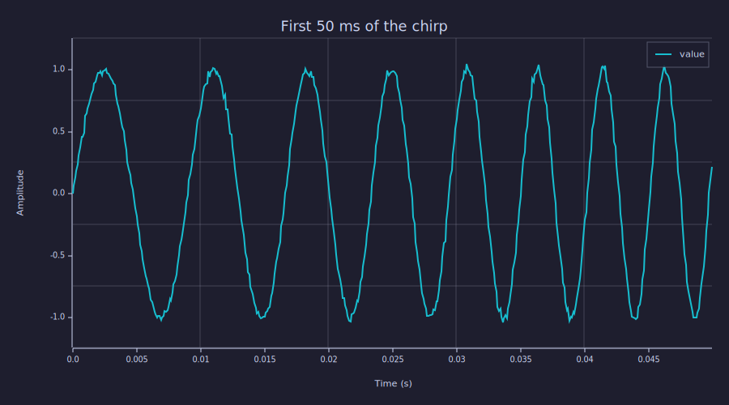
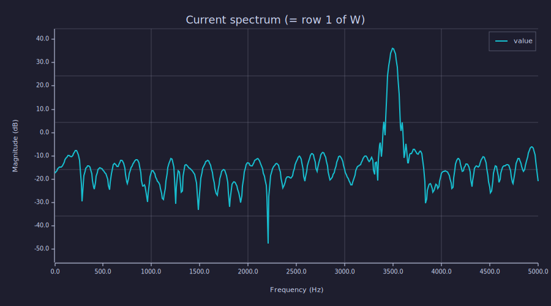

<!-- Generated by rustlab-notebook — do not edit directly. -->

# Frequency Waterfalls

A **frequency waterfall** is the same time-frequency data a spectrogram
shows, transposed and re-oriented for a particular ergonomic goal:
frequency reads along the *horizontal* axis (so it can sit directly
under a live spectrum line plot) and time runs *vertically downward*
(newest at the top, oldest scrolling off the bottom). This is the
layout SDR receivers, audio analysers, and burst-event monitors have
used for decades — a fresh transient appears at the top of the chart
and a vertical eye-trace down a column tells you how that frequency
behaved over the recent past.

This notebook introduces the offline `waterfall(...)` builtin and shows
how it differs from `spectrogram`. The companion live-streaming form,
`waterfall_stream`, is demonstrated in
[`examples/audio/waterfall_monitor.sh`](../audio/waterfall_monitor.sh).

## Spectrogram vs. waterfall — same data, different orientation

`spectrogram(x, fs)` and `waterfall(x, fs)` both compute the
Short-Time Fourier Transform of `x`. They differ only in how the result
is laid out:

| Builtin       | Matrix shape          | Y-axis             | Time direction              |
|---------------|-----------------------|--------------------|-----------------------------|
| `spectrogram` | `[n_freqs × n_time]`  | frequency          | left → right (oldest left)  |
| `waterfall`   | `[n_time × n_freqs]`  | time (seconds-ago) | top → bottom (newest top)   |

The waterfall layout pairs naturally with a horizontal spectrum line
plot — both share a frequency x-axis — which is why the live
`waterfall_stream` builtin renders a 2-row figure (line on top,
heatmap below).

## Test signal — a linear chirp

A 100 Hz → 5 kHz linear sweep over 2 seconds is the cleanest
demonstration: the instantaneous frequency is monotonic, so the
resulting heatmap traces a single diagonal ridge whose direction makes
the orientation choice obvious.

```rustlab
seed(42)
fs   = 10000;
dur  = 2.0;
n    = round(fs * dur);
t    = (0:(n-1)) / fs;
f0   = 100;
f1   = 5000;
phase = 2*pi*(f0*t + 0.5*(f1 - f0)*t.*t / dur);
x = sin(phase) + 0.02*randn(n);
plot(t(1:500), x(1:500))
title("First 50 ms of the chirp")
xlabel("Time (s)"); ylabel("Amplitude")
grid on
```

<!-- rustlab:output-start -->


<!-- rustlab:output-end -->

## Spectrogram for comparison

The familiar spectrogram of the same chirp — time on the x-axis,
frequency on the y-axis, ridge sweeping diagonally upward from
$(t=0, f=100)$ to $(t=2, f=5000)$:

```rustlab
spectrogram(x, fs, window("hann", 512), 384, 1024)
```

<!-- rustlab:output-start -->


<!-- rustlab:output-end -->

## Frequency waterfall

`waterfall(x, fs, ...)` returns `[W, f, t]` where `W` is the
`[n_time × n_freqs]` real magnitude matrix in dB with **row 1 = newest
segment** and column 1 = DC. The time vector `t` is aligned with rows
(so it's monotonically *decreasing*: `t[1]` is the latest segment, the
last entry is the first).

```rustlab
[W, f, twf] = waterfall(x, fs, window("hann", 512), 384, 1024);
size(W)
```

<!-- rustlab:output-start -->
```text
[1×2]  153.000000  513.000000
```

<!-- rustlab:output-end -->

For a 20 000-sample chirp with a 512-sample window and a 128-sample
hop, this gives a $153 \times 513$ matrix — 153 time rows by 513
one-sided frequency bins, the same numbers as the spectrogram but
with the axes swapped.

Rendering with `imagesc` uses the default image convention (row 1 at
the top), giving the canonical waterfall view: the most recent segment
is at the top of the chart, and the chirp's diagonal sweeps from
**upper-right** (newest = high frequency) down to **lower-left**
(oldest = low frequency).

```rustlab
imagesc(W, "viridis")
title("Waterfall — chirp 100 Hz → 5 kHz")
xlabel("Frequency bin (DC at left, Nyquist at right)")
ylabel("Time row (newest = top)")
```

<!-- rustlab:output-start -->


<!-- rustlab:output-end -->

## A stepwise frequency-changing sine

Where the chirp is a continuous sweep, a *stepwise* signal — three
1-second tones at 200 Hz, 1500 Hz, and 3500 Hz — produces three
horizontal stripes in the waterfall. Reading top-to-bottom: the most
recent 3500 Hz tone sits at the top, then 1500 Hz, then the oldest
200 Hz tone at the bottom.

```rustlab
seed(42)
fs       = 10000;
seg_dur  = 1.0;
freqs    = [200, 1500, 3500];
n_seg    = round(fs * seg_dur);
n        = n_seg * length(freqs);
x = zeros(n);
for k = 1:length(freqs)
    t_seg = (0:(n_seg - 1)) / fs;
    x((k - 1) * n_seg + 1 : k * n_seg) = sin(2*pi*freqs(k)*t_seg);
end
x = x + 0.02*randn(n);
[W, f, twf] = waterfall(x, fs, window("hann", 256), 192, 1024);
imagesc(W, "viridis")
title("Stepwise tones: 200 → 1500 → 3500 Hz")
xlabel("Frequency bin")
ylabel("Time row (newest = top)")
```

<!-- rustlab:output-start -->


<!-- rustlab:output-end -->

The transitions between tones look crisp because we picked a shorter
256-sample window — narrower in time, wider in frequency. The same
Heisenberg–Gabor trade-off discussed in
[`time_frequency.md`](time_frequency.md) applies here unchanged.

## Reading the current spectrum off row 1

Because row 1 of `W` is the most recent column, slicing it gives
exactly the "what's playing right now" spectrum — the live line plot
you'd pair the waterfall with:

```rustlab
spectrum_now = W(1, :);
plot(f, spectrum_now)
title("Current spectrum (= row 1 of W)")
xlabel("Frequency (Hz)"); ylabel("Magnitude (dB)")
grid on
```

<!-- rustlab:output-start -->


<!-- rustlab:output-end -->

This is exactly what the live `waterfall_stream` builtin does: panel 1
gets the most-recent column as a line plot, panel 2 gets the rolling
`W` matrix as a heatmap, and a single combined call refreshes both
atomically.

## Streaming form

For real-time use — driving a 2-panel live figure from an audio source
— pair `waterfall_stream_init` with the combined-call
`waterfall_stream(samples, fig, state)`. Each call pushes the next
audio frame into a rolling history, then on every `update_every`-th
tick atomically refreshes both panels and redraws:

```
% Pseudo-code (won't run in a notebook — see examples/audio/waterfall_monitor.sh):
sr           = 44100;
nfft         = 1024;
noverlap     = 512;
time_history = 5.0;     # seconds visible in the heatmap
win = window("hann", nfft);
st  = waterfall_stream_init(sr, win, noverlap, nfft, time_history);
fig = figure_live(2, 1);
adc = audio_in(sr, 1024);
while true
    samples = audio_read(adc);
    [fig, st] = waterfall_stream(samples, fig, st);
end
```

The wrapper [`examples/audio/waterfall_monitor.{sh,rlab}`](../audio/waterfall_monitor.sh)
runs this from a microphone (or from a piped synthetic chirp / tone-step
test signal via `--chirp` / `--steps`) in `rustlab-viewer`.

## When to reach for waterfall vs. spectrogram

| Task                                                | Reach for      |
|-----------------------------------------------------|----------------|
| One-shot time-frequency picture of a captured signal | `spectrogram` |
| Comparing instantaneous spectrum against recent history | `waterfall` |
| Burst / transient detection in a live SDR / audio stream | `waterfall_stream` |
| Reading a stepwise frequency change as a top-down sequence | `waterfall` |
| Matching MATLAB / Octave plotting conventions       | `spectrogram` |

Mechanically they are the same data; the choice is about which axis
deserves which screen direction for your task.

## See also

- [Spectral Estimation](spectral_estimation.md) — `pwelch` and the
  stationary-PSD foundations
- [Time-Frequency Analysis](time_frequency.md) — `stft`, `spectrogram`,
  `cwt`, `scalogram`, and the resolution trade-off
- `examples/audio/spectrogram_monitor.sh` — live spectrogram (time
  on x-axis, leftward scroll)
- `examples/audio/waterfall_monitor.sh` — live waterfall (time on
  y-axis, downward scroll)
