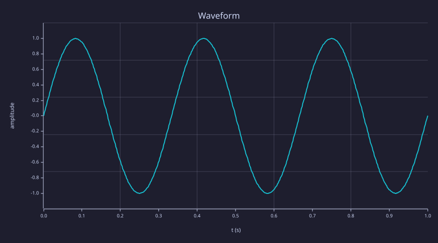

<!-- Generated by rustlab-notebook — do not edit directly. -->

# Interactive Widgets

This notebook embeds live controls — a **slider**, a **number input**, and
an **option** group — that drive a single plot. Open it with the
interactive server to make them live:

```sh
rustlab-notebook watch examples/notebooks/widgets_demo.md
```

Drag a control and only the blocks that read it (and those downstream)
re-run. Rendered statically (`notebook render`), each control shows at its
declared default and `widget(...)` returns that default — so this page is a
faithful snapshot either way.

See `docs/notebooks.md` → *Interactive widgets* for the full reference.

## Controls

**Amplitude:** `1`

**Frequency (Hz):** `3`

**Waveform:** `sine`

## The plot

A one-second waveform whose amplitude, frequency, and shape come straight
from the controls above. Move a control (under `watch`) and this block
re-runs:

```rustlab
amp  = widget("amp");
freq = widget("freq");
t = linspace(0, 1, 500);
if widget("shape") == "cosine"
  y = amp * cos(2 * pi * freq * t);
else
  y = amp * sin(2 * pi * freq * t);
end
clf
plot(t, y)
title("Waveform")
xlabel("t (s)")
ylabel("amplitude")
```

<!-- rustlab:output-start -->


<!-- rustlab:output-end -->

The current settings are **amplitude 1.0**, **3 Hz**, shape
**sine** — the prose updates with the controls too, via
[template interpolation](../../docs/notebooks.md#template-interpolation).
